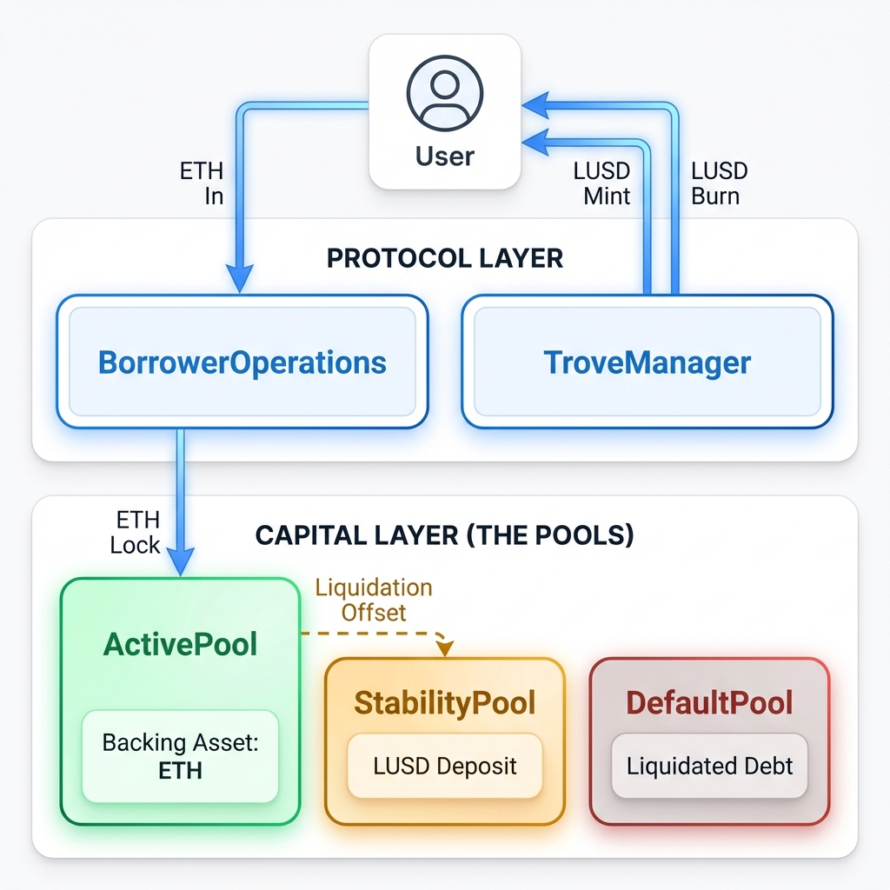
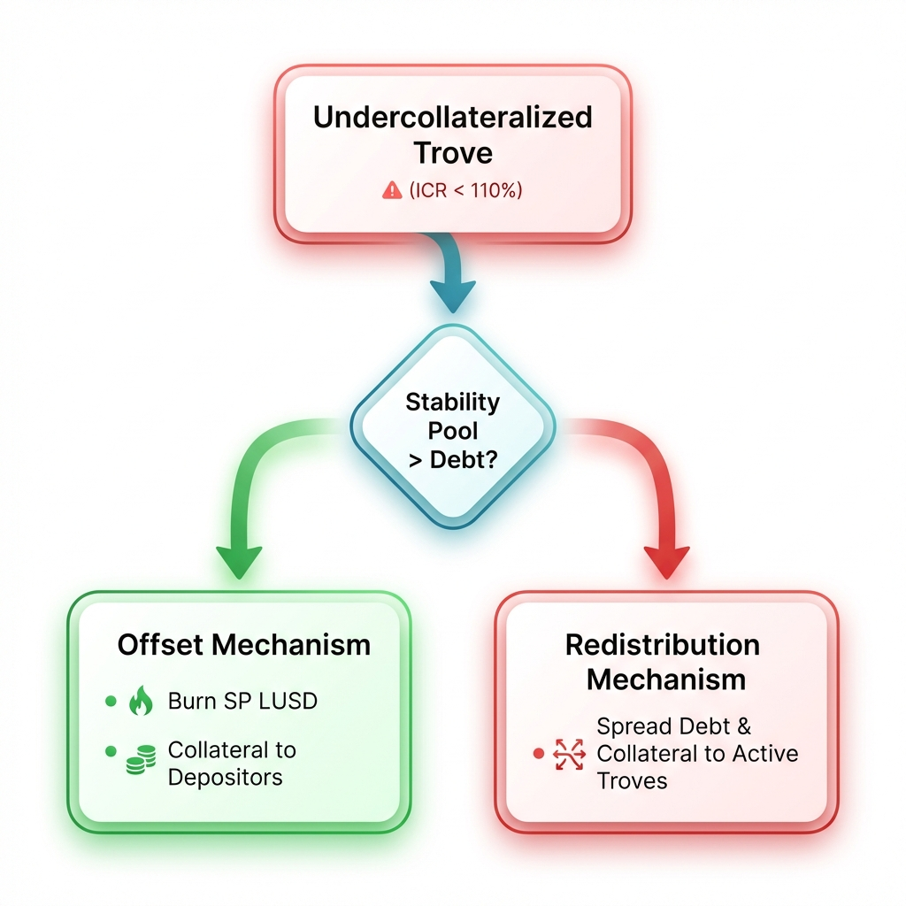

# Liquity V1 (LUSD): Kinetic Solvency & Backing Mechanics

**Authors**: Research Challenge Team
**Date**: January 2026
**Series**: Liquity Research Series (Part I - Backing Mechanism)
**Source**: Consolidated from [Liquity V1 Technical Documentation](./README%20%281%29.md)

---

## Abstract

This report analyzes the **Kinetic Solvency** of Liquity V1 (LUSD). Unlike "Gov-Managed" stablecoins (MakerDAO) or "Fiat-Wrappers" (USDC), Liquity V1 operates as an **Immutable Vault**. It couples a rigid over-collateralization requirement (110% MCR) with an atomic **Stability Pool** mechanism that prioritizes speed of liquidation over capital efficiency ([Liquity, 2021](#ref-liquity-technical)).

The core insight is **Redemption-Driven Value**: LUSD is not "pegged" by a market maker, but by the protocol's unconditional promise to exchange 1 LUSD for $1 of ETH collateral, creating a hard arbitrage floor.

> [!IMPORTANT]
> **Critical Axiom**: Liquity V1 assumes ETH is the only collateral. It cannot diversify risk; it can only **over-collateralize** against it.

---

## 1. Introduction: The Immutable Vault

### 1.1 The Technical Thesis: Governance Minimization

Most stablecoins rely on human governance to adjust parameters (Risk Premiums, Debt Ceilings). Liquity V1 replaces this with algorithmically determined incentives.

* **No Governance Votes:** Parameters like MCR (110%) are hardcoded.
* **No Admin Keys:** The contracts are immutable.
* **No Whitelisting:** The protocol is permissionless.

### 1.2 System Architecture

The state is compartmentalized into specific "Pools" that handle distinct logic, preventing monolithic failure.

* **ActivePool:** Holds ETH for all healthy Troves.
* **DefaultPool:** Holds ETH/Debt for liquidated Troves pending redistribution.
* **StabilityPool:** Holds LUSD deposited by solvency providers (First line of defense).

---

## 2. The Hard Peg: Direct Redemption

### 2.1 The "Floor" Mechanism

Unlike other protocols that rely on "Stability Fees" to discourage borrowing, Liquity enforces a price floor via **Direct Redemption**.

* **Mechanism:** Any user can call `redeemCollateral(amount)`.
* **Function:** The protocol takes `x` LUSD, burns it, and gives the user `$x` worth of ETH (minus fee).
* **Targeting:** Redemptions act against the **riskiest Troves** (lowest ICR) first.

> **Economic Effect:** If LUSD trades at $0.90, an arbitrageur can buy it, redeem it for $1.00 of ETH, and sell the ETH, instantly mocking a 10% profit. This buying pressure restores the peg.

### 2.2 Redemption Sequence

Redemptions are not random; they are a **disciplinary force**.

1. **Sort:** Troves are ordered by ICR (Individual Collateral Ratio) in a linked list (`SortedTroves.sol`).
2. **Target:** The redemption hits the tail (lowest ICR).
3. **Impact:** The borrower loses collateral but their debt is paid off. They are essentially "force-closed" at net asset value.

---

## 3. Kinetic Solvency: The Liquidation Waterfall

Liquity V1 prioritizes **speed-to-solvency** over auction complexity. There are no auctions. Liquidations are atomic.

### 3.1 Primary Defense: Stability Pool (Offset)

* **Speed:** Instant.
* **Logic:** `SP.LUSD` is burned 1:1 against the bad debt. The collateral (110% value) is given to SP depositors.
* **Incentive:** SP depositors buy ETH at a ~10% discount during liquidations.

### 3.2 Secondary Defense: Redistribution (Socialization)

* **Condition:** If SP is empty.
* **Logic:** The debt and collateral are distributed proportionally to all other Trove owners.
* **Impact:** Everyone "eats" the debt, but also receives the collateral. Since `Collateral > Debt` (usually), this is net-positive for the system in dollar terms, but lowers individual ICRs.

---

## 4. Recovery Mode: The "Defcon 1" State

When the **Total Collateral Ratio (TCR)** falls below **150%**, the system enters **Recovery Mode**.

### 4.1 Changes in Logic

1. **Liquidation Threshold:** Rises from 110% to **150%**.
2. **Transaction Blocks:** Borrowers cannot issue new debt unless it improves the TCR.
3. **Aggressive Clearing:** Liquidations can occur up to 150% ICR to restore system health.

> **Purpose:** Prevents a death spiral by aggressively deleveraging the system *before* it hits the critical 110% line.

---

## 5. The Oracle Layer: Epistemic Solvency

Liquity is "blind" without price data. It uses a **Dual Oracle** strategy to prevent false liquidations.

* **Primary:** Chainlink (ETH/USD).
* **Secondary:** Tellor (Fallback).

### 5.1 Failure Modes

* **Frozen:** If Chainlink is silent for >4 hours, switch to Tellor.
* **Broken:** If execution reverts or returns 0, switch to Tellor.
* **Drift:** If the price difference is too high (>50%), the system assumes data corruption.

---

## 6. Conclusion: The Trade-off

Liquity V1 achieves **Absolute Backing Confidence** by sacrificing **Capital Efficiency**.

* **Pros:** Cannot become insolvent as long as SP > 0 or Redistribution works. Peg is hard-coded.
* **Cons:** 110% MCR is capital inefficient compared to modern LST-backed systems. 0% interest rate became a liability in high-rate environments (2023-2024), leading to the development of V2 (BOLD).

---

### Series Navigation

* [Part I: V1 Backing Profile](./Liquity_V1_Backing_Profile.md)
* **Part II: V1 Backing Deep Dive** (You are here)
* [Part III: V1 Sustainability Profile](./Liquity_V1_Sustainability_Profile.md)
* [Part IV: V1 Decentralization Profile](./Liquity_V1_Decentralization_Profile.md)
* [Comparison: V2 Backing Deep Dive](./Liquity_V2_Backing_DeepDive.md)

---

## References

Liquity. (2021). *[Liquity Protocol README](https://github.com/liquity/dev/blob/main/README.md)*. GitHub Repository.

Internal Research. (2026). *[General Backing Framework](./general_backing_framework.md)*. Canonical Methodology.
