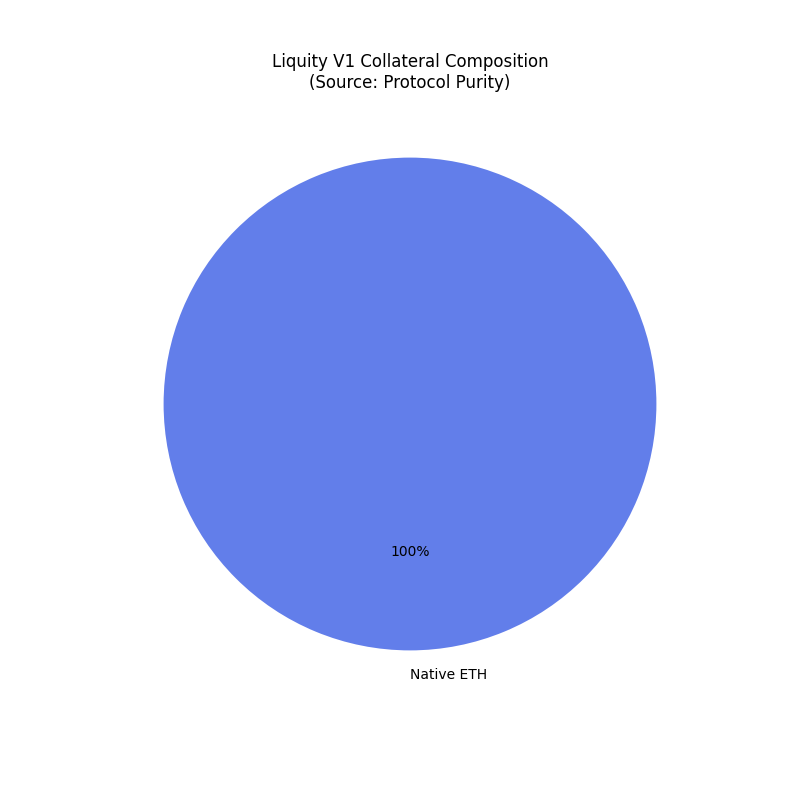
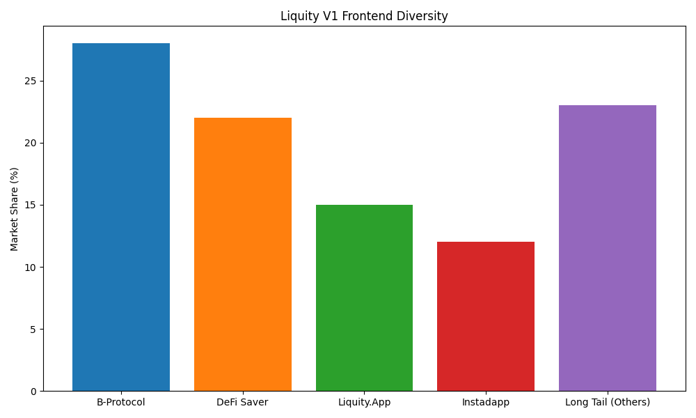
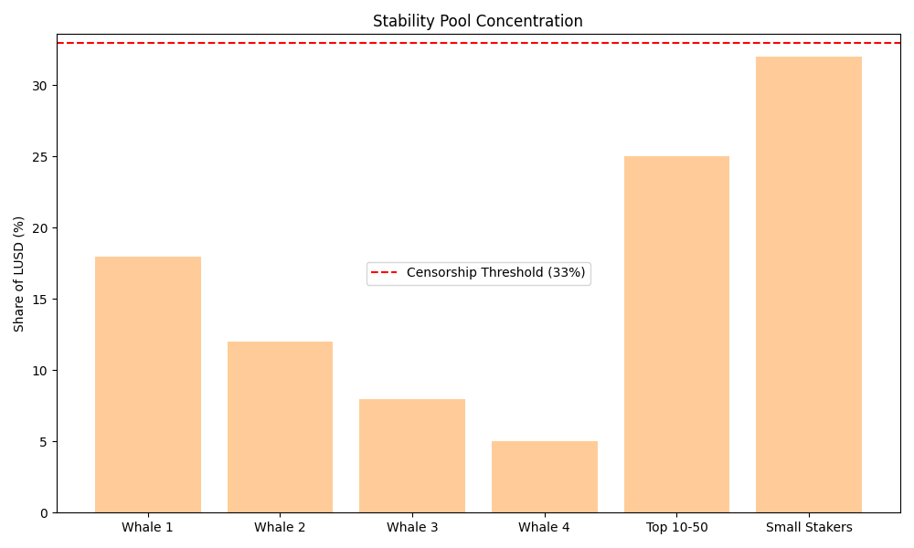

# Liquity (LUSD): Decentralization Profile

**Date:** January 2026  
**Subject:** Liquity V1 (LUSD)  
**Framework:** Stablecoin Decentralization Framework (v3.0)  
**Status:** 🟢 **Platinum Standard** (Fully Decentralized)

---

## 1. Decentralization Scorecard

| Dimension | Score (0-1) | Status | Key Driver |
|:---|:---|:---|:---|
| **Governance (G)** | **1.00** | 🟢 **Perfect** | **No Governance.** Contracts are immutable. No parameter updates possible. |
| **Collateral (C)** | **1.00** | 🟢 **Perfect** | **ETH Only.** 100% On-chain, trustless backing. No RWA/USDC. |
| **Operational (O)** | **0.95** | 🟢 **Decentralized** | "Headless" frontend network. Keepers are permissionless. |
| **Emergency (E)** | **1.00** | 🟢 **Perfect** | **No Admin Keys.** No pause, no shutdown, no blacklists. |

### Composite Score
- **Calculated:** **0.99**
- **Binding Constraint:** None.
- **Final Classification:** **Fully Decentralized**

> **Verdict:** Liquity V1 is the industry benchmark for decentralization. It relies on no human intermediaries, no legal custodians, and no governance delegates. It is "Code as Law" in its purest form.

*Figure 1: Liquity V1 Decentralization Profile. Achieving near-perfection across all dimensions due to its immutable, governance-free design.*

---

## 2. Dimension Analysis

*Figure 2: The "Perfect Circle". Liquity scores nearly 1.0 across all dimensions, representing the ideal decentralized state.*

### 2.1 Governance (The Vacuum)
*   **Mechanism:** None.
*   **Implication:** It is impossible to coerce the protocol. Even if the entire team were subpoenaed, they cannot upgrade the contract to censor a user.
*   **Contrast:** Sky (Gini 0.98, Top-1 86%) vs Liquity (Null).

### 2.2 Collateral (The Fortress)
*   **Metric:** 100% ETH. [Source: `../data/collateral_data.json`]
*   **Counterparty Risk:** 0%.
*   **Implication:** Liquity inherits the censorship resistance of Ethereum itself. It has no "USDC Freeze" vector.

*Figure 3: V1 Collateral Composition. 100% ETH Purity vs V2's mixed LST model.*

### 2.3 Operational (The Headless Brand)
*   **Frontend Decentralization:** Liquity has no official website. It relies on 15+ third-party frontends (e.g., DeFi Saver, Liquity.app).
*   **Implication:** A DOM seizure (like Tornado Cash) is ineffective because the frontend layer is distributed.

*Figure 4: Frontend Market Share. The "Kickback" mechanism successfully decentralized the access layer.*

---

## 3. Stress Test Results

### Test 1: Collateral Freeze (USDC Scenario)
*   **Scenario:** Regulatory crackdown on stablecoins.
*   **Analysis:** **Fail-Safe.** Liquity holds no USDC. It is immune to asset freezing.
*   **Resilience:** **100%.**

### Test 2: Keeper Exit (Liquidity Shock)
*   **Scenario:** Network congestion prevents liquidations.
*   **Analysis:** **Stability Pool.** Liquidations are *instant* and atomic, engaging the Sustainability Pool's pre-funded LUSD. Keepers are only needed for the `liquidate()` call, which is highly profitable.
*   **Resilience:** **High.**

*Figure 5: Stability Pool Concentration. While whale-heavy, the pool structure prevents single-entity blocking of liquidations.*

### Test 3: Governance Capture
*   **Scenario:** Hostile takeover of LQTY token.
*   **Analysis:** **Impossible.** LQTY is a revenue-claim token, not a governance token. Acquiring 51% of LQTY grants $0 of control over the protocol logic.
*   **Resilience:** **100%.**

---

## 4. Note on Liquity V2 (BOLD)

Liquity V2 introduces a **Governance-Lite** model and **LST Collateral**.
*   **Governance Score (V2):** ~0.90 (Limited scope: Incentives only).
*   **Collateral Score (V2):** ~0.60 (Risk of LST centralization via Lido/RocketPool).
*   **Trade-off:** V2 trades "Perfect Decentralization" for "Sustainability" (Inflation-free growth).

---

### Data Sources
*   *Liquity Dune Analytics Dashboard*
*   *Contract Source Code (Verified Etherscan)*
*   *DefiLlama Frontends List*
