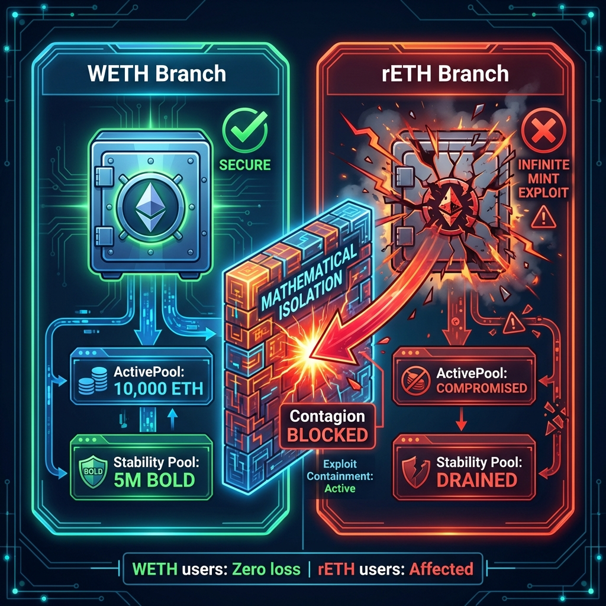
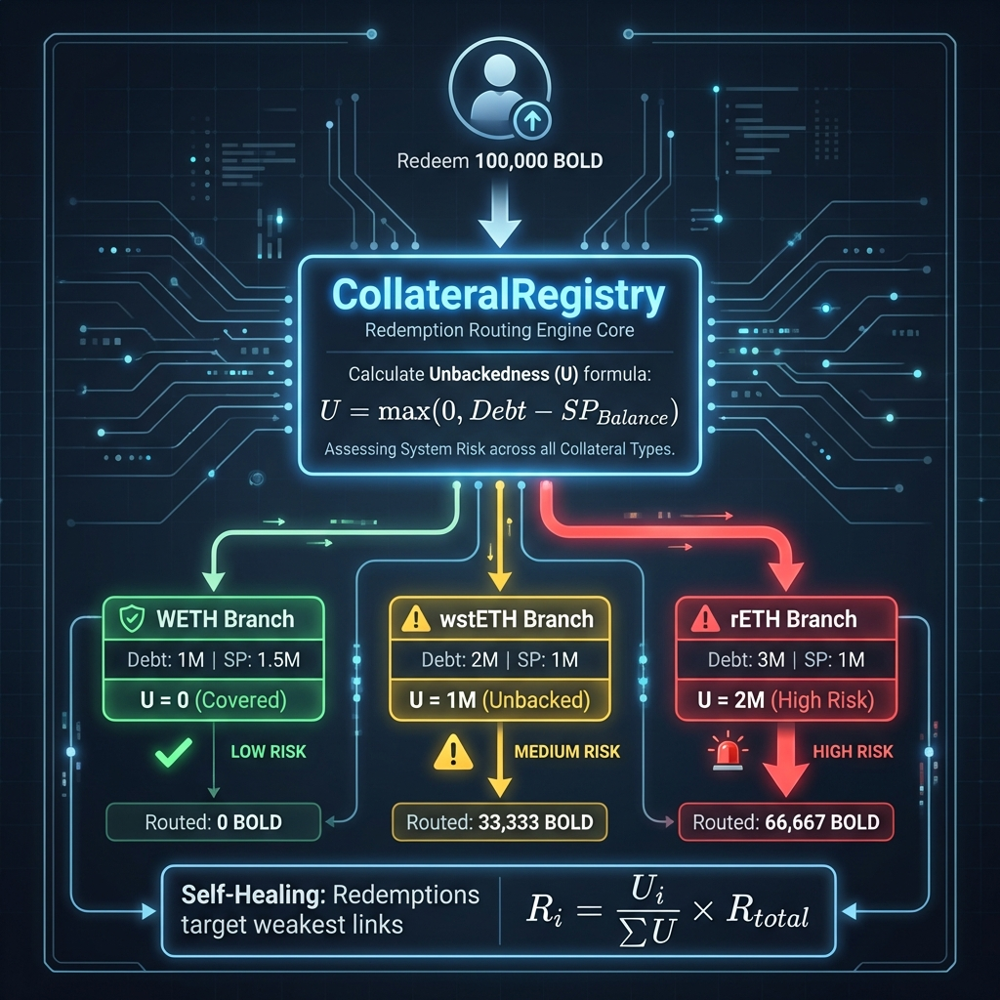
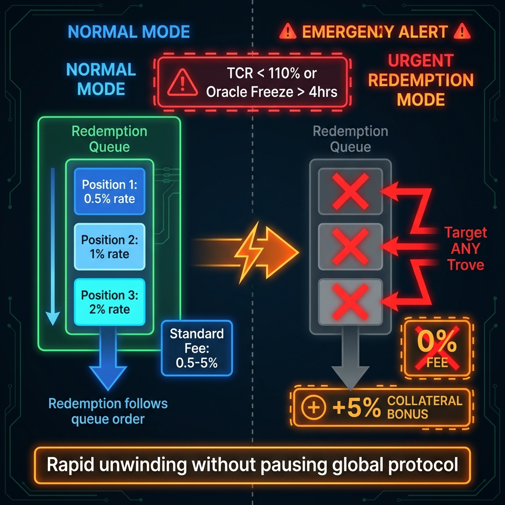

# Liquity V2 (BOLD): Kinetic Solvency & Backing Mechanics

**Authors**: Research Challenge Team
**Date**: January 2026
**Series**: Liquity Research Series (Part I - Backing Mechanism)
**Source**: Consolidated from detailed analysis

---

## Abstract

This report analyzes the **Kinetic Solvency** of Liquity V2 (BOLD). Unlike the "Siloed" model of V1 (ETH-only), V2 introduces a **Federated Solvency** architecture. It compartmentalizes risk into isolated "Branches" (e.g., WETH, wstETH) while unifying liquidity via a global liability token (BOLD).

The core innovation—**Algorithmic Unbackedness Routing**—transforms redemption from a simple peg mechanism into a "Self-Healing" immune system that automatically targets the system's riskiest debt. This is coupled with a **User-Set Interest Rate** mechanism that turns the cost of capital into a localized solvency defense budget.

> [!IMPORTANT]
> **Critical Lens**: This analysis focuses on the "Physics" of the liquidation engine. We assume a hostile environment where individual collateral assets (LSTs) may fail completely.

---

## 1. Introduction: The Siloed Liability Model

### 1.1 The Technical Problem: Collateral Contagion

In a **Unified Debt Model** (e.g., MakerDAO's `Vat`), solvency is calculated globally. The system sums the value of all collateral assets and compares it to total issued debt. This creates three vectors for systemic contagion:

1. **Oracle Corruption**: A single manipulated feed can create false solvency/insolvency across all assets
2. **Lowest Common Denominator**: Users underwrite the risk of the *riskiest* asset in the pool
3. **Bad Debt Cascade**: Failure in one vault type socializes losses to the entire system

### 1.2 V2's Core Insight: Separate Solvency, Unify Liability

Liquity V2 inverts the standard Multi-Collateral logic:

> **Instead of pooling assets to back a liability, it pools liabilities to monetize isolated assets.**

**The Solvency Invariant:**
$$\text{Solvency}_{\text{Global}} = \min(\text{Branch}_1, \text{Branch}_2, ... \text{Branch}_n)$$

* **The Hub (Registry):** Manages the global liability (BOLD) and routes redemptions. Holds **zero collateral**.
* **The Spokes (Branches):** Independent markets (WETH, rETH) that hold collateral and manage their own risk parameters.

---

## 2. Architecture: The Hub-and-Spoke Registry

### 2.1 The Hub: CollateralRegistry as Solvency Router

The `CollateralRegistry` acts as the system's "Solvency CPU." It **holds no collateral** but routes redemptions based on risk:

1. **Risk Aggregation:** Queries every Branch for its "Unbackedness"
2. **Algorithmic Routing:** Directs redemption volume proportionally to highest-risk branches
3. **Asset Dispatch:** Instructs specific Branches to release assets
4. **Liability Extinguishment:** Burns BOLD tokens globally

*Fig 2.1: Detailed schematic of the CollateralRegistry Hub showing the Unbackedness data flows and redemption routing logic.*

### 2.2 The Spokes: Isolated Branch Economies

Each Branch is a fully self-contained lending market with five components:

| Component | Function |
|:---|:---|
| **TroveManager** | Manages debt positions, applies rates, executes liquidations |
| **ActivePool** | Holds raw collateral (ONLY this asset type) |
| **StabilityPool** | First line of defense for this branch only |
| **DefaultPool** | Receives debt from overwhelmed SP |
| **BorrowerOperations** | User interface for loans |

### 2.3 The Bulkhead Security Pattern

**The Contagion Firewall:**
If rETH suffers an infinite mint exploit, the rETH branch becomes insolvent. However, the WETH `ActivePool` is mathematically isolated—the contagion cannot cross the boundary.

* **Failure Mode:** The rETH branch shuts down
* **Impact on WETH:** **Zero**
* **User Protection:** Only users who opted into rETH risk are affected

*Fig 2.3: The Bulkhead Pattern ensures that an infinite mint exploit in the rETH branch cannot drain the WETH Stability Pool.*

---

## 3. The Soft Peg: User-Set Interest Rates

### 3.1 The Price of Protection (θ)

Borrowers purchase **Redemption Insurance** via their interest rate:

* **Low Rate:** "I am the First Responder" (High redemption risk, cheap liquidity)
* **High Rate:** "I am the Protected Core" (Safety premium, pushed to head of queue)

Redemptions always hit the lowest-rate borrowers first (LIFO priority).

### 3.2 The 75% Yield Split

75% of all interest revenue routes directly to the branch's Stability Pool ([Liquity, 2025](#ref-liquity-v2-docs)):

$$\text{High Risk} \rightarrow \text{High Rates} \rightarrow \text{Deep SP} \rightarrow \text{Secure Backing}$$

### 3.3 Anti-Fragility Constraints

* **Minimum Borrow Rate (0.5%):** Baseline revenue even in "safe" times
* **Premature Adjustment Fee:** Prevents front-running rate changes

---

## 4. The Hard Peg: Algorithmic Unbackedness Routing

### 4.1 Compute Global Unbackedness

$$U_i = \max(0, \text{RecordedDebt}_i - \text{SPBalance}_i)$$

* **Secure Branch (U=0):** SP covers all debt—no systemic risk
* **Fragile Branch (U>0):** Exposed to liquidation failure

### 4.2 Proportional Routing

$$R_i = \frac{U_i}{\sum_{j=1}^{N} U_j} \cdot R_{\text{total}}$$

**The "Healing" Effect:**

* rETH has high debt, empty SP ($U_{rETH}$ = high)
* WETH has deep SP ($U_{WETH}$ = 0)
* User redeems 100,000 BOLD
* **Result:** 100% routed to rETH. WETH untouched.

### 4.3 Dynamic Redemption Fee

$$f(t) = f_{base} + b(t)$$

Where $b(t)$ spikes with volume and decays over time—ensuring redemptions only occur when profitable.

*Fig 4.1: The CollateralRegistry routes redemptions proportionally to each branch's Unbackedness, targeting high-risk branches first.*

---

## 5. Solvency: The Liquidation Waterfall

### 5.1 Primary: Stability Pool Offset

* **Mechanism:** Atomic swap—burns BOLD, receives collateral
* **Speed:** Instant (no auction delay)
* **Scaling:** 75% yield split ensures SP depth scales with risk

### 5.2 Secondary: Redistribution

If SP is empty:
$$\text{RemainingDebt} = \text{EntireDebt} - \text{Offset}_{SP} \rightarrow \text{DefaultPool}$$

* **Effect:** All active borrowers in branch receive proportional debt + collateral
* **Net Value:** Positive (CR > 100% at liquidation)
* **CR Impact:** Decreases (taking on leverage)

### 5.3 Gas Compensation

* **Fixed Stipend:** 0.0375 ETH per liquidation
* **Variable Bounty:** 0.5% of collateral

---

## 6. Terminal Defenses: Granular Shutdown

### 6.1 Trigger Conditions

1. **Economic Insolvency:** TCR < 110% (Event Horizon)
2. **Epistemic Failure:** Oracle freeze > 4 hours
3. **Governance Safety:** Optional sunset for experimental assets

### 6.2 Urgent Redemption Mode

Once shutdown triggers:

* **Queue Bypass:** Redeemers can target *any* Trove
* **0% Fee:** Standard redemption fee waived
* **Collateral Bonus:** Redeemer receives $1.00 + Bonus worth

**Goal:** Rapid unwinding of specific insolvent branch without pausing global protocol.

*Fig 6.1: When a branch becomes unsafe, Urgent Mode bypasses the queue, waives fees, and adds collateral bonuses to accelerate unwinding.*

---

## 7. Conclusion: Modular Liability

Liquity V2 represents the evolution from **Monolithic Solvency** to **Modular Liability**. By unbundling the stablecoin from its backing:

* **Kinetic Integrity:** High. Self-healing redemption mechanism.
* **Asset Risk:** Isolated. Users only underwrite chosen branch risk.
* **Contagion:** Firewalled. Branch failure ≠ Protocol failure.

---

### Series Navigation

* **Part I: Kinetic Solvency (Backing)** (You are here)
* [Part II: Economic Sustainability](./Liquity_V2_Economic_Resilience.md)
* [Part III: Decentralization Risk](./Liquity_V2_Decentralization_Analysis.md)

---

## References

Liquity. (2025). *[Liquity V2 Technical Documentation](https://docs.liquity.org/v2/)*. Protocol Documentation.

Internal Research. (2026). *[Liquity V2 Economic Resilience](./Liquity_V2_Economic_Resilience.md)*. Canonical Artifact.

Internal Research. (2026). *[Liquity V2 Decentralization Analysis](./Liquity_V2_Decentralization_Analysis.md)*. Canonical Artifact.

Internal Research. (2026). *[General Backing Framework](./general_backing_framework.md)*. Methodological Framework.

Internal Research. (2026). *[Liquity Backing Mechanism Analysis Draft](./Backing-Mechanism.md)*. Source Document.
