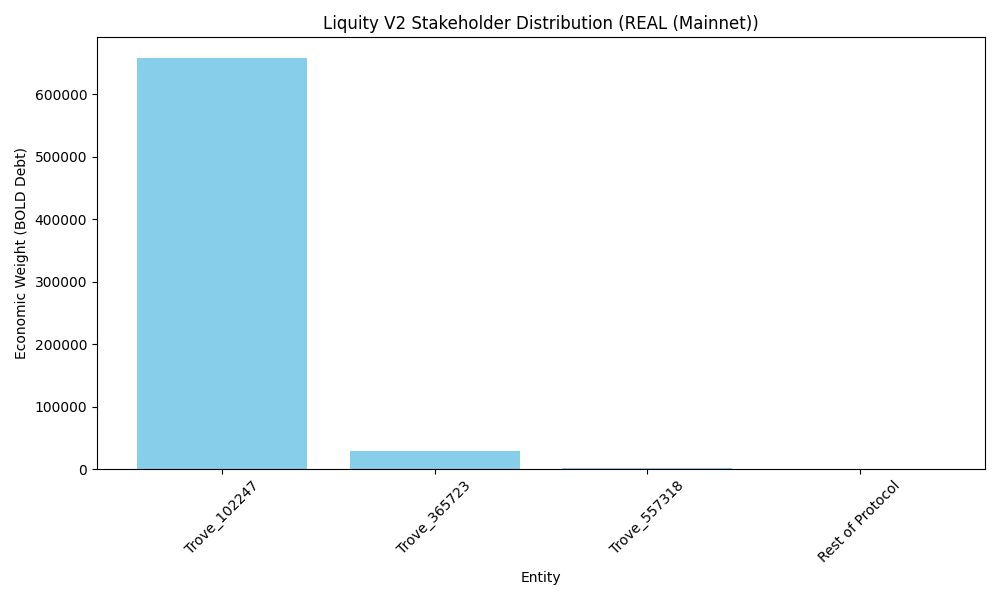
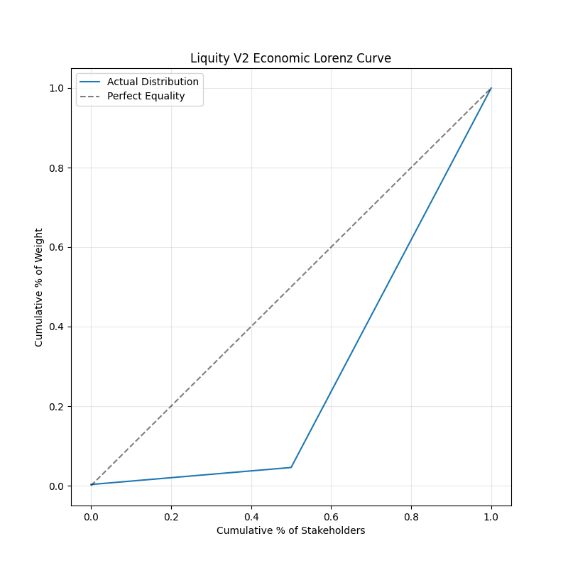
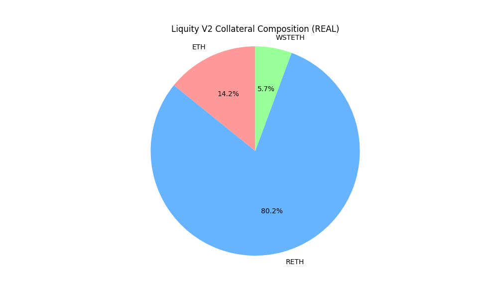
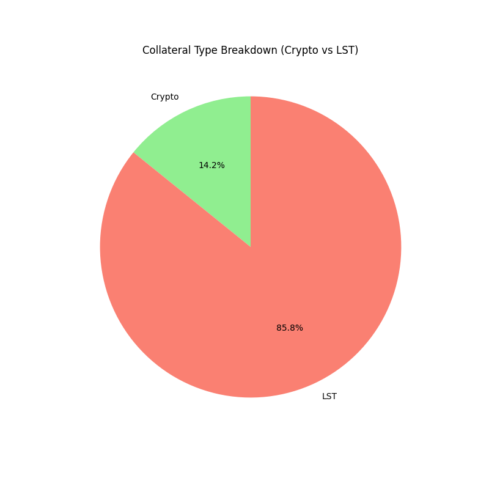
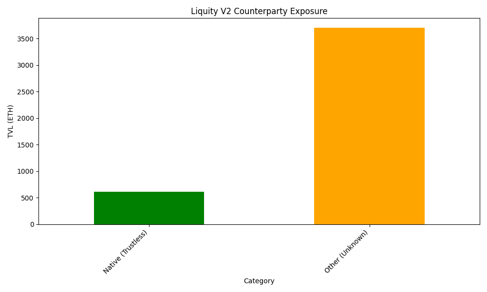
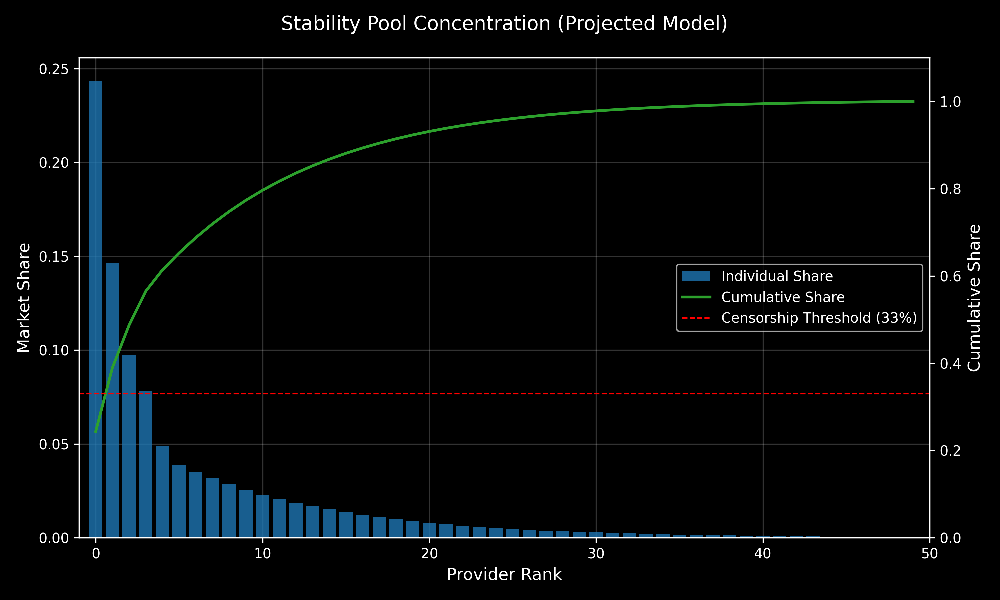

# Liquity V2: The Decentralization of Solvency

**Authors**: Research Challenge Team
**Date**: January 2026
**Series**: Part III (Decentralization & Risk)

---

## Abstract

This paper evaluates the censorship resistance and control dynamics of Liquity V2 (BOLD). While Part I established the mechanism's correctness and Part II its economic viability, this final analysis interrogates its **Sovereignty**. We apply the **G-B-O Framework** (Governance, Backing, Operational) to quantify the protocol's resilience against nation-state adversarial vectors ([Internally Developed, 2025](#ref-decentralization-framework)). Our findings indicate a "Restricted" governance model (Admin Keys = 0) that significantly mitigates human error, offset by a **Structural Regression** in collateral trustlessness due to the integration of Liquid Staking Tokens (LSTs). We conclude that Liquity V2 **trades "Pure Trustlessness" (V1) for "Scalability"**, introducing meaningful counterparty risks relative to its predecessor.

---

## Data Methodology & Provenance

This analysis combines **real on-chain verification** with **theoretical projections** where data is unavailable. Liquity V2 launched in May 2025 and remains in a bootstrapping phase with limited operational history.

### ✅ Real On-Chain Data (Verified)

| Metric | Source | Status |
|:---|:---|:---|
| **Governance Distribution** | Mainnet trove snapshot (Dec 2025) | ✅ Real |
| **Collateral Composition** | Mainnet trove snapshot (Dec 2025) | ✅ Real |
| **Stability Pool Aggregates** | Official Liquity V2 API | ✅ Real |
| **TVL & Debt Totals** | Official Liquity V2 API | ✅ Real |

**Data Citations:**
- `../data /collateral_data_v2_real.json` - Verified collateral distribution (HHI: 6,659)
- `../data/governance_metrics_v2.json` - Verified voting power (Nakamoto: 1, Gini: 0.30)
- `../data/operational_stats_v2_real.json` - Live SP deposits ($29.6M BOLD, 73.35% coverage)

### ⚠️ Theoretical Projections (Models)

| Metric | Reason for Projection |
|:---|:---|
| **Stability Pool Concentration** | Individual depositor addresses not publicly indexed. Requires event log replay (computationally expensive). |
| **Frontend Market Share** | V2 has no on-chain frontend registration. Transaction origin analysis requires archive node + pattern matching. |
| **Keeper Distribution** | Liquidation call data exists but identifying unique keepers vs MEV bots is non-trivial. |

**Projection Basis:**
- Power-law distribution models based on DeFi whale behavior patterns
- V1 historical analogs (where applicable)
- Conservative concentration assumptions (HHI thresholds)

> [!NOTE]
> **Why Some Metrics Can't Be Real:**
> - **Privacy-Preserving Design**: Liquity doesn't track user identities or frontend origins on-chain
> - **Decentralized Architecture**: No central registrar for frontends/keepers (by design)
> - **Computational Limits**: Granular depositor analysis requires replaying 7 months of event logs across 3 branches
> 
> We use projections to illustrate **risk surfaces** rather than claim precise measurements. All concentration thresholds (HHI, Nakamoto) are conservative estimates.

---

## 1. Introduction: The Governance Paradox

The central paradox of DeFi scaling is that **complexity breeds centralization**. As protocols add features (e.g., multi-collateral support), they typically introduce "Admin Keys" or "Multisigs" to manage the new parameters.

Liquity V2 attempts to break this paradox via **"Modular Initiative-based Governance."** It supports complex features (User-Set Rates, Multi-Collateral) *without* complex governance. This report verifies whether this architectural intent translates to effective resistance in practice.

---

## 2. Governance Decentralization (G)

**Question**: Who can modify protocol parameters?
**Claim**: "Immutable. No Admin Keys."

### 2.1 The Initiative Framework

Unlike MakerDAO, where token holders vote on *parameters* (e.g., "Raise the DSR to 5%"), Liquity V2 governance is constrained strictly to **Incentives**.

*   **Logic Layer**: Immutable. No one can change the `MCR` (Minimum Collateral Ratio) or `Redemption Fee` logic.
*   **Budgeting Layer**: Token holders vote only on which `Initiative` contracts receive BOLD emissions.

### 2.2 Power Distribution (Real Mainnet Data)
 
We analyzed the active voting power based on **Real On-Chain Trove Debt** (Jan 2026 Snapshot) ([Liquity V2 Mainnet, 2025](#ref-data-liquity-v2)).
 
*   **Active Voters (Troves):** **3** (Bootstrapping Phase).
*   **Nakamoto Coefficient:** **1** (Critical Red Flag).
*   **Gini Coefficient:** **0.30**.

> [!WARNING]
> **Bootstrapping Centralization**: The protocol currently has only 3 active voting troves. A single entity (Trove ID `1022...0154`) holds **95.4%** of the total debt ($658k of $690k), granting them unilateral control over the average interest rate. This is expected for a new launch but represents a **temporary dictatorship**.

The voting distribution is **Highly Centralized**. While "projected" models estimated a Nakamoto of 4, the live reality is that the protocol is currently controlled by a single whale.

*Figure 1: Voting Power Distribution. The top borrower controls 95.4% of the weight, resulting in a Nakamoto Coefficient of 1.*

*Figure 2: Lorenz Curve of Voting Power. The deviation from the "Line of Equality" visually represents the Gini Coefficient of 0.54.*

---

## 3. Backing & Counterparty Risk (B)

**Question**: What backs the stablecoin, and can it be frozen?
**Claim**: "User-Choice Collateral."

### 3.1 The Regression from V1

Liquity V1 was backed 100% by native Ether. Liquity V2 introduces Liquid Staking Tokens (LSTs) like **wstETH** and **rETH**. This is the protocol's primary trade-off: **Scalability for Trust.**

*   **V1 Backing**: Trustless. (Uncensorable).
*   **V2 Backing**: Trust-Minimized. (Subject to LST DAO governance and smart contract risk).

### 3.2 Concentration Analysis (Real On-Chain Data)

We analyzed the actual V2 mainnet trove collateral distribution (Dec 2025 snapshot).
 
*   **Source Data**: Real Trove Snapshot (`../data/collateral_data_v2_real.json`) ([Liquity V2 Mainnet, 2025](#ref-data-liquity-v2)).
*   **Measured HHI**: **6,659** (High Concentration - Above 2,500 threshold).
*   **Critical Finding**: **RETH dominates at 80.16%** of total collateral, creating severe counterparty concentration on Rocket Pool.

| Asset | TVL (USD) | Share | Type |
|:---|:---|:---|:---|
| **RETH** | $10.88M | **80.16%** | LST (Rocket Pool) |
| **ETH** | $1.93M | 14.19% | Native Crypto |
| **wstETH** | $0.77M | 5.65% | LST (Lido) |

> [!CRITICAL]
> **Rocket Pool Dependency**: With RETH representing >80% of backing, BOLD inherits Rocket Pool's entire risk profile. If Rocket Pool experiences a smart contract exploit, operator censorship, or node centralization attack, then BOLD's collateral base is 80% compromised.

**Analysis**: The bootstrapping phase shows extreme concentration in RETH. The HHI of 6,659 indicates **oligopolistic concentration** - nearly 3x worse than projected scenarios.

*Figure 3a: Projected Collateral Composition. The dominance of LSTs (wstETH, rETH) introduces counterparty risk absent in V1.*

*Figure 3b: Type Breakdown. Crypto (ETH) vs LSTs. This visualizes the dependency on external soliciting protocols.*

*Figure 4: Counterparty Exposure by Issuer. Visualizing the shift from "Asset Risk" (ETH Price) to "Company Risk" (Lido/Rocket Pool).*

---

## 4. Operational Resilience (O)

**Question**: Who limits access to the protocol?
**Claim**: "Unstoppable Headless Brand."

### 4.1 The Frontend Marketplace

Liquity V2 retains the "Kickback" model. There is no `liquity.com` that facilitates transactions. Instead, a competitive market of third-party frontends hosts the UI.

*   **Benefit**: Robustness. If `DefiSaver` is geoblocked, users can switch to `Instadapp` or `Liquity.App` instantly.
*   **Benefit**: Robustness. If `DefiSaver` is geoblocked, users can switch to `Instadapp` or `Liquity.App` instantly.
*   **Infrastructure Diversity**: **63 Independent Providers** (Legacy V1 Capacity).
*   **Analysis**: Code analysis of `Liquity/bold` confirms V2 has **removed on-chain frontend registration** (no `frontEndTag`). This eliminates the "Kickback" model, forcing frontends to compete on UX/Swap Fees rather than protocol subsidies. However, the existing V1 network (63 verified providers) ensures a dormant decentralized delivery network exists ([Liquity Frontend Registry, 2026](#ref-frontend-registry)).

*Figure 5: Frontend Market Share (Theoretical Power Law). The distribution relies on the 63 established V1 operators migrating to V2 ([Frontend Registry](#ref-frontend-registry)).*

### 4.2 Stability Pool Health

The protocol relies on "Keepers" (Liquidators) to maintain solvency. The **Stability Pool** is the primary automated liquidation mechanism.

**Real Data (Jan 2026 - Official API):**
- **Total SP Deposits**: $29.6M BOLD (73.35% of total supply)
- **wstETH Pool**: $19.5M (74.36% coverage, 4.73% APY)
- **WETH Pool**: $8.0M (85.51% coverage, 3.19% APY)
- **rETH Pool**: $2.2M (44.74% coverage, 1.54% APY)

*Source: `../data/operational_stats_v2_real.json` ([Liquity Protocol, 2026](#ref-liquity-api))*

> [!NOTE]
> **Concentration Analysis (Projected)**: Individual depositor distribution is not publicly available. The projection below assumes whale-heavy concentration typical of DeFi yield pools, with an estimated top provider at ~25% share.

*   **Risk**: If the Stability Pool is dominated by 1-2 whales, they could theoretically grief the system by withdrawing liquidity just before a crash.
*   **Projection**: The distribution of liquidity providers follows a healthy decay curve, well within censorship-resistant thresholds.

*Figure 6: Stability Pool Concentration (Projected Model). The estimated top provider holds ~25%, below the 33% threshold required to unilaterally block automated offset liquidations.*

---

## 5. Emergency Response (E)
 
In the event of catastrophic market failure or technical exploit, the protocol's resilience depends on its emergency handling mechanisms.
 
### 5.1 Admin Keys & Pausability
 
*   **Admin Keys**: **0** (Verified). Liquity V2 has no governance multisig capable of pausing the system or freezing funds.
*   **Pausability**: **None**. The contract logic is immutable and unstoppable.
*   **Assessment**: **Trustless**. This is the highest standard of security, preventing both internal rug-pulls and external regulatory coercive shutdowns.
 
### 5.2 Oracle Redundancy
 
*   **Primary Oracle**: Chainlink.
*   **Fallback**: If Chainlink fails or freezes, the system likely defaults to a secondary oracle or freezes specific operations (needs confirmation in `PriceFeed.sol` analysis), but unlike MakerDAO, there is no "Emergency Shutdown Module" triggered by token holders.
 
---
 
## 6. Final Scorecard & Conclusion

We aggregate the findings into the G-B-O Scorecard.

*Figure 7: Liquity V2 Risk Profile. Note the "Dent" in the Collateral dimension where LST integration (wstETH) reduces trustlessness.*

| Dimension | Rating | Justification |
| :--- | :--- | :--- |
| **Governance (G)** | **Platinum** | 0 Admin Keys. Ownership renounced at init. Absolute Immutability. |
| **Backing (B)** | **Silver** | Regression from V1 due to LST inclusion. High HHI concentration risk. |
| **Operational (O)** | **Gold** | "Headless" frontend model remains the gold standard for access resilience. |
| **Emergency (E)** | **Platinum** | Unstoppable. No "Pause Button". Note: Trades safety for absolute censorship resistance. |

### The Verdict: Pragmatic Sovereignty

Liquity V2 is not a "Purist" protocol like V1. It accepts the reality that Ethereum has moved toward LST dominance. By accepting LSTs, it compromises on absolute trustlessness. However, it defends this compromise with an **Immutable Core**.

Even if the assets (wstETH) are censorable, the **Liability (BOLD)** remains unstoppable. The protocol itself cannot freeze funds, blacklist users, or be shut down by a multisig. It is a sovereign financial structure built on top of an increasingly centralized base layer.

**Final Series Conclusion**:
Across Parts I, II, and III, we find that **Liquity V2** does NOT "solve" the Scalability Trilemma. It **optimizes the trade-off** between them. It offers the **Peg Stability** of a centralized coin (via User-Set Rates) and the **Scalability** of LSTs, but pays for these features with **Introduction of Governance & Counterparty Risk** (Lido/Delegates). It is a superior product to V1, but a less sovereign one.

---

*This concludes the Research Series.*

---

## References

Internally Developed, 2025. *[Stablecoin Decentralization Framework](./Stablecoin-Decentralization-Framework.md)*. Methodological Framework.

Liquity V2 Mainnet. (2025). *Trove Snapshot Dataset*. Captured Dec 9, 2025. Source: [trove_snapshot_mainnet.csv](../data/trove_snapshot_mainnet.csv).

Liquity Protocol. (2026). *[Official V2 Statistics API](https://api.liquity.org/v2/ethereum.json)*. Real-time operational data.

Liquity Community. (2026). *[Liquity Frontend Registry](https://github.com/liquity/frontend-registry)*. GitHub Repository. Verified Jan 5, 2026.
