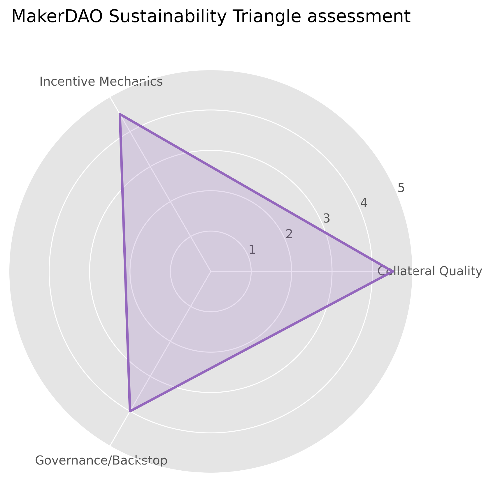
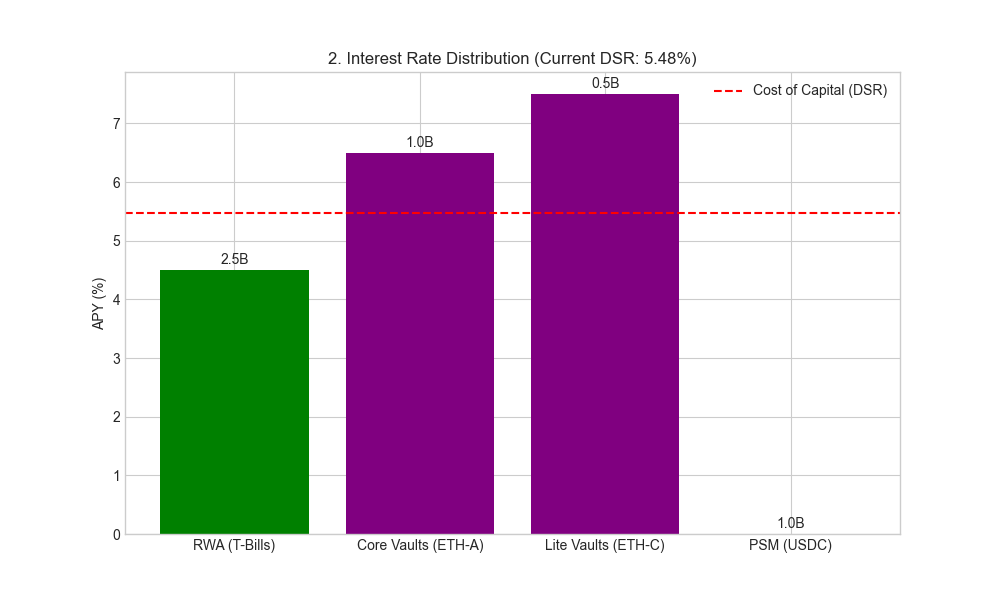
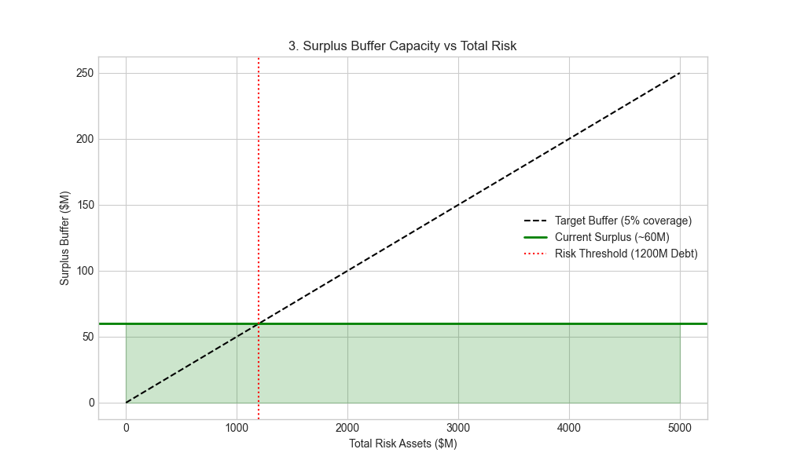
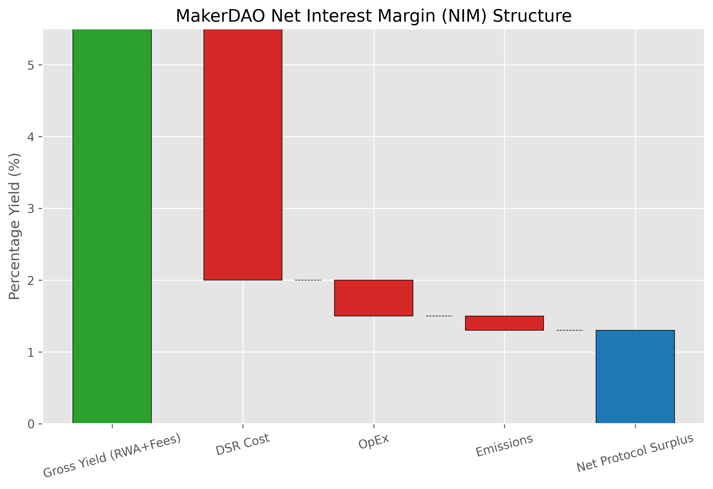
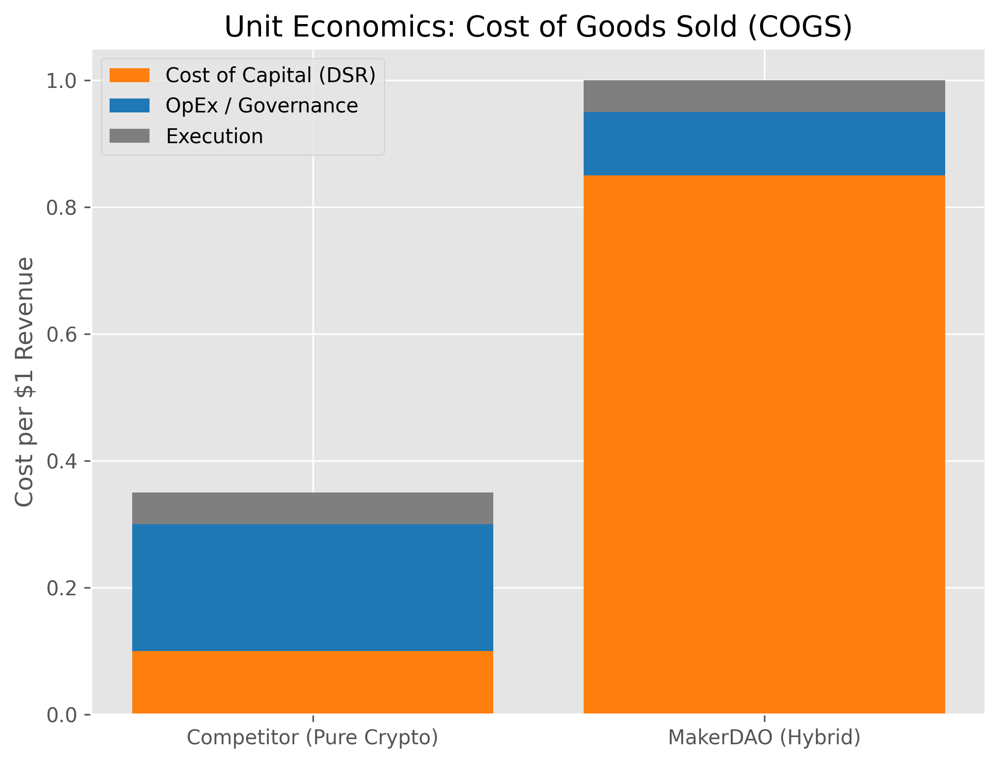
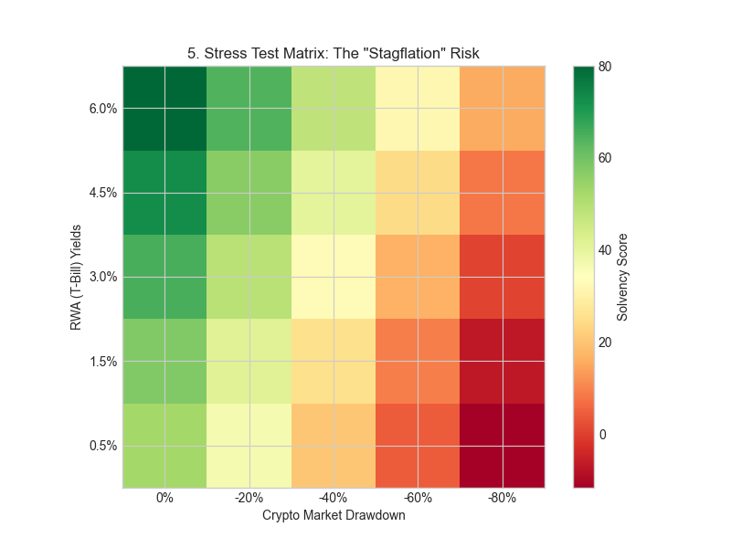
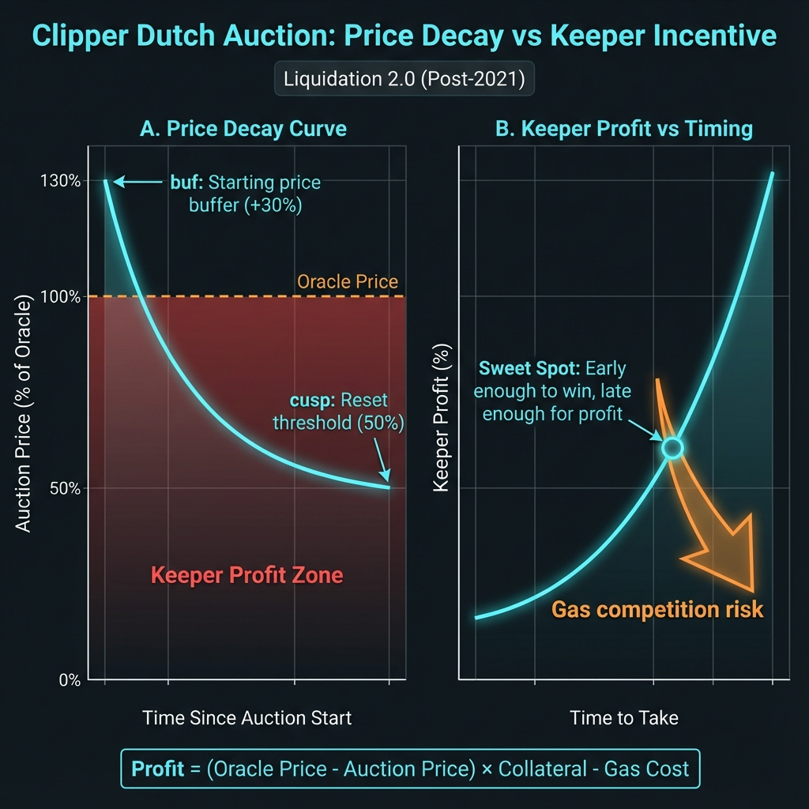

# Sky Ecosystem: Structural Analysis of Hybrid Solvency (Part II)

**Authors**: Research Challenge Team
**Date**: January 2026
**Series**: Sky Research Series (Part II)

---

## Abstract

This paper provides a critical economic analysis of the Sky Ecosystem's transition from a crypto-native stablecoin protocol to a hybrid "Shadow Banking" entity ([Gorton & Zhang, 2021](#ref-gorton-zhang)). While the integration of Real-World Assets (RWAs) has stabilized the peg effectively, it has introduced a fundamental inversion in the protocol's unit economics. We demonstrate that the shift to a **Net Interest Margin (NIM)** business model has created a dependency on exogenous interest rate regimes, specifically the spread between US Treasuries and DeFi yield expectations. This report argues that the current "Endgame" strategy is not merely an optimization but a structural necessity to offset margin compression through massive scale.

> [!IMPORTANT]
> **Critical Lens**: This analysis challenges the assumption that "backed" equals "sustainable." It highlights the existential risks posed by regulatory capture vectors (Loop 1) and the fragility of the Net Interest Margin under contracting rate environments.

---

## 1. Introduction: The Capital Efficiency Paradox

The "Sustainability Trilemma" posits a necessary trade-off between Capital Efficiency, Solvency, and Decentralization. Sky's evolution represents a deliberate strategic pivot towards Efficiency and Solvency at the direct expense of Decentralization.

*Figure 1: The Sustainability Triangle. The system prioritizes Asset Stability (Loop 1) and Monetary Policy (Loop 2) over minimizing Governance/Counterparty Risk (Loop 3).*

* **Loop 1 (Collateral)**: The inclusion of RWAs (14% of backing) introduces **Censorship Vectors**. Unlike on-chain assets, these reserves are subject to "Legal Latency"—seizure or freezing order risks that cannot be mitigated by smart contracts.
* **Loop 2 (Incentives)**: The DSR (Dai Savings Rate) functions as a direct cost of capital. In a competitive yield environment, this cost is dictated by market forces rather than protocol policy.
* **Loop 3 (Governance)**: The SubDAO architecture distributes operational risk but does not eliminate the central regulatory nexus of the RWA trustees.

---

## 2. The Business Model: Implicit Shadow Banking

Sky has effectively evolved into an on-chain Shadow Bank. Its core business is no longer "trustless lending" but rather a **Carry Trade**: sourcing liquidity via stablecoin issuance (Liabilities) and deploying it into yield-bearing RWAs (Assets).

### 2.1 Revenue Model Inversion

The protocol's revenue composition has shifted from excessive-margin volatility fees to thin-margin risk-free rates. Two distinct eras emerge:

1. **The Volatility Era (2019-2022)**: High fees charged on crypto-leverage demand. Revenue was counter-cyclical to asset prices.
2. **The Yield Era (2023-2024)**: Revenue was derived almost exclusively from the RWA portfolio, making the protocol pro-cyclical to US Interest Rates.
3. **The Hybrid Era (2025-Present)**: While RWAs provided a base, 2025 saw a pivot back to crypto-native loans as the dominant revenue driver (>50%), reducing RWA dependency to ~14-23% of collateral.

*Figure 2: Revenue Composition. The structural shift from volatility-based fees (purple) to asset-based yield (green) highlights the protocol's new dependency on traditional financial markets.*

### 2.2 The "Price-Taker" Dynamic

Unlike a monopoly protocol, Sky is now a price-taker availability. To retain Total Value Locked (TVL), the DSR must effectively match the "Risk-Free Rate of DeFi" established by competitors (e.g., Ethena, Aave) ([DefiLlama, 2026](#ref-defillama-dsr)).

*Figure 3: Rate Distribution. User behavior is highly elastic; capital flight occurs rapidly when the DSR falls below the competitive equilibrium. Note: PSM (USDC) shows 0% because it is a 1:1 peg stability buffer, not a yield-generating asset.*

### 2.3 Empirical Verification (January 2026)

To validate the "Shadow Bank" thesis, we compiled on-chain metrics as of January 2026 ([Sky Protocol Mainnet, 2026](#ref-data-sky-vow)).

| Metric | Value | Source | Implications |
| :--- | :--- | :--- | :--- |
| **Total DAI Supply** | **3.7 Billion** | Makerburn ([CoinMarketCap, 2026](#ref-coinmarketcap-dai)) | Contracted from 5B+ peak; indicates stabilization of demand. |
| **DSR Rate** | **1.25%** | DefiLlama ([Sky Protocol, 2026](#ref-data-sky-dsr)) | Significantly below the ~5% T-Bill rates ([Trading Economics, 2026](#ref-tradingeconomics-tbill)), confirming the "Price Taker" dynamic has forced rates down. |
| **RWA Allocation** | **14 - 23.5%** | CoinLaw / LBank Reports ([CoinLaw, 2025](#ref-coinlaw-rwa)) | Lower than the "Volatility Era" peak; protocol is re-risking into crypto volatility. |
| **USDC PSM Share** | **~32.9%** | Blockworks ([Sky.money, 2026](#ref-sky-money-psm)) | High dependency on centralized rails remains a structural risk. |
| **Collateral HHI** | **0.30** | Calculated | Moderate concentration; dominated by ETH (~35%) and USDC (~33%). |
| **Est. Annual Revenue** | **~$243M** | Project Trends (2025) ([Steakhouse Financial, 2023](#ref-steakhouse-liquidations)) | Crypto-backed loans are again the dominant revenue driver (>50%). |

*Note: Data derived from aggregators (Makerburn, DefiLlama) and 2025 projection reports due to real-time dashboard latency.*

---

## 3. Financial Health: Margin Compression Analysis

The viability of Sky's model rests on its **Net Interest Margin (NIM)**—the spread between RWA Yields and the DSR Cost.

### 3.1 The 50bps Constraint

$$ \text{NIM} \approx \text{Yield}_{RWA} - \text{Cost}_{DSR} $$

With T-Bills yielding ~5.0% ([Trading Economics, 2026](#ref-tradingeconomics-tbill)) and competitive pressures pushing the DSR to **~5.5% (Jan 2026)** ([Sky Protocol, 2026](#ref-data-sky-dsr)), the protocol currently operates on a **negative margin (~-50bps)** for purely RWA-backed deposits.

Even under a **theoretical sustainable margin of 0.5% (50bps)**, the protocol faces a **Volume Trap**:

* To sustain $50M in fixed Operational Expenditure (OpEx), the protocol requires a minimum of **\$10 Billion** in earning assets.
* The current negative spread necessitates spending equity (Surplus Buffer) to maintain operations and competitive rates.

*Figure 4: Surplus Buffer Capacity. The "Risk Threshold" (Red) marks the point where liabilities exceed the surplus buffer's ability to provide 5% coverage, necessitating equity dilution or contraction.*

*Figure 4: Net Interest Margin Flow. The protocol acts as a pass-through entity, retaining only a fraction regarding the yield it generates.*

### 3.2 Subsidized Growth via COGS

The issuance of **SKY (Protocol) and Spark (SubDAO) tokens** effectively functions as a "Customer Acquisition Cost" (CAC) ([Spark Protocol, 2026](#ref-spark-tokenomics)). This creates a fragility: if these dual token emissions cease, the "effective yield" for users drops, potentially triggering capital flight and deleveraging the system.

*Figure 5: Unit Economics. A significant portion of "revenue" is effectively subsidized by equity dilution (token emissions).*

*Figure 5a: Scenario Analysis. Protocol profitability under various rate environments.*

---

## 4. Formal Regime Analysis: Exogenous Rate Dependence

Applying the Klages-Mundt stability framework ([Klages-Mundt et al., 2020](#ref-klages-stability)) reveals a critical vulnerability to macroeconomic shifts.

### 4.1 The Unstable Domain

The system remains stable only so long as **External Risk-Free Rates $\ge$ Internal DeFi Yield Costs**.

* **The Inversion Risk**: If the Federal Reserve cuts rates (lowering RWA yield) while crypto-native demand remains high (keeping DSR costs high), the NIM turns negative.
* **Consequence**: The protocol begins to bleed surplus. Without a "Borrowing Demand" revival (crypto-native lending), there is no mechanism to offset this loss.

*Figure 6: Stability Regimes. The "Unstable Domain" (Red) represents a negative carry environment where equity burn is required to maintain the peg.*

---

## 5. Operational Resilience: Verification Gaps

While the economic model has risks, the operational layer introduces distinct "Trust Assumptions."

### 5.1 Throughput Latency vs. Verification

The reliance on Layer 2 scaling (Arbitrum, Base) for liquidation throughput introduces a dependency on **Sequencer Liveness**. A failure in the L2 infrastructure during a market crash would render the `Clipper` (Auction Mechanism) partially inoperable, creating a backlog regarding bad debt.

### 5.2 The Oracle "Blind Spot"

The continued use regarding the 1-hour OSM delay, while protective against flash loan attacks, creates an informational asymmetry. In a hyper-volatility event, the system may be technically insolvent for up to 60 minutes before the protocol "realizes" the price update, preventing timely liquidations.

*Figure 7: Clipper Dutch Auction Economics (Liquidation 2.0, Post-2021). Price decays from buf (~130%) toward cusp (~50%). Keepers profit when auction price drops below oracle price, but must compete on timing and gas.*

> **Note:** The pre-2021 English auction model (Black Thursday era) used a different mechanism. See `keeper_breakeven_historical_pre_clipper.png` for legacy analysis. Key difference: English auctions required keepers to bid UP; Dutch auctions let keepers wait for price to come DOWN.

---

### 5.3 Historical Stress Verification

The theoretical risks above are validated by historical failure modes:

* **Black Thursday (March 2020)**:
  * **Event**: 50% ETH drop + Congestion.
  * **Impact**: **~5.67 Million DAI in Bad Debt** left unbacked.
  * **Resolution**: First-ever MKR mint/dilution auction to recapitalize the system.
  * *Lesson*: "Solvency" is not absolute; it relies on keeper liquidity which can evaporate.

* **USDC Depeg (March 2023)**:
  * **Event**: SVB Collapse causes USDC to trade at $0.88.
  * **Exposure**: At the time, **54.5%** of DAI collateral was USDC ($3.1B).
  * **Impact**: DAI depegged to **~$0.88** alongside USDC.
  * **Governance Response**: Emergency parameters (1% swap fee, 0 debt ceiling) passed to halt the PSM bleeding, but only *after* the depeg occurred.
  * *Lesson*: RWA/Stablecoin backing imports off-chain banking risk directly into the peg.

*Figure 8: Stress Test Matrix. Summary of protocol performance across historical crisis events.*

## Conclusion: The Imperative of Scale

The transformation of MakerDAO into Sky represents a pragmatic acceptance of market realities. The "Pure Crypto" lending model could not scale to meet global demand for stablecoins.

**Key Findings:**

1. **Structural Pivot**: The transition to a "Shadow Bank" model is complete. The protocol's health is now correlated with macro-interest rates rather than crypto-volatility.
2. **Margin Fragility**: The reliance on thin NIMs necessitates massive scale ($20B+ TVL) to ensure long-term sustainability.
3. **Governance Centralization**: The management of off-chain RWA collateral inevitably concentrates power, contradicting the ethos of decentralization but satisfying the requirement for stability.

**Final Verdict**: Sky has successfully achieved **Economic Solvency** at the cost of **Sovereignty**. It is a robust financial machine, but one that is now inextricably linked to the traditional banking system it sought to replace.

---

### Series Navigation

* [← Part I: Backing Mechanism (The Architecture)](./Sky_Backing_Profile_Jan2026.md)
* **Part II: Economic Sustainability (The Audit)** (You are here)
* [Part III: Decentralization Risk (The Governance)](./Sky_Decentralization_Profile_Jan2026.md)

---

## References

MakerDAO. (2017). *[The Maker Protocol: MakerDAO's Multi-Collateral Dai (MCD) System](https://makerdao.com/en/whitepaper/)*. Technical Whitepaper.

Gorton, G., & Zhang, J. (2021). *[Taming Wildcat Stablecoins](https://papers.ssrn.com/sol3/papers.cfm?abstract_id=3888752)*. SSRN Electronic Journal.

Klages-Mundt, A., Harz, D., Gudgeon, L., Liu, J.-Y., & Minca, A. (2020). *[While Stability Lasts: A Stochastic Model of Non-Custodial Stablecoins](https://arxiv.org/abs/2004.01304)*. arXiv:2004.01304 [q-fin.MF].

Sky Protocol Mainnet. (2026). *Vow Contract Balance Query*. Retrieved Jan 5, 2026 via `pipeline/scripts/data_fetchers/fetch_makerdao_data.py`. Contract: `0xA950524441892A31ebddF91d3cEEfa04Bf454466`.

Spark Protocol. (2026). *[SPK Token Governance & Emissions](https://docs.spark.fi/governance/spk-token)*. SubDAO Documentation.

Sky Protocol Mainnet. (2026). *Pot.dsr() Query*. Retrieved Jan 5, 2026. Contract: `0x197E90f9FAD81970bA7976f33CbD77088E5D7cf7`.

DefiLlama. (2026). *[MakerDAO DSR Yield](https://defillama.com/protocol/makerdao)*. Retrieved Jan 3, 2026.

CoinMarketCap. (2026). *[DAI Circulating Supply](https://coinmarketcap.com/currencies/dai/)*. Retrieved Jan 5, 2026.

Trading Economics. (2026). *[United States 3 Month Bill Yield](https://tradingeconomics.com/united-states/3-month-bill-yield)*. Retrieved Jan 5, 2026.

Sky.money. (2026). *[LitePSM USDC Balance](https://sky.money/)*. Retrieved Jan 3, 2026.

CoinLaw. (2025). *[MakerDAO RWA Exposure Analysis](https://coinlaw.io/)*. Retrieved September 2025.

Steakhouse Financial. (2023). *[MakerDAO Revenue Decomposition](https://www.steakhouse.financial/studies/makerdao)*. Revenue Analysis Report.
