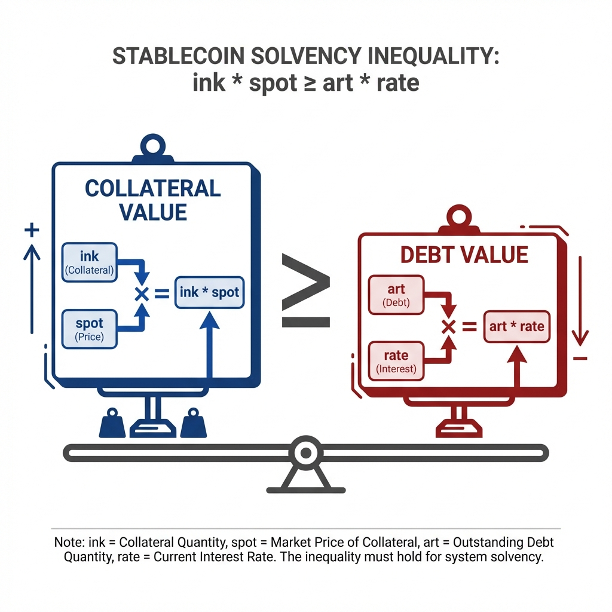
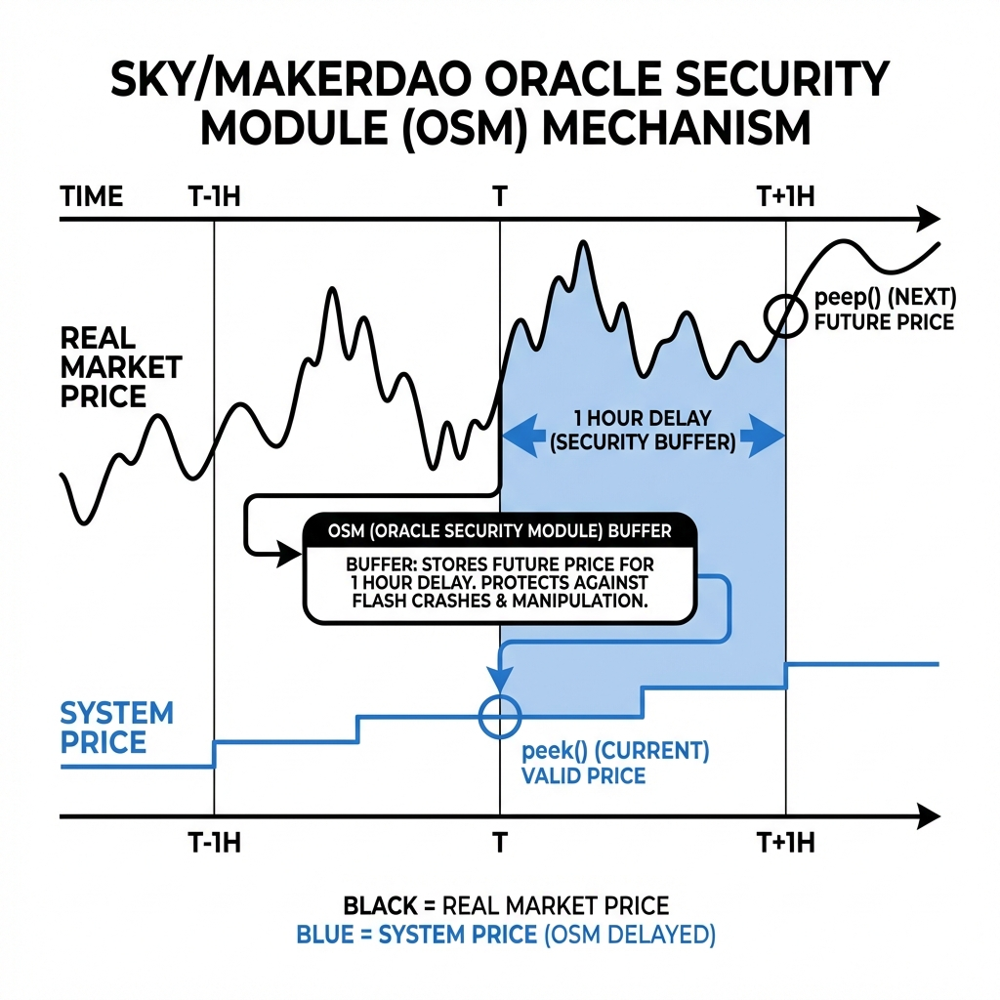

# Sky Ecosystem: Kinetic Solvency & Backing Mechanics (Part I)

**Authors**: Research Challenge Team
**Date**: January 2026
**Series**: Sky Research Series (Part I)

---

## Abstract

This report establishes the **Kinetic Solvency** baseline for the Sky Ecosystem (formerly MakerDAO). Unlike "Static Solvency" (Assets > Liabilities), Kinetic Solvency analyzes the system’s physical capacity to convert collateral into stablecoin liquidity during extreme stress. We demonstrate that the transition to **Liquidation 2.0 (Dutch Auctions)** has successfully mitigated the throughput congestion failures observed during Black Thursday (2020), rendering the protocol kinetically robust. However, this mechanical resilience is now coupled with a dependency on the **Oracle Security Module (OSM)** delay and a static reliance on centralized custodial assets (USDC).

> [!IMPORTANT]
> **Critical Lens**: This analysis separates the "Physics" of the protocol (Code, Auctions, Gas) from its "Economics" (Yield, Profit). We assume a hostile network environment (High Gas, MEV predation) to test if the machine functions mechanically.

---

## 1. Introduction: The Solvency Invariant

The integrity of USDS does not rest on a bank promise, but on a single mathematical inequality enforced by the `Vat` contract:

$$ \forall \text{vaults}: \text{ink} \times \text{spot} \ge \text{art} \times \text{rate} $$

Where:

* **ink**: Locked Collateral (ETH/WBTC).
* **spot**: Collateral Price / Liquidation Ratio.
* **art**: Normalized Debt.
* **rate**: Accumulator for interest fees.

If this inequality breaks, the **Kinetic Engine** must seize and sell `ink` fast enough to cover `art * rate`. If it fails, the system accrues `Sin` (Bad Debt).

### 1.1 The Architecture of Solvency

The system relies on a pipelined interaction between four key contracts:

1. **The Database (`Vat`)**: The immutable core. It holds the "Physical Reality" of the system—how much collateral corresponds to how much debt. It blindly enforces the accounting logic.
2. **The Sentry (`Dog`)**: The liquidation protection layer. It monitors the `Vat` for unsafe vaults. When a vault cracks, the `Dog` "barks" (seizes the collateral) and passes it to the auctioneer.
3. **The Auctioneer (`Clip`)**: The "Kinetic" component. It sells the seized collateral via Dutch Auction. Its job is to turn "Collateral" into "USDS" as fast as possible to cover the Hole.
4. **The Insurer (`Vow`)**: The system's balance sheet. It tracks `Sin` (Bad Debt) and `Surplus`. If the `Clip` fails to raise enough USDS, the `Vow` absorbs the loss and eventually triggers a debt auction (`Flop`) to dilute SKY holders.

---

## 2. Kinetic Failure Analysis: Black Thursday (2020)

To understand the current design, we must analyze the specific failure mode of the legacy system.

### 2.1 The Legacy Mechanism (English Auctions)

* **Type**: `Cat` -> `Flip` (English Auction).
* **Logic**: Keepers bid **up** (increasing USDS) for a fixed lot of collateral.
* **Constraint**: Required capital lockup and multiple transactions per bid.

### 2.2 The Collapse

On March 12, 2020:

1. **ETH Crash**: Price dropped 43% in hours.
2. **Network Congestion**: Gas prices spiked > 500 gwei.
3. **Keeper Failure**: It became unprofitable to place bids.
4. **Result**: \$5.67M of ETH was sold for **\$0** because only one keeper showed up ([Kjaeer, 2021](#ref-kjaeer-thesis)).

> [!WARNING]
> **Lesson**: Solvency is not just Asset Value. Solvency is **Execution Throughput**.

---

## 3. The Current Engine: Liquidation 2.0

Sky responded by completely re-architecting the liquidation engine to be "Flash Loan Native."

### 3.1 Dutch Auctions (The Clipper)

* **Type**: `Dog` -> `Clip` (Dutch Auction).
* **Logic**: Price starts high (`top`) and decays exponentially over time (`Abacus`).
* **The "Take" Function**:
  * A keeper waits until `Price < Market`.
  * Calls `take(id, amount, ...)` to buy instantly.

### 3.2 The Flash Loan Advantage

This redesign fundamentally changes the game theory:

* **Atomic Settlement**: A keeper can Flash Loan USDS -> Buy Collateral -> Sell on Dex -> Repay Loan.
* **Capital Efficiency**: Liquidators need **$0 balance sheet**. They only need code and gas.
* **Throughput**: Validated to handle high congestion, as "Taking" is a single high-priority transaction.

---

## 4. Systemic Latency: The One-Hour Delay

While the auction engine is fast, the **Input System** is deliberately slow.

### 4.1 The Oracle Security Module (OSM)

* **Mechanism**: The OSM acts as a **Price Delay Buffer** ([Sky Ecosystem, 2026](#ref-sky-docs)).
  * `peek()`: Returns the *current* valid price (delayed).
  * `peep()`: Returns the *next* price (future), visible 1 hour before it becomes effective.
  * The `Spotter` only "pokes" the `Vat` with the `peek()` price, strictly enforcing the lag.
* **Purpose**: Defense against Oracle hacks/flash crashes. It gives Governance exactly 1 hour to **Emergency Shutdown** if a malicious price appears in `peep()`.
* **Risk**: Informational Asymmetry.
  * The market crashes (Real Time), but the `Vat` denies reality (On-Chain Time) for 60 minutes.
  * **The "Dam Burst"**: At T+60:01, the price updates, and *every* insolvent vault is bitten simultaneously. This ensures a massive "Block 0" gas spike.

> [!NOTE]
> **Mitigation**: The system relies on the `Surplus Buffer` to absorb any bad debt created by this latency gap.

---

## 5. Terminal Defense: The Vow & Flapper

If the Kinetic Engine fails (Auctions don't cover debt), the **Financial Backstop** activates.

1. **The Vow**: Accumulates `Sin` (Bad Debt).
2. **The Write-Off**: Uses `Surplus` (Retained Earnings) to cancel `Sin`.
3. **The Dilution (`Flopper`)**: If `Surplus < Sin`, the system mints **SKY** and sells it for USDS.
    * *Effect*: Determining that token holders are the ultimate insurers.

---

## 6. Conclusion: Kinetic Robustness

The transition from English to Dutch auctions has successfully hardened the "Physics" of the protocol.

* **Mechanical Integrity**: **High**. Flash loan compatibility ensures liquidations occur even in liquidity crunches.
* **Latency Risk**: **Medium**. The OSM delay is a known trade-off (Security vs. Speed).
* **Verdict**: The machine works. The risks to Sky are no longer mechanical (Backing), but Political (Decentralization) ([Internal Research, 2026](#ref-sky-decentralization)) and Economic (Sustainability) ([Internal Research, 2026](#ref-sky-sustainability)).

---

### Series Navigation

* **Part I: Kinetic Solvency (Backing)** (You are here)
* [Part II: Economic Sustainability (The Audit)](./Sky-Economic-Sustainability.md)
* [Part III: Decentralization Risk (The Governance)](./Sky-Decentralization-DeepDive.md)

---

## References

Kjaeer Martin. (2021). *[Quantitative Analysis of MakerDAOs Liquidation System](https://repositum.tuwien.at/handle/20.500.12708/18324)*. Diploma Thesis, TU Wien.

Sky Ecosystem. (2026). *[Collateral Auction Integration Guide](https://developers.sky.money/)*. Developer Documentation.

Internal Research. (2026). *[Sky Decentralization Profile](./Sky_Decentralization_Profile_Jan2026.md)*. Canonical Artifact.

Internal Research. (2026). *[Sky Sustainability Profile](./Sky_Sustainability_Profile_Jan2026.md)*. Canonical Artifact.
