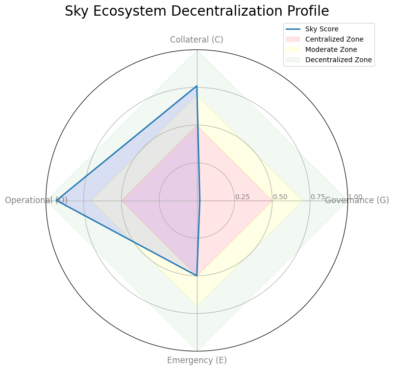
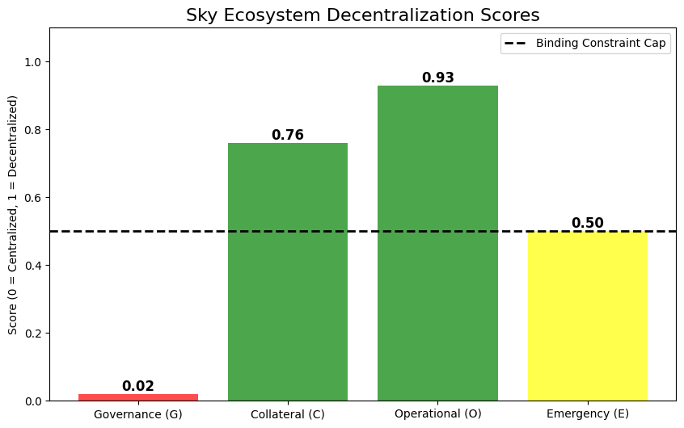
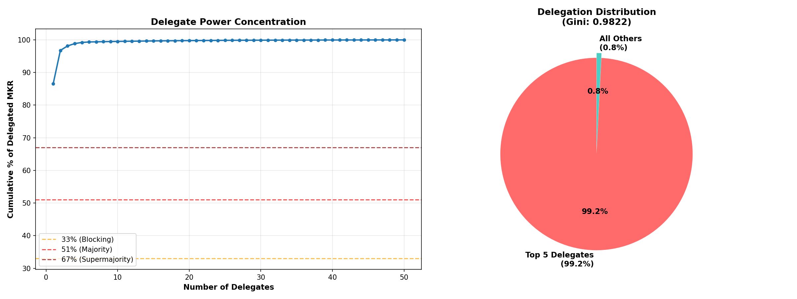

# Sky Ecosystem (MakerDAO): Decentralization Profile

**Date:** January 5, 2026
**Framework Version:** 3.0 (Stablecoin Decentralization Framework)
**Status:** 🔴 **Effectively Centralized** (Capped by Binding Constraints)

---

## 1. Decentralization Scorecard

| Dimension | Score (0-1) | Status | Key Driver |
|:---|:---|:---|:---|
| **Governance (G)** | **0.02** | 🔴 **Centralized** | Gini: 0.98. Top-1 Delegate holds **86%** of voting power. |
| **Collateral (C)** | **0.76** | 🔴 **Centralized** | HHI Low (Good), but **Single Counterparty (USDC+Coinbase) > 42%**. |
| **Operational (O)** | **0.93** | 🟢 **Decentralized** | Competitive keeper market (HHI 0.11), diverse oracles. |
| **Emergency (E)** | **0.50** | 🟡 **Moderate** | ESM exists but relies on MKR whale coordination (Plutocratic). |

### Composite Score
- **Calculated:** 0.56
- **Binding Constraint Cap:** **0.50** (Due to Red Flags in G and C)
- **Final Classification:** **Boundedly Decentralized / Centralized**

> **Verdict:** Sky Ecosystem possesses robust operational decentralization (keepers/oracles) but fails structurally at the Governance and Collateral layers. It is a "Centralized Protocol running on Decentralized Infrastructure."

---

## 2. Dimension Analysis

### 2.1 Governance (The Plutocracy Problem)
* **Gini Coefficient:** 0.98 (Extreme Concentration)
* **Effective Control:** Top 1 Delegate (`0x1678...`) controls **86.5%** of active voting power.
* **Implication:** The "DAO" is effectively a sole proprietorship for voting purposes.
    *   

### 2.2 Collateral (The Custodial Cliff)
* **HHI:** 0.23 (Green). The *types* of assets are diverse.
* **Single Counterparty Risk:** **42.2%** exposure to Circle/Coinbase (USDC + Coinbase Prime RWAs).
* **Threshold Violation:** Exceeds the **40% Red Line** for single-counterparty risk.
    *   

### 2.3 Operational (The Bright Spot)
* **Keeper HHI:** 0.11 (Green).
* **Top-5 Keeper Share:** 60% (Yellow/Green). Market is competitive.
* **Oracle Diversity:** Chronicle medianizer with >10 feeds.
* **Implication:** The algorithmic execution layer is resilient. Keepers compete efficiently for profit.
* **Diagram:** `docs/diagrams/o1_keeper_concentration_top10.png`

---

## 3. Stress Test Results

### Test 1: Collateral Freeze (USDC Scenario)
* **Scenario:** 100% of USDC/Coinbase assets frozen by regulators.
* **Impact:** **42% of backing lost instantly.**
* **Result:** **Insolvency.** DAI would depeg significantly ($0.58).
* **Resilience:** ❌ **None.** The protocol currently lacks the surplus buffer to absorb this loss (Surplus Buffer disabled/low relative to $2.2B exposure).

### Test 2: Keeper Exit (Liquidity Shock)
* **Scenario:** Top 5 keepers withdraw during 50% price crash.
* **Impact:** **60% reduction in liquidation capacity.**
* **Result:** **Partial Failure.** Remaining 40% of keepers might struggle to process wave of liquidations, leading to bad debt accumulation (similar to Black Thursday, but better due to Clipper Dutch Auctions).
* **Resilience:** 🟡 **Moderate.** Incentives likely sufficient to attract new entrants, but latency would spike.

### Test 3: Governance Capture
* **Scenario:** Top delegate acts maliciously (or keys compromised).
* **Impact:** **Total Protocol Capture.** capability to mint infinite DAI, change parameters, or trigger shutdown.
* **Result:** **Catastrophic.** Time-delayed (GSM Pause ~48h), but no on-chain recourse if the attacker holds the majority.
* **Resilience:** ❌ **None.** Relies entirely on the benevolence/security of one entity.

---

## 4. Conclusion & Recommendations

Sky Ecosystem demonstrates the classic "Stablecoin Trilemma": it has achieved Scale (C) and Operational Resilience (O) at the cost of Governance (G) and Asset Independence (C).

**Recommendations to Restore Decentralization:**
1.  **Reduce USDC/Coinbase exposure** to < 20% (Hard cap).
2.  **Implement Voting Decay** or Quadratic Voting to mitigate the 86% delegate dominance.
3.  **Diversify RWA Custodians:** Split the $500M Coinbase Prime allocation across 3-4 distinct regulated custodians.

---

### Data Sources
*   *On-chain Snapshot (Jan 2026)*
*   *Steakhouse Financial Reports*
*   *Sky Governance Portal API*
