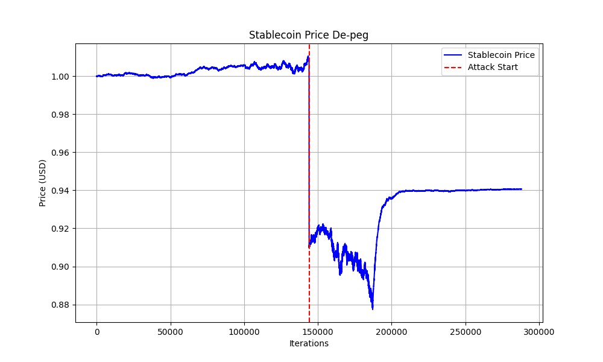
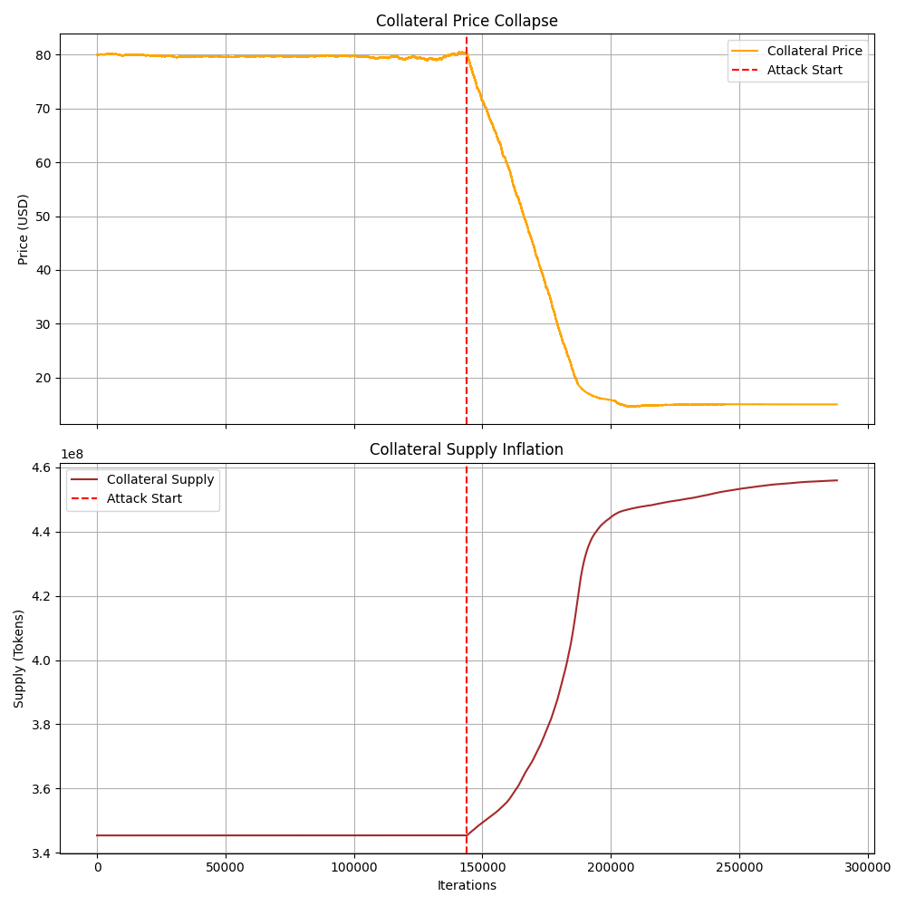

# Stablecoins — Modelling the Economic Feasibility of a De‑Peg Attack

*Canonical Version — Citation-Anchored (Frozen)*

## 1. Challenge Alignment

This artifact addresses **Stablecoins – Section 2.c (Modelling)** of the Research Technical Challenge.

**Scenario modelled:** *De‑peg of an algorithmic (dual‑token) stablecoin.*

The objective is to analyze **cost of attack vs. potential profit** for a rational adversary and identify the conditions under which initiating a de‑peg becomes economically feasible.

---

## 2. Research Question

**Under what conditions does a deliberate de‑peg attack on a dual‑token algorithmic stablecoin become profitable for an attacker?**

This study does not aim to forecast market price trajectories or optimize protocol parameters. Rather, it isolates and analyzes the *economic incentives* inherent in the stabilization mechanism to determine if they can be rationally exploited by a sufficiently capitalized adversary. For a comprehensive technical specification of the underlying model, please refer to the Model Deep Dive ([Internal Research, 2026](#ref-model-deepdive)).

---

## 3. Model Theory ([Calandra et al., 2023](#ref-calandra))

### 3.1 Dual‑Token Stabilization Logic

The modeled system follows a **dual‑token seigniorage design**, consisting of:

* **Stablecoin (AS):** Target price fixed at $1.
* **Collateral Token (CT):** Volatile endogenous asset used to absorb demand shocks.

When AS trades below peg, arbitrageurs burn AS to mint CT at oracle value. This mechanism contracts AS supply but expands CT supply.

Under stress, this creates a **reflexive feedback loop**:

1. AS price falls below peg
2. Redemptions accelerate
3. CT supply inflates
4. CT price collapses
5. Falling CT price reduces system confidence
6. Further AS selling is induced

Once this loop dominates, the system enters a *death spiral*.

---

### 3.2 Attacker Incentive Model

A rational attacker does not profit from breaking the peg alone. Profit arises only if the attacker is positioned to benefit from the **consequences** of the peg break.

The modeled attacker has two actions:

1. **Trigger:** Execute a large stablecoin sell to push the system into panic.
2. **Exploit:** Hold a short exposure to the collateral token to capture value from collateral collapse.

The economic structure of the attack is therefore:

* **Cost:** Slippage and losses from the initial stablecoin dump.
* **Payoff:** Gains from collateral price collapse.

The attack is profitable if:

> **Profit from collateral short > Cost of triggering the de‑peg**

---

## 4. Simulation Framework and Structure

### 4.1 Base Simulator

This work builds on **DualTokenSim**, introduced by Calandra et al. ([Calandra et al., 2023](#ref-calandra)) in *"Algorithmic Stablecoins: A Simulator for the Dual-Token Model in Normal and Panic Scenarios"*, and its accompanying open‑source implementation.

DualTokenSim models:

* Constant‑product AMMs for AS/USD and CT/USD
* A virtual mint–burn pool enforcing the peg
* Stochastic user trading under healthy and panic regimes

---

### 4.2 Model Extensions (Instrumentation Only)

To support attack‑profitability analysis, minor extensions were made to the original codebase:

* Introduction of an explicit **attacker agent** capable of executing a large AS dump and holding CT short exposure.
* Time‑series tracking of **attacker portfolio value** during simulation runs.
* A single‑run simulation runner to generate visualization artifacts.

**Non‑changes:**
The AMM mechanics, arbitrage logic, stochastic trade process, and stabilization rules described in the original DualTokenSim paper remain unchanged.

---

## 5. Attack Scenarios

Three progressively stronger attack configurations are evaluated.

### Phase 1 ([Internal Research, 2026](#ref-phase1)) — Raw Dump (Baseline)

* Action: Large AS sell to break the peg
* Attacker position: No collateral short

**Result:**

* Peg breaks
* CT collapses
* Attacker incurs a net loss due to slippage

This establishes the **cost of attack** in isolation.

---

### Phase 2 ([Internal Research, 2026](#ref-phase2)) — Short + Dump (Coordinated Soros-Style Attack)

* Action: Open CT short, then dump AS

**Result:**

* Same system collapse
* CT short offsets dump losses
* Net positive attacker PnL

This demonstrates that profitability emerges only when the attacker is positioned against collateral.

---

### Phase 3 ([Internal Research, 2026](#ref-phase3)) — High Leverage

* Action: Increase CT short exposure while keeping trigger size similar

**Result:**

* Dump cost remains approximately constant
* Profit scales with short exposure

This highlights the asymmetric payoff structure of the attack.

---

## 6. Simulation Results and Visual Evidence

To make the results concrete, we report **representative numerical outcomes from a single canonical attack run** (values rounded for clarity). These numbers correspond directly to the plots referenced below and are intended to illustrate *order of magnitude* effects rather than precise forecasts.

### Summary Metrics (Single Run — Phase 2: Short + Dump)

The metrics below correspond to **Phase 2 (Short + Dump)**, which represents the *minimum profitable attack configuration*. Phase 1 (raw dump) is unprofitable, while Phase 3 (high leverage) amplifies the same dynamics.

| Metric                   | Pre-Attack | Post-Attack / Final |
| ------------------------ | ---------: | ------------------: |
| Attack iteration         |          – |            ~150,000 |
| Stablecoin price (AS)    |     ~$1.00 |              ~$0.94 |
| Collateral price (CT)    |       ~$80 |                ~$15 |
| Collateral supply        |     ~3.5e8 |              ~4.5e8 |
| Attacker portfolio value |     ~$750M |              ~$830M |
| Net attacker PnL         |          – |          **~+$80M** |

---

### Figure 1 — Stablecoin Price De‑Peg

*The stablecoin remains tightly pegged prior to the attack. At the attack iteration, price drops below peg and fails to recover, triggering the panic regime.*

---

### Figure 2 — Collateral Price Collapse

*Following the peg break, collateral price enters a rapid and persistent collapse, aligning temporally with the attacker’s profit inflection.*

---

### Figure 3 — Collateral Supply Inflation

*(See bottom panel of Figure 2)*

*Collateral supply expands sharply after the attack, confirming that price collapse is driven by endogenous minting rather than exogenous price forcing.*

---

### Figure 4 — Attacker Portfolio Value Over Time

*The attacker experiences an initial drawdown corresponding to the cost of breaking the peg. As collateral collapses, gains from the short dominate, resulting in substantial net profit.*

---

## 7. Key Economic Insight

The attack exhibits a **fixed‑cost / variable‑upside** structure:

* The stablecoin dump acts as a one‑time trigger cost.
* Collateral collapse generates scalable profit through short exposure.

Once the death spiral is initiated, profitability depends primarily on access to leverage rather than on the size of the initial trigger.

---

## 8. Scope and Assumptions

* The attacker represents a coordinated capital position (single or aggregated actors).
* Sufficient market access exists to express collateral short exposure.
* The model focuses on **directional incentives**, not precise real‑world profit ceilings.

These assumptions simplify analysis without altering the qualitative conclusion.

---

## 9. Conclusion

This modelling exercise shows that dual‑token algorithmic stablecoins defending their peg via endogenous collateral minting expose a structural arbitrage opportunity.

A sufficiently capitalized attacker can rationally:

1. Trigger a peg break
2. Induce reflexive collateral inflation
3. Monetize the collapse via short exposure

The failure mode is not psychological or accidental. It is **economic**.

## 10. Reproducibility and Code References

The experiments and results presented in this artifact are fully reproducible.

* **Base simulator:** *DualTokenSim* by Calandra et al., which provides the underlying dual-token market dynamics and stabilization logic.
* **Extended attack model (this work):** A forked repository containing the attacker agent, portfolio tracking, and visualization runners used for the attack–profitability analysis.

The fork introduces **instrumentation and adversarial extensions only** (attacker agent, PnL tracking, and plotting utilities). Core protocol mechanics from the original DualTokenSim implementation remain unchanged.

In addition to the command-line simulation runners, an interactive web-based interface was developed to visualize system dynamics and attacker behavior in real time. The web application does not alter the simulation logic and serves solely as an exploratory and educational interface for inspecting parameter sensitivity and attack trajectories.
The web interface is built directly on top of the same simulation codebase used for the experiments reported here.

**Code references:**

* **Paper:** ([Calandra et al., 2023](#ref-calandra))
* **Original DualTokenSim:** ([FedericoCalandra, 2023](#ref-dualtokensim))
* **Attack-modelling fork:** ([Internal Research, 2026](#ref-attack-fork))
* **Model Deep Dive:** ([Internal Research, 2026](#ref-model-deepdive))

These repositories together constitute the full experimental setup used for this submission.

---

## References

Calandra, F., Rossi, F., Fabris, F., & Bernardo, M. (2023). *[Algorithmic Stablecoins: A Simulator for the Dual-Token Model](https://ieeexplore.ieee.org/document/11114693)*. IEEE Access.

FedericoCalandra. (2023). *[DualTokenSim Repository](https://github.com/FedericoCalandra/DualTokenSim)*. GitHub.

Internal Research. (2026). *[Attack-Modelling Fork](https://github.com/coad1024-cmd/Stablecoin_Research/tree/main/challenge-research-coad1024/Algo-Attack-Model/DualTokenSim)*. GitHub Fork.

Internal Research. (2026). *[Model Deep Dive](https://github.com/coad1024-cmd/Stablecoin_Research/blob/main/challenge-research-coad1024/Algo-Attack-Model/model_deep_dive.md)*. Technical Documentation.

Internal Research. (2026). *[Phase 1 Results](https://github.com/coad1024-cmd/Stablecoin_Research/blob/main/challenge-research-coad1024/Algo-Attack-Model/phase1_results.png)*. Simulation Output.

Internal Research. (2026). *[Phase 2 Results](https://github.com/coad1024-cmd/Stablecoin_Research/blob/main/challenge-research-coad1024/Algo-Attack-Model/phase2_results.png)*. Simulation Output.

Internal Research. (2026). *[Phase 3 Results](https://github.com/coad1024-cmd/Stablecoin_Research/blob/main/challenge-research-coad1024/Algo-Attack-Model/phase3_results.png)*. Simulation Output.
