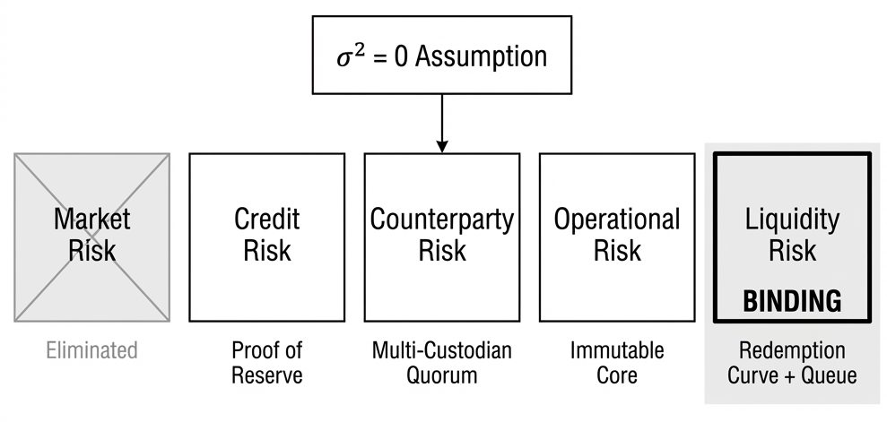
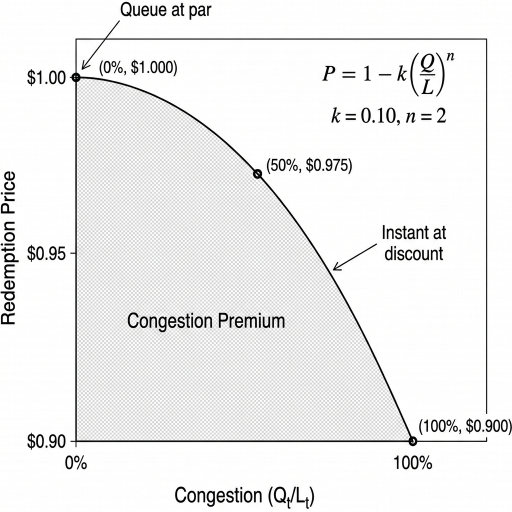

# The Stablecoin That Can't Hide Behind Price

*Price stability is the easy part. Delivery is where systems fail.*

**Thesis: When market risk vanishes, liquidity risk becomes the binding constraint.** A stablecoin backed by non-volatile reserves cannot fail from price collapse—but it can still fail from runs, custody breaches, and settlement delays. This design treats *reserve delivery* as the core engineering problem and builds the minimal architecture to guarantee it.

> **A Note on Approach**
>
> This document takes **Path A: the theoretical limit case**. We assume $\sigma^2 = 0$ and explore what design requirements remain when price volatility is eliminated by construction.
>
> An alternative approach—**Path B**—would ground the design in a concrete reserve (e.g., tokenized T-Bills, USDC). Under Path B, the thesis becomes: *"Fiat-backed stablecoins currently solve solvency but not transparency. This design adds provable reserve attestation and deterministic redemption, reducing trust in the issuer."* Path B accepts specific trust assumptions and optimizes around them.
>
> We choose Path A because it isolates the irreducible **operational risks** that remain even under perfect price stability. The insights generalize to any fiat-backed system.

---

## TL;DR

* **The Core Assumption:** Reserve price volatility is zero ($\sigma^2 = 0$).
* **Risk Shift:** Eliminating market risk exposes four Basel III categories: **credit**, **counterparty**, **operational**, and **liquidity**.
* **The Binding Constraint:** Liquidity—delivering reserves on demand—is the primary engineering challenge.
* **Property 1 (Efficiency):** No overcollateralization required; $1:1$ backing is optimal.
* **Property 2 (Stability):** Death spirals are impossible; insolvency requires theft or custody failure.
* **The Solution:** Proof of Reserve (credit) + multi-custodian quorums (counterparty) + convex redemption curve with k=0.20, n=2 (liquidity).

| Guaranteed | Not Guaranteed |
|:-----------|:---------------|
| Solvency ($C_t \ge D_t$) | Fixed $1.00 redemption price |
| No death spirals | Custody integrity |
| 100% collateralization suffices | Jurisdictional immunity |
| Instant execution (priced) | Bug-free code |
| Deterministic state transitions | Legal enforceability |

---

## The Single Assumption

Let the reserve's market price be constant and normalized:

$$P_t \equiv 1 \quad (\sigma^2 = 0) \tag{1}$$

Under this assumption, the solvency constraint simplifies from $C_t P_t \ge D_t$ to:

$$C_t \ge D_t \tag{2}$$

This is the **only** simplification. It removes mark-to-market insolvency: nominal backing equals face value. But it does not guarantee that the protocol can *deliver* that reserve to redeeming users in the timeframe they demand.

| What $\sigma^2 = 0$ Buys | What $\sigma^2 = 0$ Does Not Buy |
| :--- | :--- |
| **No liquidation cascades** | Instant liquidity |
| **No deleveraging spirals** | Custody integrity |
| **No oracle-induced insolvency** | Settlement finality |
| **No overcollateralization required** (100% suffices) | Run prevention |
| **Death spirals are impossible** (independent reserve) | |

The design problem shifts from "how do we stay solvent as prices move?" to "how do we guarantee delivery of a reserve we provably possess?"

---

## The Risk Taxonomy (Basel III)

Under $\sigma^2 = 0$, five Basel III risk categories apply. One is eliminated by assumption; four remain as design constraints.

Each category maps to a specific on-chain primitive. The architecture is the composition of these primitives.

---

## Credit Risk → Proof of Reserve

Credit risk is the possibility that the entity holding reserves defaults on its obligation to return them.

**Invariant:** $\text{PoR}_t \ge D_t$

Where $\text{PoR}_t$ is the attested reserve balance and $D_t$ is stablecoin supply. Violation = insolvency.

**Mechanism:**

* Custodians publish signed attestations every epoch (24h)
* Attestations are Merkle-proofed and on-chain verifiable
* Stale or invalid PoR → minting halts

Different reserves carry different credit risk (see [Appendix A](#appendix-a-basel-iii-capital-requirements)).

> PoR proves that a custodian *claims* to have assets—it cannot prove physical possession. This is the boundary where code meets law.

---

## Counterparty Risk → Multi-Custodian Quorum

Counterparty risk is concentration: if one custodian holds all reserves, one failure brings down the system.

**Invariant:** $\text{MaxExposure}_i \le \frac{C_t}{n}(1 + \epsilon)$

No custodian holds more than $1/n$ of reserves.

**Mechanism:**

* Reserves split across $n \ge 3$ custodians in different jurisdictions
* Redemptions require $m$-of-$n$ attestation
* Unreachable custodians flagged **impaired** (excluded from $L_t$, remain in $C_t$)
* Impaired > $(1-m/n) \cdot C_t$ → PAUSED; pro-rata redemption from healthy custodians

> Geographic diversification reduces the probability of simultaneous failure but cannot eliminate coordinated seizure across all jurisdictions.

---

## Operational Risk → Immutable Core + Circuit Breakers

Operational risk encompasses bugs, governance attacks, and human error that can compromise the system even when reserves are stable.

**Invariant:** $\frac{\partial \text{Logic}}{\partial t} = 0$

Logic frozen at deployment. No governance raids or emergency parameter changes.

**Mechanism:**

* Immutable mint/burn logic—no admin keys
* Deterministic circuit breakers trigger state transitions (not humans)

> Immutability eliminates governance risk but locks in bugs. The protocol also assumes L1/L2 liveness—if the chain fails or censors, guarantees become unenforceable.

---

## Liquidity Risk → Convex Redemption Curve

Even with full reserves ($C_t \ge D_t$), instant redemption can fail when demand exceeds instant liquidity ($Q_t > L_t$). We adapt the convex redemption curve from [Gyroscope PAMM](https://github.com/gyrostable/technical-papers/blob/main/P-AMM/P-AMM%20technical%20paper.pdf), explicitly simplified for our $\sigma^2=0$ constraint.

### The Mechanism

In the general case (volatile reserves), Gyroscope's P-AMM uses a PDE to price redemptions based on path-dependent reserve volatility. However, under $\sigma^2 = 0$, all volatility terms vanish. The pricing model collapses to a deterministic **convex bonding curve**:

$$P_{\text{redeem}} = \max\left(1 - k \cdot \left(\frac{Q_t}{L_t}\right)^n, \, P_{\min}\right)$$

where:

* $Q_t$: Cumulative redemption demand in current epoch
* $L_t$: Instant liquidity (on-chain reserves)
* $k=0.20$ (Max discount parameter)
* $n=2$ (Convexity parameter)
* $P_{\min} = 0.80$ (Floor price)

### Stability & Equilibrium

Gyroscope's analysis proves that for $n \ge 2$, this curve establishes a **stable equilibrium** that dampens runs [1, §5.2].

* **Rational Actors:** As $Q_t$ rises, the immediate cost of exit (slippage) increases.
* **Negative Feedback:** High penalties discourage panic redemptions, unlike linear curves ($n=1$) or flat queues which can accelerate runs.
* **Self-Correction:** The discount creates an arbitrage opportunity for patient capital to buy stablecoins below par, anticipating future liquidity replenishment.

### Parameter Selection: Why k=0.20, n=2?

We simulated different (k, n) combinations to minimize liquidity drain during panic while constraining normal-usage slippage to <0.1%.

| k | n | Normal Slippage | Drain @2% Fear | Drain @5% Fear | Drain @10% Fear |
|---|---|-----------------|----------------|----------------|-----------------|
| 0.10 | 2 | 0.025% | 44.7% | 70.7% | 100% |
| **0.20** | **2** | **0.050%** | **31.6%** | **50.0%** | **70.7%** |
| 0.50 | 5 | 0.000% | 52.5% | 63.1% | 72.5% |

*"Drain"* = % of $L_t$ exhausted before run self-terminates. Lower is better.

**Rationale:**

* **(k=0.20, n=2)** stops runs ~30% faster than (k=0.10, n=2) at equivalent fear levels.
* Normal slippage of 5 basis points is imperceptible to users.
* Higher convexity (n=5) provides gentler normal-usage curves but worse panic protection.

**Replenishment:** Every epoch, custodians settle T+1 reserves and transfer liquidity to $L_t$ to restore the curve.

> **Trade-off:** The system trades **price peg** (temporary de-pegging during stress) for **guaranteed execution** (no queues, no freezing).

---

**References:**
[1] Gyroscope Protocol. "P-AMM: A Path-Dependent Automated Market Maker." Technical Paper, 2023.

## The Contrast: Volatile vs. Non-Volatile

| Dimension | Volatile Collateral | Non-Volatile Collateral |
|:----------|:--------------------|:------------------------|
| **Binding constraint** | Solvency (price risk) | Liquidity (delivery risk) |
| Core mechanism | Tranches | Congestion Pricing Curve |
| Collateralization | 150%+ (buffer for volatility) | 100% (exact backing) |
| Death spiral risk | Possible (if investment token used) | Impossible (reserve value independent) |
| Failure mode | Undercollateralization | Run / custody breach |
| Reset trigger | NAV barriers | PoR failure / LCR breach |
| Governance role | Parameter setting (pre-deployment) | None (fully immutable) |

The two designs are **complements**. Volatile collateral requires a capital structure to absorb price shocks. Non-volatile collateral requires a liquidity structure to absorb demand shocks. Neither is strictly superior; they address different regimes.

---

## The Bottom Line

With $\sigma^2 = 0$, the solvency constraint ($C_t \ge D_t$) is trivially satisfied. The engineering challenge shifts entirely to **delivery**: ensuring reserves reach users despite custody failures, legal seizures, and settlement delays.

This design addresses delivery through congestion pricing. Liquidity is always available, but scarce liquidity is expensive. The convex curve (k=0.20, n=2) dampens runs by making panic redemptions progressively costlier. Failure modes—custody breach, PoR failure, LCR exhaustion—trigger deterministic state transitions, not human intervention.

The trade-off is explicit: temporary de-pegging during stress in exchange for guaranteed execution and transparent risk allocation.

---

## Appendix A: Basel III Capital Requirements

| Reserve Asset | Credit Risk Capital (per $100) |
|:--------------|:------------------------------|
| US Treasury Bills ($<3$ months) | $0.00 |
| Deposits at Federal Reserve | $0.00 |
| Deposits at A-rated bank | $1.60 |
| A-1/P-1 Commercial Paper | $1.60 |
| A-2/P-2 Commercial Paper | $4.00 |
| Cryptocurrencies | $100.00 |

**Recommended composition:** 90% short-maturity T-Bills + 10% cash at a well-rated bank.

When the reserve stops moving, the design must start working.

---

| [Previous] | Home | [Next] |
|:---|:---:|---:|
| [Volatile Collateral Design](Volatile.md) | [Table of Contents](../README.md) | — |

