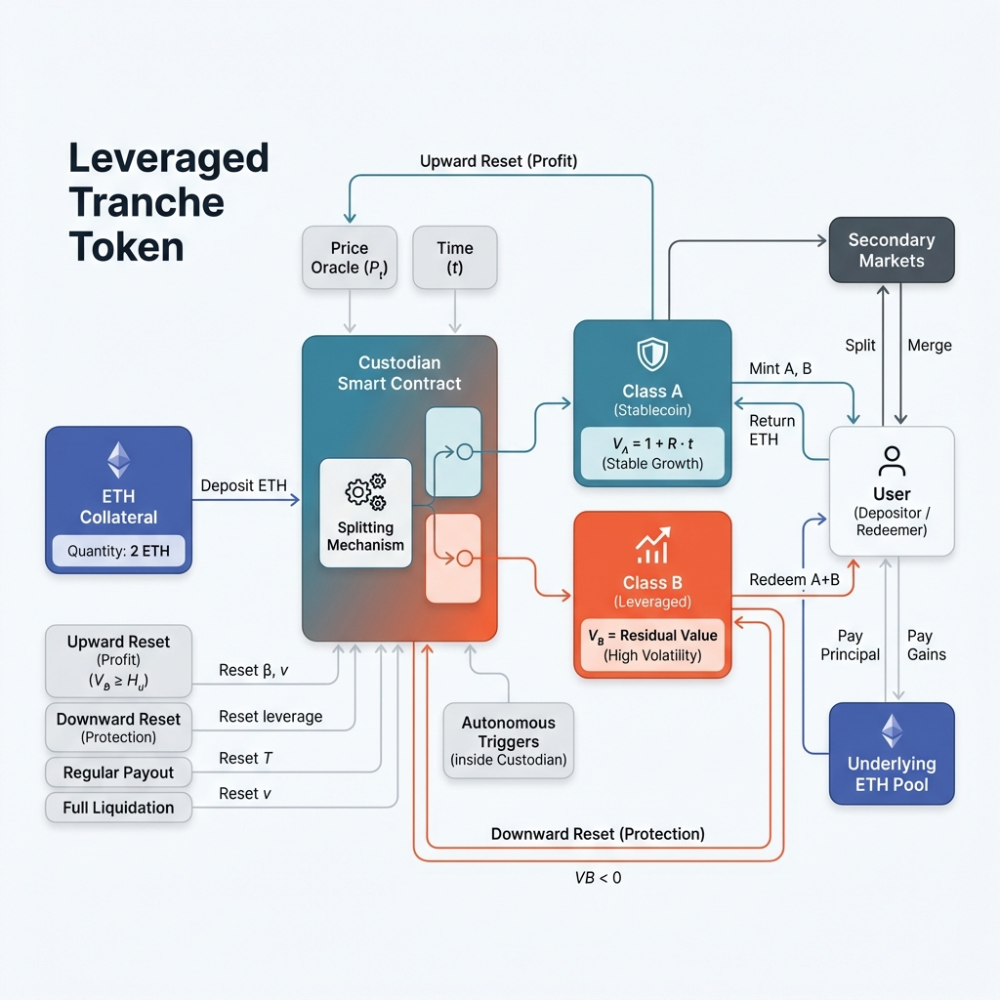

# The Stablecoin That Survives Volatility by Admitting What It Is

*Most crypto-backed stablecoins fail for the same reason: they try to engineer away the defining property of their collateral.*

**Thesis: You cannot tame volatility, you can only allocate it.** Most stablecoins fail because they try to make the entire supply stable against a volatile backing. This framework succeeds by admitting that for one tranche to be safe, the other must be leveraged—replacing the false promise of "systemic stability" with the honest mechanics of prioritized risk.

---

## TL;DR

* Volatility in crypto collateral **cannot be eliminated**, only reassigned.
* This design internalizes volatility through **securitization**: a senior–junior capital stack.
* **Class A (Senior):** Bounded returns, priority claims, reset-protected.
* **Class B (Junior):** Residual claim, absorbs variance, leveraged exposure.
* Stability is enforced by a **hard on-chain solvency invariant** ($C_t P_t \ge D_t$), not peg management.
* Class A is priced as a **barrier option** via Black-Scholes PDE; a wrapper AMM provides secondary liquidity.
* Losses are explicit and prioritized under continuous price paths.
* **Not guaranteed:** Protection against price jumps, oracle failure, or zero-loss outcomes.

---

## The Constraint That Actually Matters

A crypto-collateralized stablecoin lives or dies on one inequality. Let $P_t$ denote the price of the reserve asset, $C_t$ the collateral quantity, and $D_t$ the outstanding liability. The system is solvent if and only if

$$C_t P_t \ge D_t \tag{1}$$

This must hold **on-chain**, **deterministically**, and **without discretion**. Peg stability is cosmetic. Solvency is structural. Any design that violates this condition, even briefly, is insolvent regardless of governance intent or recovery plans.

ETH and BTC make this constraint brutal. Their price dynamics exhibit high variance, heavy tails, and discontinuous jumps. Volatility is not an edge case; it is the dominant regime. It cannot be diversified away or governed out of existence. It has to live somewhere.

---

## Volatility Is Conserved

This design starts from a premise most systems avoid stating explicitly: **volatility is conserved**. If a stable claim exists, some other claim must absorb the risk that makes it possible.

Instead of issuing a single claim against volatile collateral, the system issues two:

* **Class A (Senior)** — a low-volatility claim targeting a stable reference value.
* **Class B (Junior)** — a residual claim that absorbs volatility and leverage.

Both sit on the same collateral pool. At all times, the accounting identity holds:

$$V_A(t) + V_B(t) = \frac{C_t P_t}{\beta_t} \tag{2}$$

where $\beta_t$ is a conversion factor updated after payouts and resets.

This is not a modeling convenience. It is the mechanism by which volatility is concentrated rather than diluted. If the collateral pool shrinks, the junior claim shrinks first. If it goes to zero, it is wiped out. The senior survives only if the arithmetic allows it.

---

**Figure 1: Dual-Tranche Capital Structure**



*A single collateral pool backing two claims with strict senior–junior priority.*

---

## Stability Is an Invariant, Not a Peg

Stability here is not defined as “market price ≈ $1.” It is defined as **deterministic redemption under strict priority rules**. The enforced invariant is

$$C_t P_t \ge N_A V_A(t) + N_B V_B(t) \tag{3}$$

where $N_A$ and $N_B$ are the outstanding supplies of the two tranches.

As long as this holds, redemptions clear mechanically. If it fails, the system liquidates. Anything weaker than this invariant is an administrative promise rather than an executable guarantee.

Between reset events the two claims evolve asymmetrically. The senior claim accrues slowly. The junior claim inherits amplified exposure to $P_t$. The instantaneous leverage of the junior tranche is

$$\lambda_t = 1 + \frac{V_A}{V_B} \tag{4}$$

As drawdowns occur and $V_B$ shrinks, leverage rises automatically. This is not a flaw. It is the cost of insulating the senior claim from day-to-day volatility.

---

## Why Resets Replace Liquidations

Endogenous leverage has a consequence: **resets must be automatic**. Discretion is not an option.

Instead of continuous liquidation into markets, the system defines fixed NAV barriers $H_u$ and $H_d$. When these are crossed, the capital structure is deterministically reconfigured.

---

**Figure 2: Reset and Liquidation State Machine**


*Normal → Upward Reset → Downward Reset → Full Liquidation.*

---

The logic is explicit:

1. **Time-based payout**
   Periodic payout to Class A and update of $\beta_t$.

2. **Upward reset ($V_B \ge H_u$)**
   Gains are realized, leverage is re-centered, and NAVs are rebased.

3. **Downward reset ($V_B \le H_d$)**
   * Partial payout to Class A
   * Reverse split of remaining Class A to restore unit NAV
   * Result: reduced exposure, restored accounting peg

4. **Full liquidation ($V_B < 0$)**
   Remaining collateral is distributed to senior holders; issuance halts.

Execution is purely rule-based:

```python
def check_solvency_and_reset(V_B, H_u, H_d):
    """
    Executes autonomous state transitions based on Junior Tranche NAV (V_B).
    Triggered periodically or on oracle updates.
    """
    if V_B < 0:
        execute_full_liquidation()
        return "LIQUIDATION"

    elif V_B <= H_d:
        payout_senior_holders()
        perform_reverse_split_class_A()
        return "DOWNWARD_RESET"

    elif V_B >= H_u:
        rebalance_tranches()
        return "UPWARD_RESET"

    else:
        return "NORMAL_OPERATION"
```

No transition requires human approval. All execution is deterministic.

---

## Market Pricing: The Wrapper AMM

The core contract does **not** quote trading prices for Class A. It only supports **splitting** (ETH → A + B) and **merging** (A + B → ETH). So how does a secondary market emerge? Through a **wrapper contract** that sits on top of the core and provides liquidity.

**Figure 3: Wrapper AMM Around Core Split/Merge Contract**

*Wrapper uses PDE-derived price; core enforces solvency.*

### The Problem: What Is Class A Worth?

Class A is not a bond. It's not a share. It's a **barrier option**—a derivative whose value depends on time, ETH price, and the probability of hitting a reset barrier before expiry. Pricing it requires solving the Black-Scholes equation with exotic boundary conditions. The solution gives us $W_A(t, S)$: the fair value of one Class A token when ETH is at price $S$ and time $t$ has elapsed since the last reset.

This math happens off-chain. An oracle publishes the result. The wrapper reads it.

### How the Wrapper Works

The wrapper is a simple intermediary. It holds an inventory of Class B tokens and routes user orders through the core contract:

**To buy Class A:** The user sends ETH. The wrapper splits it through the core (receiving A + B), keeps the B in inventory, and delivers A to the user—all at the oracle-quoted price plus a small spread.

**To sell Class A:** The user sends A. The wrapper pulls B from inventory, merges them through the core (receiving ETH), and delivers ETH to the user—at the quoted price minus the spread.

The spread (roughly 50 basis points) compensates for inventory risk and oracle lag.

### The Safety Valve

The wrapper cannot create solvency risk. Its only constraint is **inventory**: if it runs out of Class B, it pauses buy orders until arbitrageurs replenish stock. The core protocol remains fully solvent regardless of wrapper state.

> **Technical Note:**
> The fair value $W_A(t,S)$ satisfies the Black-Scholes PDE with reset barriers as boundary conditions. In practice, an off-chain solver computes this numerically each block, and the wrapper fetches it via oracle. An on-chain approximation near $S \approx 1$ is: $W_A \approx 1 + Rt - \sigma\sqrt{t} \cdot \Phi^{-1}(p_{\text{down}})$, where $p_{\text{down}}$ is the probability of hitting a downward reset.

---

## What This Design Guarantees — and What It Refuses To

Under **continuous price paths**, this structure guarantees deterministic solvency enforcement, automatic deleveraging under sustained stress, and bounded losses for senior holders.

It explicitly does **not** guarantee protection against price jumps, oracle correctness, or loss-free outcomes. A single gap can skip every barrier and cause instant insolvency. This is not a flaw. It is the irreducible limit of any on-chain system tied to real markets.

Governance still exists, but it is relocated. Humans choose parameters, oracles, and upgrades ahead of time. They do not intervene during stress. Autonomy applies at runtime, not authorship.

---

## The Bottom Line

The core insight is structural: volatility does not disappear when you build a stablecoin—it gets redistributed. This architecture makes the redistribution explicit. Class A holders receive bounded returns in exchange for priority claims. Class B holders absorb variance in exchange for leverage. The system enforces this contract through deterministic state transitions, not governance discretion.

The design does not eliminate risk. It prices it, allocates it, and makes the allocation transparent. Failure modes are known in advance: jump risk, oracle failure, and sustained depletion of Class B. What the system refuses to do is pretend these risks don't exist.

---

<div align="center">

| [Previous] | Home | [Next] |
|:---|:---:|---:|
| [Sky Ecosystem](../Sky-final/Sky-Research.md) | [Table of Contents](../README.md) | [Non-Volatile Collateral Design](Non-Volatile.md) |

</div>
