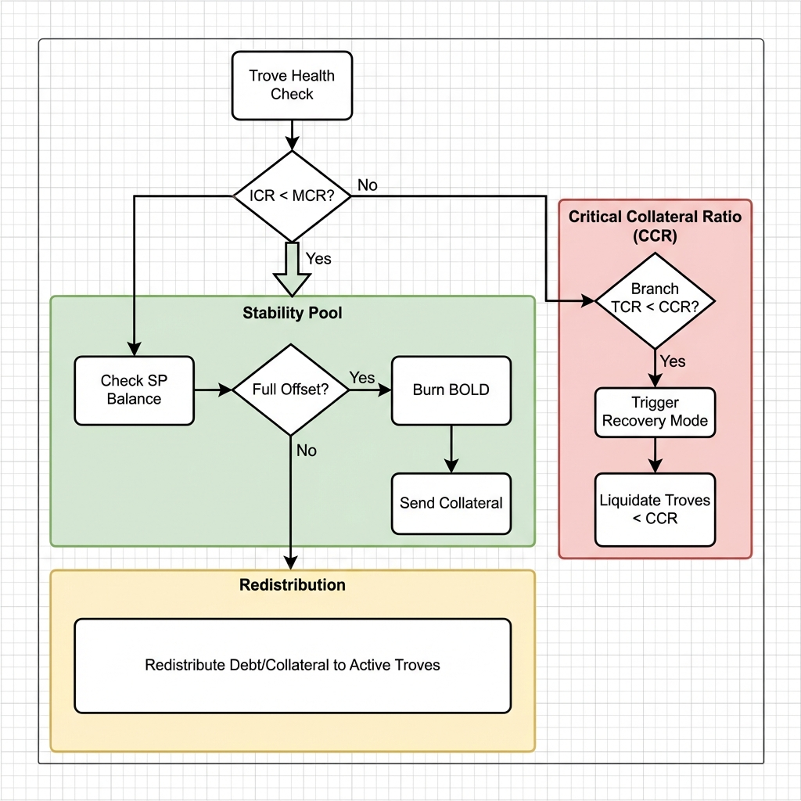
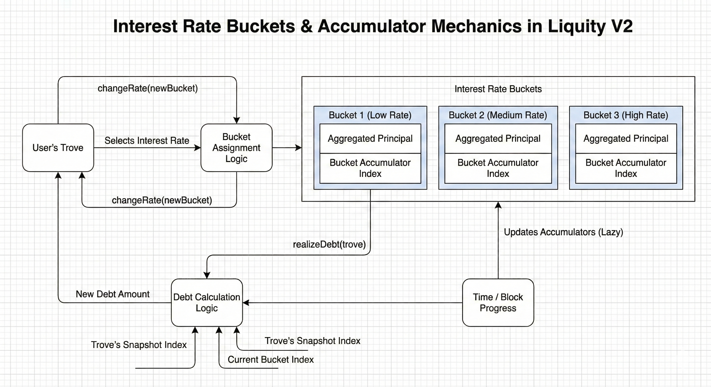
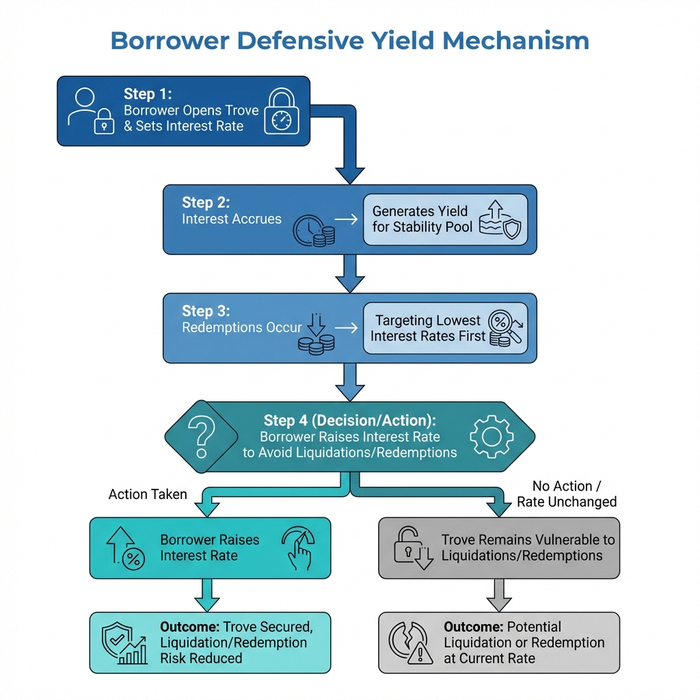
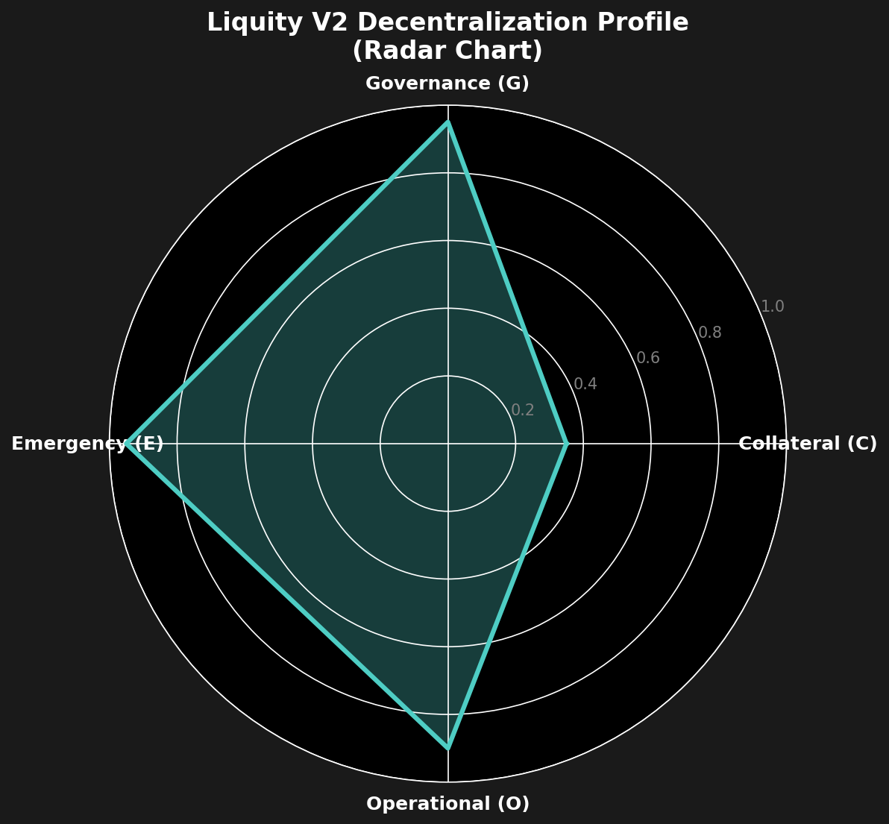
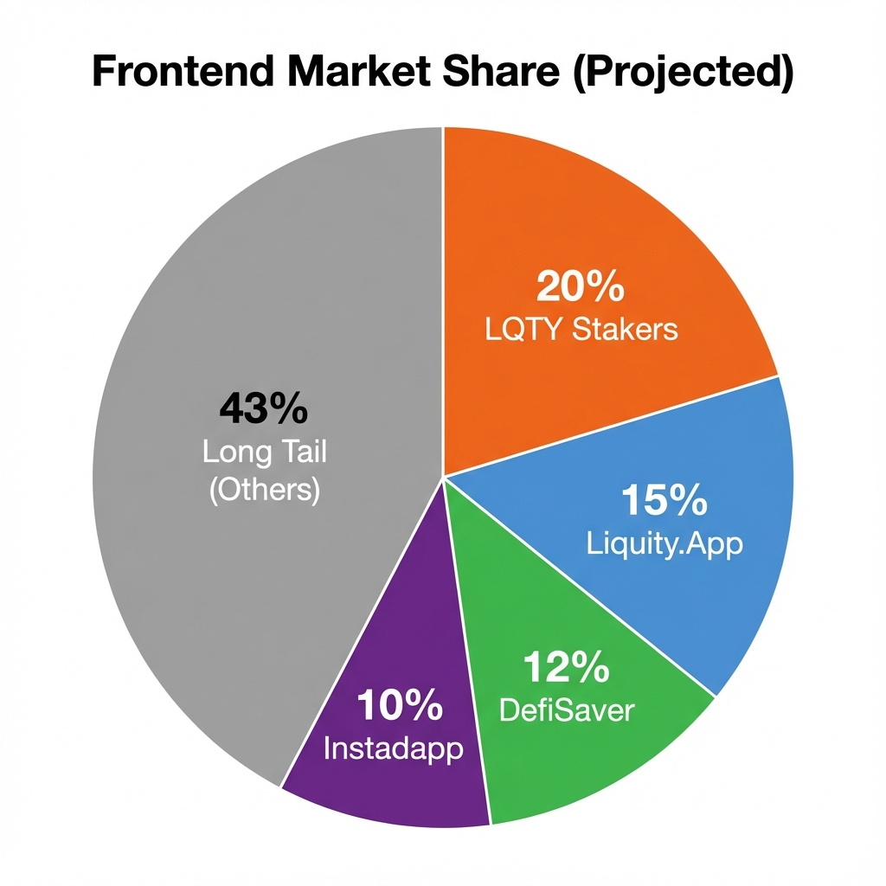
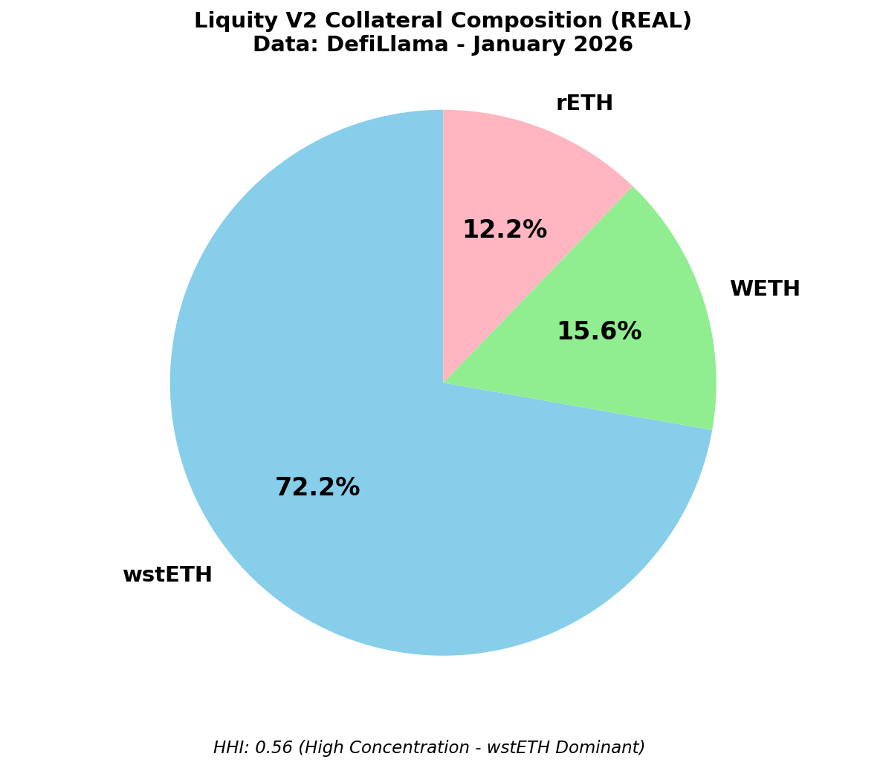

# Liquity V2: Federated Solvency

*The real innovation isn't multi-collateral — it's contagion immunity.*

**Thesis: In the long run, survivability > efficiency for stablecoin infrastructure.** Liquity V2 is the first serious attempt at structural contagion isolation in a multi-collateral stablecoin. The trade-offs are explicit, and they're worth it.

> **TL;DR**
>
> - **Federated Solvency** — Isolated branches (WETH, wstETH, rETH). One fails, others survive. Zero cross-contamination.
> - **Endogenous Yield** — 75% of interest → **`Stability Pool`**. 25% → Protocol Incentivized Liquidity (PIL). No RWAs.
> - **User-Set Rates** — Borrowers pick their own interest (0.5%–250%). Lowest rates redeemed first.
> - **Immutable** — No admin keys. No upgrades. No pause. Code is law.
> - **Trade-offs** — Redemption uncertainty (multi-branch routing). LST counterparty risk (Lido/Rocket Pool).

---

## The Problem Nobody Talks About

Every multi-collateral stablecoin has a dirty secret. Scale to new collateral types, and you import shared risk. MakerDAO's **unified debt pool** is the canonical example: all collateral backs a common liability. Maximum capital efficiency. Maximum systemic exposure.

We saw this nearly blow up in March 2023. SVB collapsed, USDC briefly de-pegged, and DAI — backed in part by USDC — traded at $0.90. One asset caught a cold, & the whole system ended up in the ICU. This is not a bug. It's the architecture.

---

## Federated Solvency: A Different Model

Liquity V2 takes the opposite approach. **Federated Solvency** means isolated risk pools that share a common token but *not* a common failure mode. Three branches today — **WETH**, **wstETH**, **rETH** — each operating as a completely self-contained system. Same BOLD token. Same fungibility. **Zero shared risk.**

The math is clean: if rETH collapses to $0, WETH depositors have **zero exposure**. The rETH branch shuts down while WETH keeps running. This isn't just marketing — it's enforced structurally.

Each branch has its own **`Stability Pool`** (absorbs liquidations locally), **`Active Pool`** (holds that branch's collateral), **`Default Pool`** (handles redistribution within the branch), and **`Price feeds`** that fail gracefully — shutting only the affected branch while others continue normally. The contracts don't reference each other. Contagion is architecturally impossible.

The safety thresholds are tiered. At the individual level, each Trove must maintain a **Minimum Collateral Ratio (MCR)** — 110% for WETH, 120% for LSTs — or face liquidation. At the system level, if a branch's *aggregate* collateral ratio drops below its **Critical Threshold (CCR)** — 150% for WETH, 160% for LSTs — the branch enters Recovery Mode: new borrowing is restricted while the system incentivizes de-risking. And if things spiral further, breaching the **Shutdown Threshold (SCR)**, the branch enters permanent shutdown. No new operations. Only closures and debt repayment. This is the "graceful death" mechanism — the failing branch is surgically removed while others continue unaffected.

Oracles follow the same paranoid logic. WETH uses Chainlink's ETH/USD — straightforward. But LSTs are trickier: wstETH synthesizes the market price with Lido's internal exchange rate. rETH goes further — a dual-check that compares market prices against Rocket Pool's official rate and always picks the lower value. If a de-peg happens, the system doesn't guess or average. It assumes the worst. Speed costs you collateral value here. That's the trade-off: conservative pricing protects the protocol at the borrower's expense.

---

## The Redemption Trade-off

Federated architecture creates one meaningful friction point: **redemptions**. When BOLD trades below $1.00, arbitrageurs redeem for underlying collateral at face value. In a multi-branch system, *which* collateral do they get? Liquity V2 routes redemptions proportionally based on "unbackedness" — how much each branch's debt exceeds its **`Stability Pool`** coverage.

> **Routing Formula:**
> $$ U_i = \max(0, \text{BranchDebt}_i - \text{SP}_i) $$
> $$ \text{Allocation}_i = \frac{U_i}{\sum U_k} $$

Redemptions are routed proportionally to exposure. The formula prioritizes **absolute dollar liability** over relative health: a branch with \$10M unbacked is drained before one with $10k unbacked, regardless of percentages. This utilitarian approach protects the peg by targeting the deepest pools of risk first.

But this is what I like to call the **Uncertainty Tax**. For large redemptions, it introduces execution risk due to **state drift** — pool depths can change between transaction submission and execution. You submit expecting 50/50 WETH/rETH; a bot front-runs you with a massive SP deposit; you land with 100% rETH. For institutional-scale redeemers hedging specific exposures, this unpredictability is a deal-breaker.

> **Builder Opportunity (Redemption Routing):** The core issue isn't visibility (dashboards exist), but state drift. Build **Intent-Based Routing** contracts: wrappers that let redeemers specify minimum acceptable collateral mixes, automatically reverting if the "race condition" goes against them. This moves complexity from the user to the solver. First-mover advantage is significant — institutional redeemers will pay for predictability.

---

## Why This Matters

The federated model means you can add cbETH tomorrow, sfrxETH next month, EigenLayer restaking tokens next year — and each new asset extends the system's reach *without diluting its core safety properties*.

> **Builder Opportunity:** Every new LST branch needs custom oracle integration, risk parameter calibration,risk modeling, and frontend support. First-movers on new collateral types capture disproportionate liquidity.

Unlike conventional multi-collateral frameworks where diversification often leads to cumulative risk, Liquity V2’s architecture ensures that expansion results in strict risk compartmentalization. By isolating each collateral type into its own branch, the protocol transforms growth from a potential liability into a purely additive benefit.

Once solvency is modular at the collateral level, the next pressure point is geography — chains, not assets L2 expansion is inevitable. The question is *how*. Simple token bridging provides BOLD liquidity across chains, but it creates cross-chain dependencies — if the bridge gets exploited, the "isolated" L2 becomes a contagion vector. The robust path is **L2-native branches**: deploy the full branch architecture (Troves, **`Stability Pool`**, liquidations) directly on each L2, using asynchronous message passing to coordinate BOLD supply without sharing risk.

> **Builder Opportunity (Multi-Chain Infrastructure):** Unified L2 branches — same BOLD, same system, different chain — don't exist yet. Building this requires L2-specific oracles, cross-chain message relayers to sync with mainnet, and local frontends. Whoever architects this owns the liquidity moat before fragmentation sets in.
---

## The Economic Engine

Most stablecoin yield comes from the outside world. Maker's DSR? T-bill returns. Real yield, but also TradFi dependency, regulatory surface, custody risk.

Liquity V2 generates yield **entirely endogenously** — no RWAs, no counterparties, no governance setting rates. The mechanism is what I call **"yield via pain"**: a self-regulating interest rate market that turns borrower competition into protocol revenue.

Here's how it works: Borrowers open Troves, lock collateral, and *choose their own interest rate*. Interest accrues simply and (non-compounding), minted as fresh BOLD at the system level.**75% flows to **`Stability Pool`** depositors**; 25% to Protocol Incentivized Liquidity (PIL). Redemptions target lowest-rate Troves first — so borrowers bid rates up to avoid the hit. The **emergent market rate** reflects true leverage cost, no governance required.

Under the hood, the protocol uses a gas-efficient "bucket accumulator" pattern: Troves are grouped by rate tier, and interest accrues lazily via a global index rather than updating each position every block. Debt is only realized when a Trove interacts (closes, adjusts, gets redeemed).

 Depositing into the **`Stability Pool`** is "raw" — users must manually claim their BOLD interest and collateral gains (ETH/LSTs from liquidations), manually sell them, and manually re-deposit if they want to compound. Idle capital earns nothing during calm periods. There's no native optimization layer.

> **Builder Opportunity (The Basis Vault):** "Auto-compounding" is a feature, not a product. The real opportunity is **Delta-Neutral Basis Trading**. Build a vault that borrows BOLD against ETH, swaps BOLD to stablecoins to farm yield elsewhere (or arbs the peg), all while remaining delta-neutral. This turns the Stability Pool from a passive savings account into an active hedge fund strategy.

When BOLD trades below $1, redemptions spike → low-rate borrowers get hit → survivors raise rates → yield increases → SP deposits become more attractive → buying pressure on BOLD. The peg defense is endogenous.

The rate auction creates an obvious attack vector: frontrun redemptions by spiking your rate, let someone else get hit, then drop it back. Free lunch right? Except the system closes it.

**Upfront borrowing fees** (7 days of average branch interest) and **Premature adjustment fees** make this net-negative. Same logic applies to batch delegation — joining a batch costs the upfront fee every time.

The system doesn't try to prevent gaming. It taxes it into unprofitability.

> **Builder Opportunity (Rate Management):** The protocol provides batch delegation as a primitive, but no one operates it at scale yet. The opportunity is two-layered: (1) **Batch Manager Operators** — professional entities who attract delegators, manage rates, and charge fees for the service; (2) **Autonomous Rate Managers (ARMs)** — algorithmic contracts that optimize redemption-protection vs. interest-cost in real-time. The killer product combines both: a Batch Manager powered by an ARM, creating a "set-and-forget" borrowing experience.

## Current State: January 2026

The numbers tell an interesting story:
<small>Source: Liquity V2 Analytics</small>

| Metric | Q1 2025 | Q2 2025 | Q3 2025 | Q4 2025 | 2025 Total |
|:-------|:--------|:--------|:--------|:--------|:-----------|
| Gross Protocol Revenue | $219k | $230k | $636k | $598k | **<u>~$1.68M</u>** |
| Gross Profit | $47k | $45k | $137k | $134k | ~$363k |
| Token Holder Net Income | **<u>$0</u>** | **<u>$0</u>** | **<u>$0</u>** | **<u>$0</u>** | **<u>$0</u>** |

This raises the obvious question: who captures the value? Unlike V1, revenue does not flow to token holders. It flows to **`Stability Pool`** depositors and PIL.

LQTY holders don't receive direct dividends; instead, they monetize **governance influence**: directing PIL emissions creates a market for **"bribes"** (vote incentives).The "profitability" is measured in influence value, not dividends

---

## The Decentralization Scorecard

Quantifying decentralization requires a holistic framework to move beyond subjective claims. We evaluate Liquity V2 through the **G-O-C-E framework** (Governance, Operational, Collateral, and Emergency).

<small>*Figure 2: Liquity's GOCE profile — maximum decentralization score (Action: None) for Governance, Operational, and Emergency. The binding constraint is Collateral (C) due to LST reliance.*</small>

### 1. Governance (G): Gold (No Multisig)

V2 is **immutable**. There are no admin keys, no DAO voting to change parameters, and no ability to upgrade contracts. Parameter adjustments (like rate changes) are **market-driven**, not governance-driven.

- *Verdict:* **Low Risk.** The protocol cannot be captured because there is no control room to capture.

### 2. Operational (O): Gold (Headless)

The "headless brand" model is fully operational. With **63+ independent frontends** hosting the interface and earning kickbacks, the failure of the primary team has zero impact on user access.

- *Verdict:* **Low Risk.** Censorship resistance is provided by a mercenary network of operators.

> **Builder Opportunity:** Liquity is immutable and permissionless — anyone can build a frontend. White-label borrowing interfaces for niche communities (e.g., restaking DAOs, LST providers) can capture origination volume.

### 3. Emergency (E): Gold (Unstoppable)

There is no "Correction" phase. No pause button. No emergency shutdown (Global Settlement). Unlike MakerDAO (which relies on delegates to trigger shutdown) or Aave (Guardian multisig), Liquity V2 runs on "Code is Law" absolutism.

- *Verdict:* **Low Risk.** Exit windows are guaranteed by valid Ethereum state transitions, not human discretion.

### 4. Collateral (C): Red (LST Dependence)

This is the fault line.

- **wstETH (72% share):** Controlled by Lido governance + smart contract risk.
- **WETH (16% share):** Immutable contract, no governance.
- **rETH (12% share):** Controlled by Rocket Pool governance.

<small>*Source: [Liquity V2 Analytics](https://dune.com/liquity/liquity-v2-protocol-analysis)*</small>

Under the DeFiScan framework, this **External Dependency** prevents a perfect score. The **`Standard`** architecture is robust, but the **`Assets`** are administratively upgradable.

Put together, the classification is clear: **Stage 2 (Immutable Core)**.

> *Definition: "Stage 2" implies a system where the protocol is effectively immutable and unshutdownable, ensuring permissionless access and exit. However, Liquity V2 presents a unique edge case: an immutable engine running on upgradable collateral assets.*

The engine is immutable.
The fuel is upgradeable.
And the strict isolation between them is where Liquity V2 finds its balance.

---

### The Basel III Lens

Under traditional banking frameworks, this is straightforward **counterparty risk**: the protocol's solvency depends on third-party smart contracts (Lido, Rocket Pool) that BOLD holders have no control over.

Compare to Maker's risk profile:

| Protocol       | Primary Counterparty Risk                                             | Failure Mode                                                              |
|:---------------|:----------------------------------------------------------------------|:--------------------------------------------------------------------------|
| **MakerDAO**   | RWA custodians (BlackRock, Coinbase Custody), USDC issuer (Circle)    | Regulatory seizure, bank run, custody failure                             |
| **Liquity V2** | LST protocols (Lido, Rocket Pool smart contracts)                     | Smart contract exploit, slashing cascade, governance attack               |

Maker's counterparty risk is *jurisdictional* — tied to TradFi entities that can be sanctioned, seized, or bankrupted. Liquity's counterparty risk is *technical* — tied to code that can be exploited or oracle-manipulated. Neither is zero. But technical risk is auditable, immutable, and transparent. Jurisdictional risk is none of these.

V1 avoided this entirely by accepting only native ETH. V2 trades maximum decentralization for multi-asset scalability
---

## The Bottom Line

Liquity V2 is the first stablecoin to solve the multi-collateral contagion problem structurally — not through governance, not through insurance, but through architecture. **Federated Solvency** is not a marketing term. It's a design pattern that creates real, mathematically-enforced risk isolation. No other multi-collateral stablecoin can make this claim.

The trade-offs are explicit:

- **Redemption uncertainty** for risk isolation
- **LST dependency** for multi-asset scalability
- **Complexity** for modular solvency

Liquity V2 isn't just "multi-collateral done better." It's a new paradigm: **federated solvency** that makes contagion a choice, not a feature.

In a space where most protocols optimize for TVL velocity, Liquity V2 optimizes for **longevity**. That's the kind of alpha that compounds quietly — until it doesn't need to anymore.

---

References:

1. Liquity V2 Technical Documentation (2025)
2. DefiLlama Protocol Analytics
3. Wonderland Research — Stablecoin Decentralization Framework v3.0

---

| [Previous] | Home | [Next] |
|:---|:---:|---:|
| — | [Table of Contents](../README.md) | [Sky Ecosystem (USDS/DAI)](../Sky-final/Sky-Research.md) |

