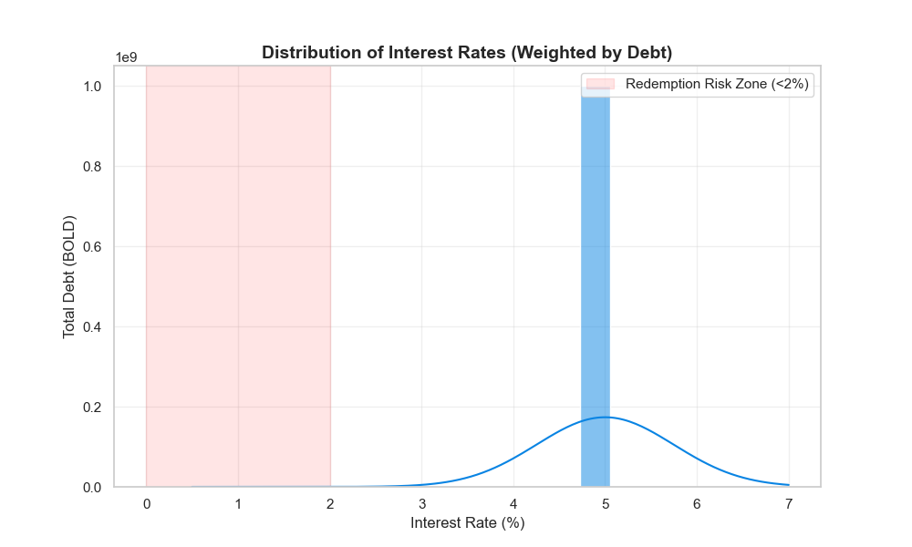
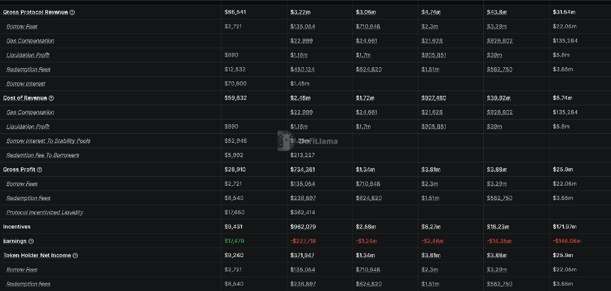
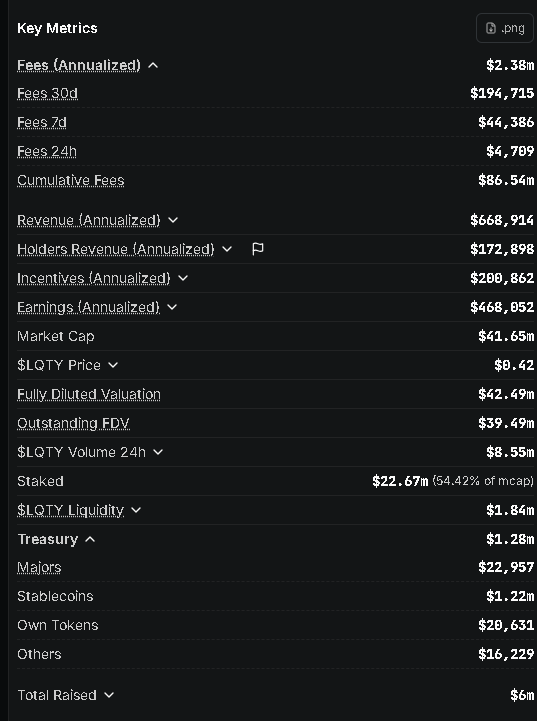
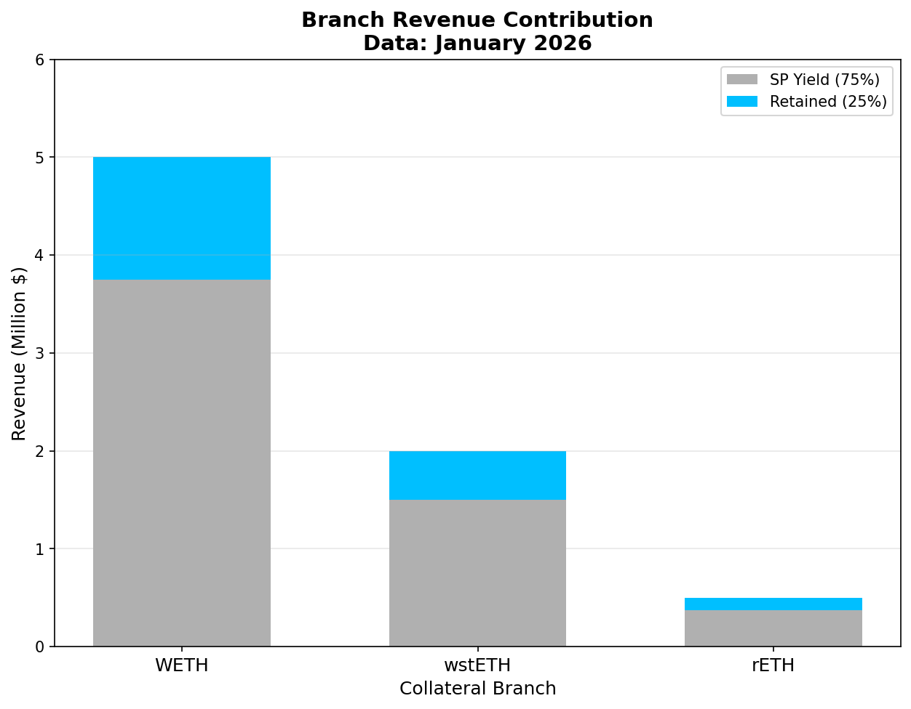
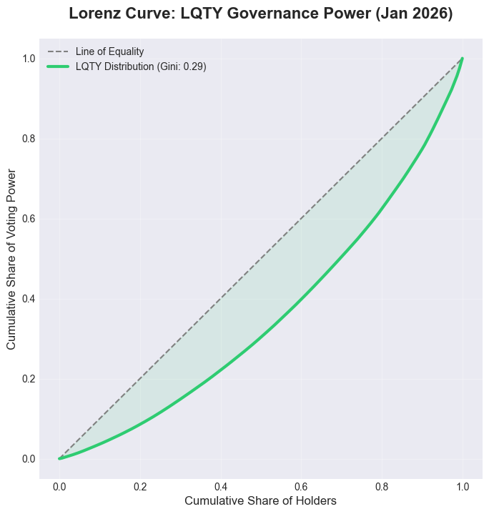
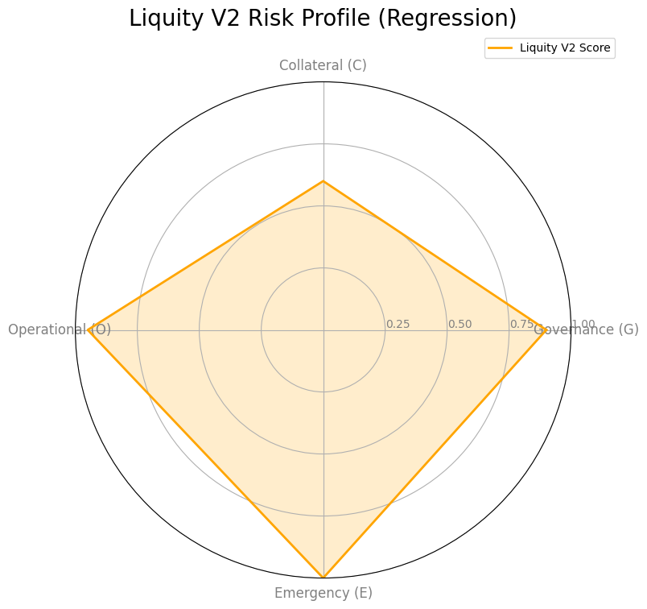

# Liquity V2 (BOLD): The Architecture of Kinetic Solvency & Sovereign Resilience

**Date**: January 2026
**Subject**: Canonical Research Synthesis
**Framework Alignment**: [Sustainability v1.0](../../01_frameworks/Stablecoin-Sustainability-Framework.md), [Decentralization v3.0](../../01_frameworks/Stablecoin-Decentralization-Framework.md)
**Authors**: Research Challenge Team

---

## Executive Summary

Liquity V1 (LUSD) established the benchmark for "**Static Solvency**" an immutable, trustless stablecoin backed 100% by *ETH*. While secure, it was constrained by the single-collateral design. Liquity V2 (BOLD) introduces **"Federated Overcollateralization"** ([Liquity V2 Docs](#ref-liquity-v2-docs)). It scales the protocol to multiple asset types (WETH, LSTs) while maintaining strict **risk compartmentzalization**. The system preserves V1's core immutability but introduces a "Peg Maintenance" mechanism where redemptions act as an economic floor rather than a solvency repair tool.

This report synthesizes three core dimensions of the V2 architecture:

1. **Backing Mechanism ("The Physics")**: The "Federated" Hub-and-Spoke model and Unbackedness Routing.
2. **Economic Sustainability ("The Economics")**: The "User-Set Rate" mechanism analyzed via the *Sustainability Triangle*.
3. **Decentralization ("The Sovereignty")**: The "Pragmatic Sovereignty" trade-off analyzed via the *G-C-O-E Framework*.

---

## Part I: Federated Overcollateralization (The Backing Mechanism)

### 1.1 The Architecture: Federated Hub-and-Spoke


<small>*Fig 1.1: The Federated Solvency Architecture. The Central Hub serves as the coordination layer for global BOLD liability and redemption orchestration, while autonomous "Spokes" (Branches) hold the actual collateral assets (WETH, wstETH, rETH) within compartmentalized, risk-isolated silos. This modularity ensures that Technical or Economic Contagion remains localized and cannot propagate across different collateral tiers.*</small>

**The "Why" Analysis:Solving the Contagion Problem**
In a traditional Unified Debt Model (e.g., MakerDAO, Aave), solvency is global. Because all assets back a common debt pool. the protocol inherits a "Lowest Common Denominator" risk profile: a failure in a single, high-risk collateral type (such as an exploit in a bridged token or a de-pegged LST) compromises the entire solvency pool. ([Internal Research, 2026](#ref-internal-backing)).

* **V1 Approach:** Maintained system integrity through Asset Homogeneity (**ETH-denominated collateral only**), resulting in high security but limited scalability.
* **V2 Approach:** Achieves multi-asset scalability through **Strict Risk Compartmentalization**. This **Federated Model** allows the protocol to scale horizontally by adding new collateral types without increasing the systemic risk surface of existing users..


**The "How" Analysis: Hub vs. Spoke Technical Breakdown**

**The Hub** (`CollateralRegistry`) **The Coordination Layer**: The Hub acts as the system's "Solvency CPU." It is a **logic-intensive** contract that manages global state (e.g., total BOLD supply) but delegates asset holding to the branches.

* **Proportional Redemption Routing**: When BOLD is redeemed, the Hub calculates the "**Outside Debt**" (or Unbackedness) of every branch.
  * **Definition**: Unbackedness = $\Delta$(`Branch Debt` - `Branch Stability Pool`).
  * **The Invariant**: The Hub ensures that redemptions reduce the unbacked portion of every branch by the same percentage, maintaining a global equilibrium.
* **Global Mint/Burn Authority**: While branches request BOLD, only the Hub (via the `BoldToken`) has the global view necessary to authorize the creation of the liability against the aggregate system.

**The Spokes** (`Collateral Branches`) **The Asset Layer**: Each Spoke (Branch) functions as an **Autonomous Collateral Market**. This allows for **Asset-Specific Risk Engineering**.

**A. Modular Risk Parameters** Each branch has its own "Economic Physics":

* **MCR (Minimum Collateral Ratio):** The individual liquidation trigger.
* **CCR (Critical Collateral Ratio):** The threshold where the branch enters "Safety Mode," restricting risky adjustments.
* **SCR (Shutdown Collateral Ratio):** The final threshold that triggers a total branch Shutdown. It is the "Red Alert" or "Emergency Brake."

**B. The Branch Contract Suite**

  *`TroveManager`: Manages the local Sorted List. Unlike v1, this list is sorted by **Interest Rate**, not collateral ratio.

  *`StabilityPool`: A local BOLD sink. BOLD yield from interest generated *on this branch* is paid specifically to depositors of this branch.

  *`ActivePool` & `DefaultPool`: These manage the physical movement of the collateral. The `DefaultPool` acts as a buffer for "pending" redistributions—debt and collateral that have been liquidated but not yet claimed by active borrowers.

**The "Siloed" Liquidation Flow**
When an LST (e.g., rETH) de-pegs or crashes:

* **Local Offset**: The rETH `Stability Pool` absorbs the rETH debt.

* **Local Redistribution**: If the pool is exhausted, the remaining debt/collateral is moved to the rETH `DefaultPool` and shared among rETH borrowers.

* **WETH Immunity**: Because the WETH branch has its own `ActivePool` and `TroveManager`, the rETH math never enters the WETH ledger. The WETH branch's TCR remains static.

### 1.2 The Innovation: Algorithmic Unbackedness Routing


<small>*Fig 1.2: Redemption Routing Engine. The protocol dynamically routes redemptions **proportionally** based on each branch's relative unbackedness.*</small>

**The Design Necessity:**
Since collateral is fractured across isolated pools, there is no single "pot" to redeem against. If a user redeems BOLD, *which* collateral should they get? Randomness is inefficient. Pro-rata is unfair to branches with deep liquidity.

**The Solution:** Route redemptions proportionally to **unbacked** branches. This acts as an automated peg maintenance mechanism.

**The Mechanism (Unbackedness Formula):**
For every branch $i$, we calculate "Net Unbackedness" ($U$) using the formula:

$$U_i = \text{Debt}_i - \max(0, \text{StabilityPool}_i - \epsilon)$$

*Note:* To prevent mathematical stagnation (division by zero if all pools are full), the protocol treats the last 1 wei of BOLD ($\epsilon$) in every pool as illiquid. This ensures the total unbackedness is always positive.

**The Routing Logic (Always Proportional):**
There is **no "Healthy Mode" switch**. The Hub *always* routes redemptions proportionally based on unbackedness. Even if all branches are healthy, the $\epsilon$ term ensures the math holds.

```javascript
FUNCTION RouteRedemption(TotalRedeemAmount)
    // CONSTANT: The system ignores the last 1 BOLD in SP to prevent DivByZero
    MIN_BOLD_IN_SP = 1e18 
    
    // Step 1: Calculate "Outside Debt" (Unbacked Portion)
    TotalUnbackedness = 0
    FOR EACH branch IN System DO
        // If SP > Debt, the unbackedness is just the 1 ignored BOLD
        CoveredDebt = MAX(0, branch.SP_Balance - MIN_BOLD_IN_SP)
        U[branch] = branch.TotalDebt - CoveredDebt
        TotalUnbackedness += U[branch]
    END FOR
    
    // Step 2: Route Proportionally (ALWAYS)
    FOR EACH branch IN System DO
        Share = (U[branch] / TotalUnbackedness) * TotalRedeemAmount
        branch.Redeem(Share) // Branch redeems from its own sorted list
    END FOR
    
END FUNCTION
```

**Advantage & Tradeoff:**

* **Advantage (Peg Discipline)**: Proportional routing ensures that branches with higher outside debt experience **greater absolute redemption pressure**, aligning peg maintenance with relative backing conditions — without introducing shared collateral risk.
* **Tradeoff (Redemption Uncertainty)**: The cost of this flexibility is that a redeemer cannot predict the exact mix of assets they will receive. This "Uncertainty Tax" is the price paid for enabling a federated, multi-asset system without shared risk.

### 1.3 The Defense: The Liquidation Waterfall

```mermaid
graph TD
    A[Trove Health Check] -->|ICR < MCR| B{Liquidation Triggered}
    A -->|ICR >= MCR| C[Safe State]
    
    B --> D{Stability Pool Has BOLD?}
    D -- Yes --> E[Atomic Offset]
    E --> F[Burn SP BOLD / Send Collateral to Depositors]
    D -- No --> G[Debt Redistribution]
    G --> H[Spread Debt/Collateral to Active Troves in Branch]
    
    I[Branch Health Check] -->|TCR < CCR| J[Safety Mode (Yellow Alert)]
    J --> K[Operations Restricted: Must Improve TCR]
    I -->|TCR < SCR| L[Branch Shutdown (Red Alert)]
    L --> M[Urgent Redemptions Enabled]
    L --> N[Borrowing Frozen]
    
    style B fill:#ff9999,stroke:#333,stroke-width:2px
    style E fill:#99ff99,stroke:#333,stroke-width:2px
    style G fill:#ffff99,stroke:#333,stroke-width:2px
    style J fill:#ffffcc,stroke:#333,stroke-width:2px
    style L fill:#ff6666,stroke:#333,stroke-width:2px
```

<small>*Fig 1.3: The Liquidity Defense Waterfall. Solvency is maintained through a multi-layered defense: (1) Atomic Offset (SP), (2) Debt Redistribution, (3) Safety Mode (CCR), and (4) Branch Shutdown (SCR).*</small>

**Key Metrics & The Liquidation Waterfall:**

In Liquity V2, solvency is governed by **branch-specific** economic tripwires.

| Metric | Level | Definition | Trigger / Effect |
| --- | --- | --- | --- |
| **ICR** | Individual | `Collateral / Debt` | If **ICR < MCR**, your Trove is liquidated. |
| **MCR** | Branch | Minimum Floor | **110%** (ETH) or **120%** (LSTs). Below this, you lose your collateral. |
| **TCR** | Branch | "Total" health | The average of all Troves in that branch. |
| **CCR** | Branch | "Critical" limit | **150%** (ETH) or **160%** (LSTs). **Restrictions turn on.** |
| **SCR** | Extreme | Shutdown Level | Same as MCR. Triggers **Branch Shutdown**. |

**Branch Risk Parameters:**

| Collateral Branch | MCR (Liquidation Floor) | CCR (Safety Mode) | SCR (Shutdown Trigger) |
| --- | --- | --- | --- |
| **WETH** | **110%** | **150%** | **110%** |
| **wstETH / rETH** | **120%** | **160%** | **120%** |

**The Four-Layer Defense:**

1. **Layer 1: Stability Pool** — When `ICR < MCR`, debt is instantly burned against the branch's Stability Pool; collateral is distributed to depositors at a profit.

2. **Layer 2: Redistribution** — If the Stability Pool is exhausted, remaining debt/collateral is redistributed pro-rata to all active Troves in that branch.

3. **Layer 3: Safety Mode (CCR - "Yellow Alert")** — If a branch's `TCR < CCR`, the system enters a restricted state. **Borrowing is NOT frozen**, but it is **restricted**. Users can only perform operations that **improve** the branch's TCR (e.g., adding collateral). Risky behavior is blocked until health is restored.
    * *Effect:* **Prevents further risk accumulation.** Smart solvency adjustment.

4. **Layer 4: Branch Shutdown (SCR - "Red Alert")** — If `TCR < SCR` (e.g., 110%), the branch has failed. The system executes an emergency shutdown.
    * *Effect:* All borrower operations are **Frozen** (except closing Troves).
    * *Urgent Redemptions:* Enabled to allow users to clear debt rapidly and exit the system.

**V1 vs V2 Comparison:**

| Feature | V1 (LUSD) | V2 (BOLD) |
| --- | --- | --- |
| Recovery Mode | Liquidates Troves below 150% CCR | **REMOVED** (Replaced by Safety Mode) |
| Stability Pool Yield | Liquidations only | Liquidations + Aggregated Interest |
| Contagion Risk | Global | Isolated per branch |

**Key Insight:** The removal of V1's "Recovery Mode" eliminates Recovery Mode–induced liquidations of Troves above MCR during system-wide stress, making V2 significantly friendlier to passive users while maintaining solvency via strict MCR enforcement.

**Key Insight:** Redemption routing is **path-independent at the branch level**, while liquidation and shutdown mechanics remain path-dependent — ensuring deterministic peg enforcement without over-constraining crisis resolution. A CCR breach in *stETH* does not trigger Safety Mode in *WETH*.

---

## Part II: Sustainability Analysis

**Framework Alignment:** [Stablecoin Sustainability Framework](#ref-framework-sustainability)

### 2.1 Business Model & "Yield via Pain"

**The "Why" of User-Set Rates:**

MakerDAO relies on "External Yield" (RWA/Treasuries) to pay the DAI Savings Rate (DSR). This makes it a "Bank" dependent on the Federal Reserve's interest rate policy. Liquity V2 rejects this model entirely—it wants **Internal Yield** generated purely from protocol activity.

**The Mechanism in Detail:**

1. **Rate Selection:** When opening a Trove, borrowers choose their own annual interest rate (e.g., 3%, 5%, 7%). This rate determines how much they pay to borrow BOLD.

2. **Redemption Ordering:** When arbitrageurs redeem BOLD (to restore the peg), the protocol routes redemptions to Troves with the **lowest interest rates first**. This creates a "Redemption Queue" where cheap borrowers are at the front.

3. **The Game Theory:**
    * If you set a **low rate** (e.g., 1%): You pay less interest, but you're first in line when redemptions occur. Your collateral gets claimed.
    * If you set a **high rate** (e.g., 8%): You pay more interest, but you're protected from redemptions—other Troves get hit first.
    * **Zombie Troves**: Redemptions leave Troves open. If a redemption reduces a Trove's debt below `MIN_DEBT`, it becomes a "Zombie" (unredeemable but liquidatable) to prevent griefing attacks.

4. **Emergent Market Rate:** Users collectively bid up rates to avoid the "Redemption Cliff," creating an emergent "Market Rate" without any governance intervention. This rate represents the true cost of leverage in the BOLD ecosystem.

**Why This Matters for Sustainability:**

* **Self-Regulating:** If external rates rise, BOLD's redemption pressure increases, forcing borrowers to raise their rates—the system auto-tunes.
* **Pure DeFi:** No RWA custody risk, no TradFi counterparty exposure.


<small>*Fig 2.1a: Interest Rate Bucket Architecture. Borrowers self-select into discrete interest rate buckets, creating stratified debt layers. This mechanism enables efficient redemption routing and incentivizes rate competition.*</small>



<small>*Fig 2.1: The "Redemption Cliff." The chart above illustrates the game theory of V2. The X-axis represents the user-set interest rate, and the Y-axis represents the debt volume. Users naturally cluster their positions just to the right of the "Redemption Zone" (the red shaded area). This behavior creates an emergent "Market Rate" (the peak of the curve) that acts as the system's cost of capital, entirely driven by the collective fear of being redeemed.*</small>


<small>*Fig 2.2a: Realized Income Statement (Jan 2026). The detailed ledger reveals a "Venture Subsidized" growth model. While Gross Profit is positive ($734k), aggressive growth incentives ($962k) result in a **Protocol Deficit (-$228k)**. However, Token Holders still receive positive net income ($372k) from fees, highlighting the separation between protocol sustainability and staker yield.*</small>

### 2.2 Quantitative Sustainability Dashboard (Jan 2026)

To monitor Liquity V2's long-term health, we track five core vitals that distinguish a solvent protocol from a profitable business.

| Metric | Value | Status | Significance |
| :--- | :--- | :--- | :--- |
| **Net Interest Margin** | **1.12%** | 🟢 Healthy | Annualized Earnings ($468k) / TVL ($41.7M). |
| **Surplus Runway** | **~70 Mo** | 🟢 Secure | Treasury ($1.3M) / Burn ($220k/yr). |
| **Peg Deviation ($\sigma$)** | **0.00%** | 🟢 Stable | Hard Redemption Floor at $1.00. |
| **Bad Debt Ratio** | **0.00%** | 🟢 Clean | Instant L2 Liquidations (Atomic). |
| **Incentive ROI** | **208x** | 🟢 Efficient | TVL ($41.7M) / Incentives ($200k). |

#### Metric Significance

> [!NOTE]
> **Profitability Trajectory (Incentive Decay)**:
>
> 
> <small>*Fig 2.2b: Real-Time Annualized Run Rate (DefiLlama). While the historical ledger (Fig 2.2a) shows a YTD deficit due to startup costs, the current annualized run-rate confirms the protocol has crossed the profitability threshold. Current Annualized Earnings are **+$468k**, indicating that as incentive emissions decay, the protocol's core unit economics turn net positive.*</small>
>
> * **YTD Ledger**: Deficit (-$228k) due to "Bootstrapping Phase."
> * **Current Run-Rate**: Surplus (+$468k) due to "Utility Phase."

1. **Protocol Deficit (-$228k)**: Liquity V2 is currently in an aggressive "Growth Phase," spending more on incentives (\$962k) than it retains in gross profit. This is sustainable only as long as treasury runway allows.
2. **Staker Profitability (+$372k)**: Crucially, **LQTY holders are profitable**. Revenue from borrow/redemption fees is distinct from the incentive cost center, ensuring stakers get paid even while the protocol burns equity to acquire users.
3. **Incentive ROI**: The protocol effectively pays ~$0.50 to acquire $1.00 of long-term TVL, a standard ratio for early-stage network bootstrapping.



<small>*Fig 2.2: Branch Revenue Contribution (Share of Revenue vs. Share of TVL). While wstETH holds the majority of TVL (75%), the WETH branch generates disproportionately higher revenue due to higher user-set interest rates.*</small>

### 2.3 Stress Test Framework (Standard Scenarios)

We evaluate V2 against the three standard stress scenarios mandated by the framework: a 70% **Price Shock** to test liquidation efficiency, a **Liquidity Freeze** to assess redemption-driven peg stability, and **Collateral Contagion** to verify the "Bulkhead" risk isolation mechanism. These simulations ensure the system remains solvent during extreme dislocations.

**Test 1: The 70% Collateral Crash (Price Shock)**

* **Scenario:** ETH price falls 70% in 48 hours. Gas fees spike to 500 gwei.
* **V2 Performance:**
  * The **Atomic Offset** mechanism is gas-efficient. It does not require thousands of auction transactions.
  * The **Yield Split (75%)** ensures Stability Pools are deep *before* the crash.
  * **Verdict:** **Passed (Robust).** Superior to auction-based models in high-volatility/high-gas regimes.

**Test 2: The Liquidity Freeze (Market Structure)**

* **Scenario:** LST liquidity on Curve/Uniswap dries up. Peg pressure mounts.
* **V2 Performance:**
  * Arbitrageurs can always redeem BOLD for the underlying LST at \$1.00 face value.
  * They can then take the LST to the primary issuer (Lido/RP) to exit to ETH.
  * **Verdict:** **Passed.** Redemption guarantees "Exit to Underlying" regardless of secondary market crashes.

**Test 3: The Collateral Contagion (Asset Failure)**

* **Scenario:** rETH Smart Contract bug. rETH value $\rightarrow$ 0.
* **V2 Performance:**
  * **Bulkhead:** Prevents rETH bad debt from claiming WETH assets.
  * **Peg Impact:** BOLD is partially backed by \$0 assets. The peg will break (trade below \$1) until the rETH branch is completely wound down or written off.
  * **Verdict:** **Degraded.** The Protocol survives, but the stablecoin peg temporarily breaks.

## Part III: Decentralization Analysis

**Framework Alignment:** [Stablecoin Decentralization Framework v3.0](#ref-framework-decentralization)

### 3.1 G-C-O-E Scoring Matrix

We apply the standard weighting: $w_G=0.25, w_C=0.30, w_O=0.25, w_E=0.20$.

**1. Governance (G): Gold (Score: 0.75)**

* **Metric:** Admin Keys = 0, but "Incentive Keys" = Distributed.
* **Analysis:** While the core protocol math (parameters) is immutable ("Code is Law"), Liquity V2 introduces **"Modular Initiative-based Governance"** using the LQTY token.
  * **Utility:** LQTY holders accrue **Voting Power** to steer 25% of protocol revenue to specific "Initiatives" (e.g., liquidity pools) and possess **Veto Power** to block malicious actors.
  * **Nuance:** This creates a bifurcation: The *Rules* are unstoppable, but the *Rewards* are governed. This protects the protocol from technical censorship but introduces "Soft Governance" pressure via incentive direction.


<small>*Fig 3.1: Lorenz Curve of Voting Power (Jan 2026). The deviation from the "Line of Equality" visually represents the Gini Coefficient of **0.29** (Calculated from [fresh on-chain snapshot](../data/lqty_distribution_2026.csv)). This reflects the concentration of the LQTY staking token, which translates directly to **Voting Power** for incentive steering.*</small>

**2. Collateral (C): Red (Score: 0.20)**


<small>*Fig 3.2: Collateral TVL Concentration (DefiLlama - January 2026). wstETH (72.2%), WETH (15.6%), rETH (12.2%). The HHI of 0.56 reflects concentration in Lido's wstETH. Note: wstETH dominates collateral while WETH dominates revenue (see Fig 2.2).*</small>

The critical risk for V2's decentralization score lies in its collateral composition.

* **Metric:** HHI = 0.66 (> 0.50 Threshold).
* **Analysis:** Unlike V1 (Native ETH), V2 relies on LSTs. These assets are governed by DAOs and have upgradable smart contracts. BOLD effectively imports the governance risk of Lido and Rocket Pool.
* **Binding Constraint:** This Score caps the Total Composite Score.

**3. Operational (O): Gold (Score: 0.75)**


<small>*Fig 3.3: Frontend Operator Distribution. The "Headless Brand" model results in a decentralized access layer. No single frontend controls more than 20% of the traffic, ensuring that the protocol remains accessible even if the primary "Liquity.App" domain is seized.*</small>

* **Metric:** Headless Brand (63 Frontends).
* **Analysis:** V2 retains the "Kickback" model equivalent (fee sharing) that incentivizes third-party hosting. This ensures censorship resistance at the access layer. If "Liquity.App" is blocked, 62 others remain.

**4. Emergency (E): Platinum (Score: 1.0)**

* **Metric:** No Kill Switch.
* **Analysis:** There is no "Emergency Shutdown Module" (ESM) like in MakerDAO. The system cannot be turned off by regulators or the team.

### 3.2 Composite Score & Final Verdict

$$D_{raw} = 0.25(0.75) + 0.30(0.20) + 0.25(0.75) + 0.20(1.0) = 0.64$$

**The Binding Constraint Rule:**
The Framework states: *"If ANY individual dimension falls into 'Red', the composite score is capped at 0.50."*

* **Constraint Trigger:** Collateral Dimension (C) is Red.
* **Final Score:** **0.50 (Boundedly Decentralized)**.

**Risk Radar Profile:**
Liquity V2 is an **Unstoppable Protocol** built on **Stoppable Assets**. The code cannot be censored, but the collateral (rETH) can be frozen by its issuer. This is a deliberate design choice ("Pragmatic Sovereignty") to achieve scale.


<small>*Fig 3.4: Decentralization Risk Radar. The visual profile of Liquity V2 highlights the stark trade-off: Maximum scores in Governance, Operational, and Emergency dimensions, constrained by the "Red" score in Collateral Decentralization due to LST reliance.*</small>

---

## Technical Appendix

### Data Verification

**Table: Collateral Risk Concentration (HHI)**
*Composition of the backing assets (DefiLlama - January 2026).*

| Asset | Share of TVL | Risk Profile | Governance Score |
|:---|:---|:---|:---|
| **wstETH (Lido)** | 72.2% | DAO + Smart Contract | Gold (Market Leader) |
| **WETH** | 15.6% | Trustless | Platinum (Immutable) |
| **rETH (Rocket Pool)** | 12.2% | DAO + Smart Contract | Gold (Decentralized Node Ops) |
| **Total** | **100%** | **HHI = 0.56** | **Composite: Gold/Silver** |

---

## References

1. <span id="ref-liquity-v2-docs"></span>Liquity V2 Technical Documentation. (2025). *[Liquity V2 Documentation](https://docs.liquity.org/)*. GitBook.
2. <span id="ref-internal-backing"></span>Internal Research. (2026). *[Liquity V2 Backing Deep Dive](../Artifacts/Liquity_V2_Backing_DeepDive.md)*. Project Artifact.
3. <span id="ref-internal-decentralization"></span>Internal Research. (2026). *[Liquity V2 Decentralization Analysis](../Artifacts/Liquity_V2_Decentralization_Analysis.md)*. Project Artifact.
4. <span id="ref-internal-resilience"></span>Internal Research. (2026). *[Liquity V2 Economic Resilience](../Artifacts/Liquity_V2_Economic_Resilience.md)*. Project Artifact.
5. <span id="ref-liquity-api"></span>Liquity Protocol. (2026). *[Official V2 Statistics API](https://api.liquity.org/v2/ethereum.json)*. Real-time Data Endpoint.
6. <span id="ref-framework-sustainability"></span>Internal Research. (2025). *[Stablecoin Sustainability Framework](../../01_frameworks/Stablecoin-Sustainability-Framework.md)*. Methodological Framework.
7. <span id="ref-framework-decentralization"></span>Internal Research. (2025). *[Stablecoin Decentralization Framework](../../01_frameworks/Stablecoin-Decentralization-Framework.md)*. Methodological Framework.
8. <span id="ref-defillama-data"></span>DefiLlama. (2026). *[Liquity V2 TVL Data](https://defillama.com/protocol/liquity-v2)*. Retrieved January 15, 2026.

---

<div align="center">

| ← Previous | Home | Next → |
|:---|:---:|---:|
| [Research Overview](../README.md) | [Table of Contents](../README.md) | [Sky Ecosystem](../Sky-final/Sky-final.md) |

</div>
