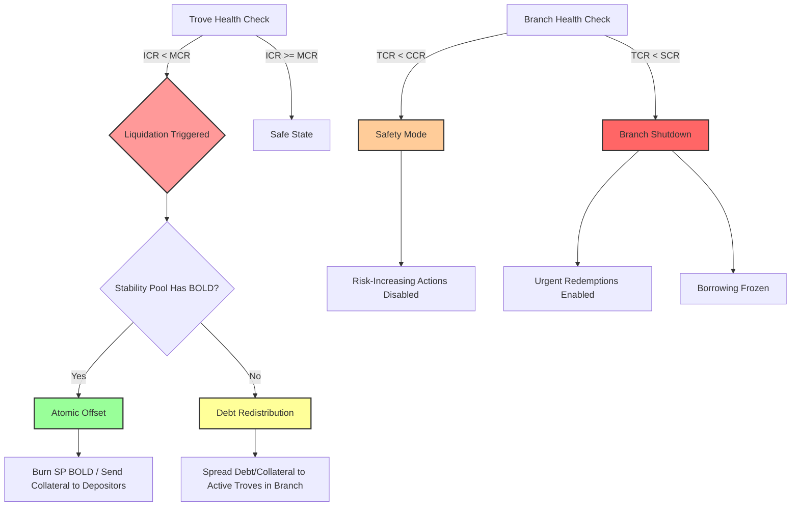

# Liquity V2 (BOLD): Federated Overcollateralization & Sovereign Resilience

<div align="center">

| **Date** | **Subject** | **Authors** |
|:---:|:---:|:---:|
| January 2026 | Canonical Research Synthesis | Research Challenge Team |

**Framework Alignment**: [Sustainability v1.0](../../01_frameworks/Stablecoin-Sustainability-Framework.md) · [Decentralization v3.0](../../01_frameworks/Stablecoin-Decentralization-Framework.md)

</div>

---

## Table of Contents

1. [Executive Summary](#executive-summary)
2. [Part I: Federated Overcollateralization](#part-i-federated-overcollateralization-the-backing-mechanism)
   - [1.1 Federated Hub-and-Spoke Architecture](#11-the-architecture-federated-hub-and-spoke)
   - [1.2 Algorithmic Unbackedness Routing](#12-the-innovation-algorithmic-unbackedness-routing)
   - [1.3 The Liquidation Waterfall](#13-the-defense-the-liquidation-waterfall)
3. [Key Metrics](#key-metrics)

---

## Executive Summary

Liquity V1 (LUSD) established the benchmark for **Static Solvency**: an immutable, trustless stablecoin backed 100% by ETH-denominated collateral. While secure, it was constrained by a single-collateral design.

Liquity V2 (BOLD) introduces **Federated Overcollateralization** ([Liquity V2 Docs](#ref-liquity-v2-docs)). It scales the protocol to multiple asset types (WETH, LSTs) while maintaining strict **risk compartmentalization**. The system preserves V1's core immutability but introduces a **peg-maintenance** mechanism where redemptions act as an economic floor rather than a solvency repair tool.

> [!NOTE]
> This report synthesizes three core dimensions of the V2 architecture:
>
> 1. **Backing Mechanism** — The Federated Hub-and-Spoke model and Unbackedness Routing.
> 2. **Economic Sustainability** — The User-Set Rate mechanism.
> 3. **Decentralization** — The Pragmatic Sovereignty trade-off via the G-C-O-E Framework.

---

## Part I: Federated Overcollateralization (The Backing Mechanism)

### 1.1 The Architecture: Federated Hub-and-Spoke


<small>*Fig 1.1: The Federated Solvency Architecture. The Central Hub coordinates global BOLD liability and redemption orchestration, while autonomous "Spokes" (Branches) hold collateral assets (WETH, wstETH, rETH) in compartmentalized silos.*</small>

#### Why: Solving the Contagion Problem

In a traditional unified-debt model (e.g., MakerDAO, Aave), solvency is global. A failure in a single high-risk collateral type compromises the entire solvency pool.

| Approach | Design | Trade-off |
|:---|:---|:---|
| **V1** | Single ETH collateral | High security, limited scalability |
| **V2** | Federated compartmentalization | Multi-asset scalability, isolated risk |


#### How: Hub vs. Spoke Breakdown

**The Hub** (`CollateralRegistry`) — *The Coordination Layer*

- Manages global state (total BOLD supply, redemption routing)
- Delegates asset custody and liquidation to branches
- **Proportional Redemption Routing**: Reduces outside debt of every branch by the **same percentage**

**The Spokes** (`Collateral Branches`) — *The Asset Layer*

Each branch functions as an **autonomous collateral market**:

| Parameter | Purpose |
|:---|:---|
| **MCR** | Individual liquidation threshold |
| **CCR** | Risk-increasing operations restricted |
| **SCR** | Emergency branch shutdown |

**Branch Contract Suite:**

- `TroveManager` — Sorted by **interest rate**, not collateral ratio
- `StabilityPool` — Local BOLD sink; yield paid to branch depositors
- `ActivePool` / `DefaultPool` — Manage collateral and debt flows

> [!IMPORTANT]
> **Siloed Liquidation Flow**: When an LST de-pegs, losses are contained to that branch. The WETH branch's TCR remains unaffected.

---

### 1.2 The Innovation: Algorithmic Unbackedness Routing


<small>*Fig 1.2: Redemptions are routed **proportionally** based on each branch's relative unbackedness.*</small>

#### The Problem

Collateral is partitioned across isolated pools — there is no single pot to redeem against.

#### The Solution

Route redemptions **proportionally** to branches based on outside debt. This is a **peg-maintenance** mechanism.

**Unbackedness Formula:**

$$U_i = \text{Debt}_i - \max(0, \text{StabilityPool}_i - \epsilon)$$

*Note:* The last 1 wei of BOLD ($\epsilon$) in each Stability Pool is treated as illiquid to prevent division-by-zero.

```javascript
FUNCTION RouteRedemption(TotalRedeemAmount)
    MIN_BOLD_IN_SP = 1e18

    TotalUnbackedness = 0
    FOR EACH branch IN System DO
        CoveredDebt = MAX(0, branch.SP_Balance - MIN_BOLD_IN_SP)
        U[branch] = branch.TotalDebt - CoveredDebt
        TotalUnbackedness += U[branch]
    END FOR

    FOR EACH branch IN System DO
        Share = (U[branch] / TotalUnbackedness) * TotalRedeemAmount
        branch.Redeem(Share)
    END FOR
END FUNCTION
```

| Advantage | Trade-off |
|:---|:---|
| **Peg Discipline**: Higher outside debt → greater redemption pressure | **Uncertainty**: Redeemers cannot predict exact collateral mix |

---

### 1.3 The Defense: The Liquidation Waterfall



<small>*Fig 1.3: The Liquidity Defense Waterfall. Solvency is enforced through: (1) Stability Pool offset, (2) Redistribution, (3) CCR restrictions, (4) Branch shutdown.*</small>

---

## Key Metrics

| Metric | Level | Definition | Effect |
|:---:|:---:|:---|:---|
| **ICR** | Individual | Collateral / Debt | Below MCR → liquidation |
| **MCR** | Branch | Liquidation floor | 110% (WETH), 120% (LSTs) |
| **TCR** | Branch | Aggregate health | Average branch CR |
| **CCR** | Branch | Critical threshold | Risk-increasing actions disabled |
| **SCR** | Branch | Shutdown trigger | Emergency branch shutdown |

---

> [!TIP]
> **Key Insight: Recovery Mode Removal**
>
> The removal of Recovery Mode eliminates liquidations of Troves above MCR during system-wide stress, improving borrower predictability.

> [!NOTE]
> **Key Insight: Path Independence**
>
> Redemption routing is path-independent at the branch level, while liquidation and shutdown mechanics remain path-dependent — enabling deterministic peg enforcement without constraining crisis resolution.

---

<div align="center">

| ← Previous | Home | Next → |
|:---|:---:|---:|
| [Research Overview](../README.md) | [Table of Contents](../README.md) | [Sky Ecosystem](../Sky-final/Sky-final.md) |

</div>
