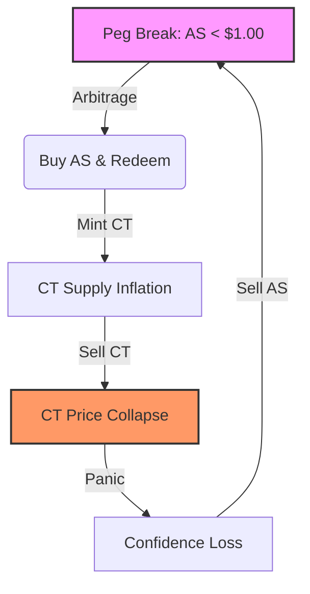

# Part I: Foundations & Architecture

## 1. Theoretical Basis: The Dual-Token Mechanism

A dual-token algorithmic stablecoin consists of two assets:

- **Stablecoin (AS):** Target price fixed at $1, backed by the promise of redemption.
- **Collateral Token (CT):** A volatile endogenous asset used to absorb demand shocks.

The peg is maintained through a mint-burn facility: 1 **AS** can always be redeemed for $1 worth of **CT** at oracle price. When **AS** trades below peg, arbitrageurs burn **AS** to mint **CT**, contracting stablecoin supply and (_theoretically_) restoring the peg.

### The Death Spiral Mechanism

When confidence erodes, the redemption mechanism becomes reflexive:

1. **AS** price falls below peg.
2. Redemptions accelerate (Arbitrageurs burn **AS** for **CT**).
3. **CT** supply inflates (each redemption mints new **CT**).
4. **CT** price collapses (supply inflation exceeds demand).
5. Redemption value falls (**CT** is worth less).
6. Confidence collapses further.

This is the **death spiral**—a positive feedback loop where the mechanism designed to stabilize the peg instead accelerates its destruction.



---

## 2. Simulation Framework (DualTokenSim)

The experiments build on `DualTokenSim`, modeling a three-pool architecture:

### The Three-Pool Economy

1. **Pool 1 (AS/USD):** Market price discovery for the stablecoin.
2. **Pool 2 (CT/USD):** Market price discovery for the collateral token.
3. **Virtual Pool (Mint-Burn):** The protocol's redemption mechanism.

**Critical Dynamic:** The **Virtual Pool** enforces the peg by allowing 1 **AS** to be burned for $1 of **CT**. This mints new **CT**, expanding supply.

### Core Components

#### 1. The Virtual Liquidity Pool (The Mechanism)

The "**Solvency Mechanism**" that burns **AS** to mint **CT**. It behaves like an AMM that _must_ provide liquidity at the oracle price, regardless of market conditions.

```python
def redeem_stablecoin(amount_as):
    oracle_price_ct = get_oracle_price()
    # Mints CT based on $1.00 peg value, not market value of AS
    mint_amount_ct = (amount_as * 1.00) / oracle_price_ct
    
    ct_supply.mint(mint_amount_ct)
    as_supply.burn(amount_as)
    return mint_amount_ct
```

#### 2. Arbitrage Logic (The Trigger)

Rational actors exploit the spread between the market price ($P_{market}$) and the redemption price ($1.00$).

```python
if as_market_price < (1.00 - slippage):
    # 1. Buy Cheap AS
    buy_as_on_market()
    # 2. Redeem for $1.00 of CT
    ct_received = redeem_stablecoin(as_held)
    # 3. Sell CT immediately (Driving CT price down)
    sell_ct_on_market(ct_received)
```

#### 3. Panic Psychology (The Feedback)

As the Collateral Token crashes, confidence erodes, accelerating the sell-off.

```python
def calculate_sell_pressure(confidence):
    # Panic selling inversely proportional to confidence/price
    sell_volume = base_volume * (1 / confidence_score)
    return sell_volume
```

### System Parameters (Pre-Crash)

> **Note:** These parameters are modeled after the **Terra/Luna** state circa May 7, 2022, just prior to the [de-peg event](https://www.sciencedirect.com/science/article/abs/pii/S1544612322005359).

| Token | Initial Price | Total Supply | Pool Liquidity |
|:------|:-------------:|:------------:|:--------------:|
| AS (Stable) | $1.00 | 18.49B | $18.5B (AS/USD) |
| CT (Collateral) | $80.00 | 345.3M | $27.6B (CT/USD) |

---

## 3. The Profitability Hypothesis

### Core Thesis

We posit that the "Death Spiral" is not merely a failure mode, but a **profitable arbitrage opportunity** for a sufficiently capitalized adversary.

The system is structurally vulnerable if the value extracted from shorting the collapsing collateral exceeds the capital cost required to break the peg.

### The Profit Theory

The attack is viable only when:

$$ \text{Net Profit} = (\text{Short Position} \times \Delta \text{Price}_{CT}) - \text{Cost to Trigger De-Peg} > 0 $$

This research focuses exclusively on quantifying these variables:

1. **Trigger Cost:** Effect of pool depth and AMM curves on the cost to crash **AS**.
2. **Short Capture:** The ROI of shorting **CT** during the deterministic collapse.

**Conclusion:** We do not seek to fix the system. We seek to demonstrate that it is economically rational to destroy it.

---

<div align="center">

| [Previous] | Home | [Next] |
| :--- | :---: | ---: |
| [Modelling Overview](README.md) | [Table of Contents](../README.md) | [2. Market Simulations →](02_Market_Simulation.md) |

</div>
