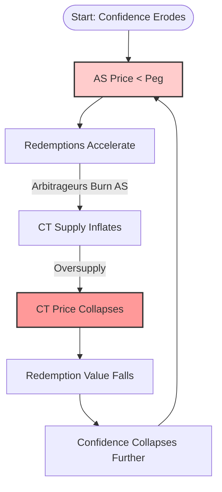

# Part I: Theoretical Foundation

## The Dual-Token Mechanism

A dual-token algorithmic stablecoin consists of two assets:

- **Stablecoin (AS):** Target price fixed at $1, backed by the promise of redemption.
- **Collateral Token (CT):** A volatile endogenous asset used to absorb demand shocks.

The peg is maintained through a mint-burn facility: 1 AS can always be redeemed for \$1 worth of CT at oracle price. When AS trades below peg, arbitrageurs burn AS to mint CT, contracting stablecoin supply and (theoretically) restoring the peg.

The mechanism works in both directions under normal conditions. The failure mode emerges under stress.

---

## The Death Spiral

When confidence erodes, the redemption mechanism becomes reflexive:

1. **AS** price falls below peg
2. Redemptions accelerate (arbitrageurs burn **AS** for **CT**)
3. **CT** supply inflates (each redemption mints new **CT**)
4. **CT** price collapses (supply inflation exceeds demand)
5. Redemption value falls (**CT** is worth less)
6. Confidence collapses further
7. Return to step 1

This is the **death spiral**—a positive feedback loop where the mechanism designed to stabilize the peg instead accelerates its destruction. The critical insight is that this loop is *deterministic* once triggered. The stabilization math, running faithfully, executes the protocol's own destruction.

---

## The Attacker's Position

A rational attacker does not profit from breaking the peg alone. Profit arises from **positioning against the consequences** of the peg break.

The attack structure is:

| Component | Action | Economic Effect |
|:----------|:-------|:----------------|
| **Trigger** | Large AS sell | Incurs slippage loss; breaks the peg |
| **Capture** | CT short position | Gains from collateral collapse |

The attack is profitable when:

$$\text{Short Profit} > \text{Trigger Cost}$$

This is a classic asymmetric payoff: fixed downside (slippage on the dump), variable upside (gains scale with leverage on the short).

---

[← Back to Index](README.md) | [Next: Simulation Framework →](02_Framework.md)
