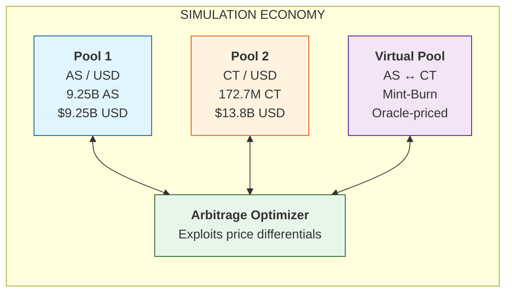

# Part II: Simulation Framework

## DualTokenSim ([Calandra et al., 2024](https://ieeexplore.ieee.org/document/11114693))

The experiments build on DualTokenSim, an open-source simulator for dual-token stablecoins published alongside the IEEE Access paper. The framework models a three-pool architecture that captures the core dynamics of Terra-style systems.

---

## The Three-Pool Architecture

The simulation economy consists of three interconnected pools:



**Pool 1: AS/USD (Stablecoin Market)**

- Constant-product AMM: $x \cdot y = k$
- Market price discovery for the stablecoin
- When AS trades below $1, arbitrage opportunity exists

**Pool 2: CT/USD (Collateral Market)**  

- Constant-product AMM: $x \cdot y = k$
- Market price discovery for the collateral token
- Receives selling pressure as CT is minted during redemptions

**Virtual Pool: AS ↔ CT (Mint-Burn Facility)**

- NOT a trading venue—this is the protocol's redemption mechanism
- Enforces the peg: 1 AS can always be **burned** for $1 worth of CT at oracle price
- When AS trades at $0.90, arbitrageurs:
  1. Buy AS at $0.90 from Pool 1
  2. Burn AS in Virtual Pool → receive $1.00 worth of CT
  3. Sell CT in Pool 2 for ~$1.00
  4. Pocket $0.10 profit per AS

This arbitrage loop is **supposed to restore the peg** by contracting AS supply. The death spiral occurs because the CT minted in step 2 crashes CT price, eroding confidence and triggering more AS selling.

---

## Simulation Parameters

The simulation is calibrated to approximate Terra/Luna scale at pre-crash levels:

**Token Configuration:**

| Token | Initial Price | Total Supply | Pool Quantity | Free Supply |
|:------|:-------------:|:------------:|:-------------:|:-----------:|
| AS (Stablecoin) | $1.00 | 18.49B | 9.25B | 9.25B |
| CT (Collateral) | $80.00 | 345.3M | 172.7M | 172.7M |
| USD (Reference) | $1.00 | — | — | — |

**Pool Liquidity:**

| Pool | Token A | Token B | TVL |
|:-----|:-------:|:-------:|----:|
| Pool 1 (AS/USD) | 9.25B AS | $9.25B USD | $18.5B |
| Pool 2 (CT/USD) | 172.7M CT | $13.8B USD | $27.6B |
| Virtual Pool | Dynamic | Oracle-priced | — |

**System Capitalization:**

- AS market cap: ~$18.5B (at peg)
- CT market cap: ~$27.6B (345M × $80)
- **Collateralization ratio: ~149%** (CT cap / AS cap)

**Attack Parameters (Phase 2):**

- Attacker AS holdings: 500M (~2.7% of supply)
- CT short position: $300M notional
- Attack iteration: 150,000 (~10 days into simulation)

The 149% collateralization ratio reflects a "healthy" system—the death spiral occurs despite over-collateralization because CT price is endogenous and crashes during redemptions.

---

## Repository Structure

```
Algo-Attack-Model/
├── DualTokenSim/
│   └── source/
│       ├── Tokens/                    # Token definitions (AS, CT, USD)
│       ├── liquidity_pools/           # AMM pool implementation
│       ├── arbitrage_optimizer/       # Arbitrage bot logic
│       ├── purchase_generators/       # Stochastic trade generation
│       ├── simulations/
│       │   ├── three_pools_simulation.py    # Main simulation runner
│       │   └── three_pools_live_simulation.py
│       ├── attacker.py               # [NEW] Attacker agent class
│       └── lending_pool.py           # [NEW] Short position mechanics
├── sensitivity_analysis_results/      # Parameter sweep outputs
├── model_deep_dive.md                 # Technical documentation
└── web-app/                           # Interactive visualization
```

---

## Core Components

### Tokens (`source/Tokens/`)

| Token | Class | Role |
|:------|:------|:-----|
| AS (Algorithmic Stablecoin) | `AlgorithmicStablecoin` | Target price $1.00; can be burned for CT via virtual pool |
| CT (Collateral Token) | `CollateralToken` | Volatile backing; price determined by AMM; supply expands on AS redemption |
| USD (Reference Token) | `ReferenceToken` | Fixed at $1.00; numeraire for all prices |

Each token tracks `price`, `supply`, and `free_supply` (circulating outside pools). The death spiral occurs because AS redemptions *mint* new CT, increasing CT supply and crashing its price.

### Liquidity Pools (`source/liquidity_pools/`)

```python
class LiquidityPool:
    # Standard constant-product AMM (x * y = k)
    def swap(self, token, amount):
        # Computes output using constant-product formula
        # Applies transaction fee
        # Updates pool reserves and token supplies
```

```python
class VirtualLiquidityPool(LiquidityPool):
    # The mint-burn facility that enforces the peg
    # 1 AS can always be burned for $1 worth of CT at oracle price
    
    def swap(self, token, amount):
        # Burns input token
        # Mints output token at oracle-derived rate
        # Tracks delta (deviation from equilibrium)
    
    def update_supplies(self, token, other_token, amount, other_amount):
        token.burn(amount)       # Destroys AS
        other_token.mint(other_amount)  # Creates new CT
```

The `VirtualLiquidityPool` is **the mechanism that creates the death spiral**. It burns AS and mints CT at oracle price—rational behavior that accelerates collapse when CT price is falling.

### Arbitrage Optimizer (`source/arbitrage_optimizer/`)

```python
class ThreePoolsArbitrageOptimizer:
    def detect_arbitrage(self) -> Tuple[str, bool]:
        # Type 1: AS trading above peg → Sell AS for profit
        # Type 2: AS trading below peg → Buy AS, burn for CT, sell CT
        
    def leverage_arbitrage_opportunity(self):
        if arbitrage_type == 'Type 2':  # AS below peg
            # 1. Buy cheap AS in Pool 1
            # 2. Burn AS in virtual pool → mint CT
            # 3. Sell CT in Pool 2
            # This is "rational" and accelerates the death spiral
```

**Critical insight:** Type 2 arbitrage (triggered when AS < $1) is the death spiral engine. Each cycle:

- Contracts AS supply (stabilizing)
- Expands CT supply (destabilizing)
- Depresses CT price (erodes confidence)
- Triggers more AS selling (reflexive)

### Purchase Generators (`source/purchase_generators/`)

```python
class SeignorageModelRandomPurchaseGenerator:
    def generate_transaction_amount(self) -> float:
        # Gaussian-distributed order sizes
        # Mean shifts based on market conditions:
        
        if token.price < (1 - threshold):  # Panic mode
            mean = delta_variation(token.price)  # Default: 1/price
            # When price = $0.50, mean = 2.0 (strong sell pressure)
        else:
            mean = 0.0  # Normal mode: balanced buy/sell
```

The `delta_variation` function (default: `lambda x: 1/x`) models panic psychology—as price falls, selling accelerates.

---

## Key Extensions

### Attacker Agent (`attacker.py`)

```python
class Attacker:
    def __init__(self, initial_wallet: dict[Token, float]):
        self.wallet = initial_wallet
        self.short_positions = {}  # {token: {'amount', 'entry_price'}}
        self.realized_pnl = 0.0

    def swap(self, pool, token_in, amount_in):
        # Execute large market sell through AMM pool
        
    def open_short(self, token, amount):
        # Open short position at current price
        # Tracks weighted-average entry for PnL calculation
        
    def get_portfolio_value(self):
        # Wallet assets + Unrealized short PnL + Realized PnL
```

### Core Simulation (`three_pools_simulation.py`)

```python
def run_simulation(self):
    for iteration in range(self.number_of_iterations):
        
        # === THE ATTACK TRIGGER ===
        if self.attacker and iteration == self.attack_iteration:
            print("Attacker is executing the attack!")
            self.attacker.swap(self.stablecoin_pool, 
                               self.stablecoin_token, 
                               self.attack_swap_amount)
        
        # Record state (prices, supplies, attacker portfolio)
        simulation_data["stablecoin_price_history"].append(stablecoin.price)
        simulation_data["collateral_price_history"].append(collateral.price)
        simulation_data["attacker_portfolio_history"].append(
            self.attacker.get_portfolio_value()
        )
        
        # Execute random market activity + arbitrage
        self.market_simulator.execute_random_purchases()
```

**Why This Matters:** The death spiral is not a bug—it's the intended mechanism operating correctly. The mint-burn facility contracts AS supply but mints CT, which crashes CT price, which erodes confidence, which triggers more AS selling. The arbitrageurs accelerate the collapse by exploiting the price differential.

---

[← Back to Index](README.md) | [Previous: Theory ←](01_Theory.md) | [Next: Experiments →](03_Experiments.md)
