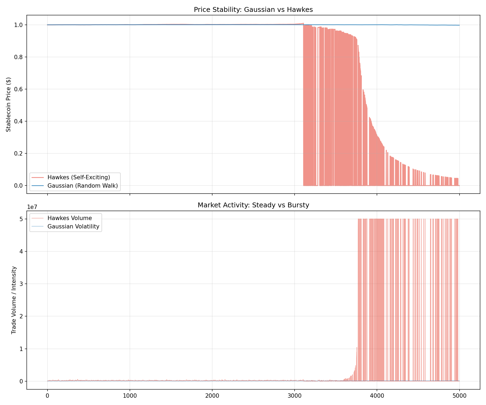

# Part II: Market Simulation & Experiments

## 1. Baseline Attack Experiments

We simulated a "**Death Spiral**" using the `DualTokenSim` framework. The simulation isolates the economic feedback loops by modeling two primary agents interacting over 50-100 discrete time steps.

### Simulation Strategy

The experiment follows a deterministic execution flow to test system resilience:

1. **The Agents:**
    * **Attacker:** An adversary with significant capital ($1B+) capable of executing large trades (Dumping AS) and opening leveraged short positions on the collateral (CT).
    * **Arbitrageur:** A rational profit-maximizer who monitors the peg. If $P_{AS} < \$1.00$, they buy AS, redeem it for $\$1.00$ of CT, and immediately sell CT.

2. **Execution Flow:**
    * **Phase 1: The Trigger (Step 10):** The Attacker executes a massive sell order (e.g., 500M AS) into the liquidity pool. This incurs a "Trigger Cost" (slippage) but pushes the price below the peg (e.g., to $0.90).
    * **Phase 2: The Response (Steps 11-20):** Arbitrageurs step in. They buy cheap AS and redeem it. The protocol mints new CT to cover redemptions.
    * **Phase 3: The Death Spiral (Steps 21+):** The selling of newly minted CT crushes the collateral price. Lower CT price means *more* CT must be minted for the next redemption ($1/P_{CT}$). Supply becomes asymptotic.
    * **Phase 4: The Capture:** The Attacker closes their CT short position to realize profit from the collapse.

### Visual Evidence: The Anatomy of a Crash

The following charts visualize the system state over 50 simulation steps (approximately 4 hours of panic).

*Fig 1: The Stablecoin (AS) peg breaks immediately under selling pressure. The 'Arbitrage' attempts to fix it by printing CT, but fails.*

*Fig 2: The Death Spiral. As AS is redeemed, CT supply (Top Right) goes vertical. This hyper-inflation causes CT price (Top Left) to collapse to near-zero.*

### Attacker Performance

Does the attacker make money? We modeled three distinct strategies.

*Fig 3: Cumulative PnL of a "Max Leverage" attacker. The initial drop is the cost of dumping AS (slippage loss). The subsequent rise is the profit from the CT short position.*

| Experiment | Strategy | Short Size | Net PnL | Outcome |
| :----------- | :--------- | -----------: | --------: | :-------- |
| **1. Raw Dump** | Sell 500M AS | $0 | **-$87M** | Attack succeeds, but attacker loses money (slippage). |
| **2. Soros** | Short 300M CT + Dump 500M AS | $300M | **+$68M** | Profitable. Short side captures the volatility. |
| **3. Max Lev** | Short 1B CT + Dump 500M AS | $1B | **+$411M** | Profit scales linearly with leverage. Trigger cost is fixed. |

**Key Insight:** The attack has a fixed entry cost (the dump) and variable upside (the short).

---

## 2. Liquidity Sensitivity Analysis

We varied pool depth from 0.25x to 5x baseline ($18.5B) to test if "deeper liquidity" protects the peg.

### The Liquidity Paradox

*Fig 4: Attacker PnL vs Pool Liquidity. Note the inverted relationship.*

Counterintuitively, **shallow pools are more dangerous to the attacker**.

| Multiplier | Trigger Cost | Net PnL |
|:----------:|-------------:|--------:|
| 0.25x | High ($117M) | -$37M |
| 1.0x | Moderate ($32M) | +$68M |
| 5.0x | Low ($9M) | -$35M |

**Why?**

* **Shallow Pools:** High slippage during the initial dump makes the "Entry Cost" prohibitively expensive ($117M).
* **Deep Pools:** While entry is cheap ($9M), the massive liquidity absorbs the sell pressure too well. The death spiral acts too slowly to profit within the window.
* **Conclusion:** The "Goldilocks Zone" for attackers is moderate liquidity—enough to minimize slippage, but not enough to absorb the shock.

---

## 3. Curve (StableSwap) vs Uniswap

**Hypothesis**: Does a flatter curve (StableSwap) prevent de-pegs? We compared the standard $x*y=k$ (Uniswap) against Curve's invariant with $A=100$.

The StableSwap invariant creates a flattened curve near the peg:

$$ A n^n \sum x_i + D = A D n^n + \frac{D^{n+1}}{n^n \prod x_i} $$

Where $A$ is the amplification coefficient, determining how "flat" the curve is.

### The "Flat Curve" Trap

*Fig 5: Price defense comparison. Curve (Blue) holds the peg longer but crashes harder.*

| Pool Type | Trigger Cost | Min AS Price | Net PnL |
|:----------|-------------:|-------------:|--------:|
| **Uniswap** | $32.2M | $0.90 | -$14.9M |
| **Curve (A=10)** | $31.4M | $0.89 | -$30.9M |
| **Curve (A=100)** | $29.5M | $0.89 | -$28.7M |
| **Curve (A=500)** | $29.6M | $0.89 | -$27.5M |

**Mechanism Analysis:**

1. **Lower Trigger Cost:** Flatter curve = less slippage. It is *cheaper* to dump AS on Curve.
2. **Protected Collateral:** Because the AS price holds closer to $1.00 for longer, fewer redemptions occur. The death spiral *failed to ignit* fully.
3. **Zombie State:** AS price fell off the "cliff" to $0.88 and stayed there. The protocol entered a "Zombie State"—permanently de-pegged but not dead.

**Verdict:** Curve prevents total zero-collapse but traps the protocol in a permanent de-pegged state that is arguably worse (loss of confidence without resolution).

---

## 4. Market Dynamics: Gaussian vs Hawkes

We compared standard random-walk market noise (Gaussian) vs. self-exciting volatility (Hawkes Process) to test "Spontaneous Failure".

### Findings: The Hidden Risk

*Fig 6: Simulation of collateral price under Gaussian (Blue) vs Hawkes (Orange) volatility models.*

* **Gaussian:** Protocol handles 6-sigma events easily. Mean-reversion stabilizes the peg.
* **Hawkes:** A small dip triggers panic selling (intensity spike).
  * **Phase Transition:** The feedback loop creates a "volatility explosion".
  * **Result:** The protocol drained to zero *spontaneously* without an attacker.

**Implication:** Protocols stable under Normal distributions can fail catastrophically under Fat-Tailed conditions. "Black Swans" are internal properties of the market structure.

---

[← Back to Index](README.md) | [Previous: Foundations ←](01_Foundations.md) | [Next: Attack Analysis →](03_Attack_Analysis.md)

---

| [Previous] | Home | [Next] |
| :--- | :---: | ---: |
| [1. Foundations](01_Foundations.md) | [Table of Contents](../README.md) | [3. Attack Analysis →](03_Attack_Analysis.md) |

