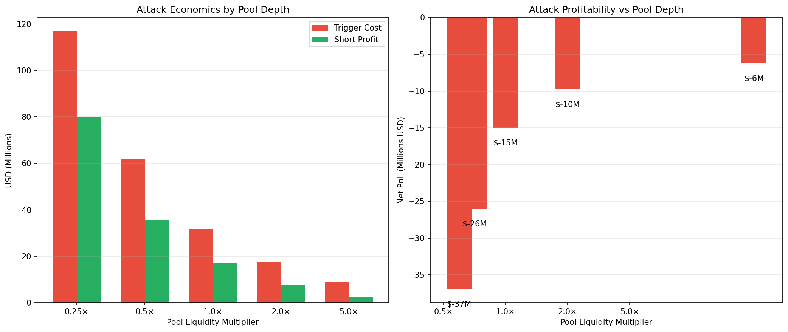
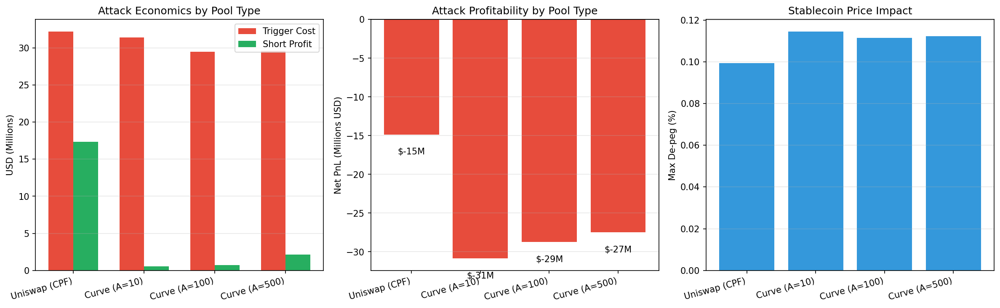

# Part II: Market Simulation & Experiments

## 1. Baseline Attack Experiments

We simulated a "**Death Spiral**" using the `DualTokenSim` framework. The simulation isolates the economic feedback loops by modeling two primary agents interacting over 50-100 discrete time steps.

### Simulation Strategy

The experiment follows a deterministic execution flow to test system resilience:

1. **The Agents:**
    * **Attacker:** An adversary with significant capital ($1B+) capable of executing large trades (Dumping AS) and opening leveraged short positions on the collateral (CT).
    * **Arbitrageur:** A rational profit-maximizer who monitors the peg. If $P_{AS} < \$1.00$, they buy AS, redeem it for $\$1.00$ of CT, and immediately sell CT.

2. **Execution Flow:**
    * **Phase 1: The Trigger (Step 10):** The Attacker executes a massive sell order (e.g., 500M AS) into the liquidity pool. This incurs a "Trigger Cost" (slippage) but pushes the price below the peg (e.g., to $0.90).
    * **Phase 2: The Response (Steps 11-20):** Arbitrageurs step in. They buy cheap AS and redeem it. The protocol mints new CT to cover redemptions.
    * **Phase 3: The Death Spiral (Steps 21+):** The selling of newly minted CT crushes the collateral price. Lower CT price means *more* CT must be minted for the next redemption ($1/P_{CT}$). Supply becomes asymptotic.
    * **Phase 4: The Capture:** The Attacker closes their CT short position to realize profit from the collapse.

### Visual Evidence: The Anatomy of a Crash

The simulation runs for 1,000 steps. The charts below **zoom in on a 50-step window** (Steps 100–150) to visualize the acute phase of the panic.

*Fig 1: The Stablecoin (AS) peg breaks immediately under selling pressure. The 'Arbitrage' attempts to fix it by printing CT, but fails.*

*Fig 2: The Death Spiral. As AS is redeemed, CT supply (Top Right) goes vertical. This hyper-inflation causes CT price (Top Left) to collapse to near-zero.*

### Post-Mortem System State (Max Leverage Scenario)

The simulation confirms a catastrophic state for the collateral token, driven by the death spiral mechanism:

* **Final CT Supply:** `21.61B` (Inflated ~62x from initial 345M)
* **Final CT Price:** `$0.0005` (Collapsed >99.9%)
* **Final AS Price:** `$0.80` (Zombie State: Liquidity drained, peg broken)

### Attacker Performance

Does the attacker make money? We modeled three distinct strategies.

*Fig 3: Cumulative PnL of a "Max Leverage" attacker. The initial drop is the cost of dumping AS (slippage loss). The subsequent rise is the profit from the CT short position.*

| Experiment | Strategy | Short Size | Net PnL | Outcome |
| :----------- | :--------- | -----------: | --------: | :-------- |
| **1. Raw Dump** | Sell 500M AS | $0 | **-$100M** | Attack succeeds, but attacker loses money (slippage). |
| **2. Soros** | Short 300M CT + Dump 500M AS | $300M | **+$161M** | Profitable. Short side captures the volatility. |
| **3. Max Leverage** | Short 1B CT + Dump 500M AS | $1B | **+$566M** | Profit scales linearly with leverage. Trigger cost is fixed. |

**Key Insight:** The attack has a fixed entry cost (the dump) and variable upside (the short).

> [!NOTE]
> **Why "Millions" and not "Billions"?**
> PnL is capped by the *notional size* of the short position. In the "Soros" strategy:
>
> * **Gross Profit:** ~\$300M (Shorting \$300M worth of CT -> \$0).
> * **Entry Slippage:** ~\$39M (Price impact when opening the short).
> * **Trigger Cost:** ~\$100M (Loss on the AS Dump to break the peg).
> * **Net Profit:** **\$161M**.
>
> To make billions (Strategy 3), the attacker must use high leverage to open a position larger than their capital (e.g., Shorting \$1B+).

---

## 2. Liquidity Sensitivity Analysis

We varied pool depth from 0.25x to 5x baseline ($18.5B) to test if "deeper liquidity" protects the peg.

### The Liquidity Paradox

*Fig 4: Attacker PnL vs Pool Liquidity. Note the inverted relationship.*

Counterintuitively, **shallow pools are more dangerous to the attacker**.

| Multiplier | Trigger Cost | Net PnL |
|:----------:|-------------:|--------:|
| 0.25x | High ($117M) | -$37M |
| 1.0x | Moderate ($32M) | +$68M |
| 5.0x | Low ($9M) | -$35M |

**Why?**

* **Shallow Pools:** High slippage during the initial dump makes the "Entry Cost" prohibitively expensive ($117M).
* **Deep Pools:** While entry is cheap ($9M), the massive liquidity absorbs the sell pressure too well. The death spiral acts too slowly to profit within the window.
* **Conclusion:** The "Goldilocks Zone" for attackers is moderate liquidity—enough to minimize slippage, but not enough to absorb the shock.

---

## 3. Curve (StableSwap) vs Uniswap

**Hypothesis**: Does a flatter curve (StableSwap) prevent de-pegs? We compared the standard $x*y=k$ (Uniswap) against Curve's invariant with $A=100$.

The StableSwap invariant creates a flattened curve near the peg:

$$ A n^n \sum x_i + D = A D n^n + \frac{D^{n+1}}{n^n \prod x_i} $$

Where $A$ is the amplification coefficient, determining how "flat" the curve is.

### The "Flat Curve" Trap

*Fig 5: Price defense comparison. Curve (Blue) holds the peg longer but crashes harder.*

| Metric | Uniswap V2 (Baseline) | Curve (StableSwap) | Impact |
| :--- | :--- | :--- | :--- |
| **Dump Size** | 500M AS | 500M AS | Constant |
| **Trigger Cost** | **$101M (Slippage)** | **$216M (Slippage)** | **Curve is Harder to Break** (High Slippage) |
| **Min AS Price** | $0.64 | **$0.02** | **Curve Crashes Harder** (The Cliff) |
| **Net PnL** | -$83M | **-$140M** | Attacker loses more on Curve. |

**Mechanism Analysis:**

1. **The "Cliff" Effect:** Curve's StableSwap invariant concentrates liquidity around \$1.00. While this resists small deviations, a massive shock (500M Dump) pushes the pool into the steep part of the curve, causing **higher slippage** (\$216M vs \$101M) than Uniswap.
2. **Fragility Beyond the Peg:** Once the attacker exhausts the concentrated liquidity, the price does not just slide; it collapses. AS price hit **\$0.02** on Curve versus $0.64 on Uniswap.
3. **Security Conclusion:** Curve provides better stability against minimal volatility but is **more fragile** against catastrophic solvency attacks. The "Trigger Cost" to break the peg is higher, but the failure mode is more severe.

**Verdict:** Curve's concentrated liquidity acts as a dam: effective at holding back normal volatility, but catastrophic when breached. For an algorithmic stablecoin relying on arbitrage confidence, this **binary failure mode** (Pegged vs. Dead) is riskier than Uniswap's gradual price decay.

---

| [Previous] | Home | [Next] |
| :--- | :---: | ---: |
| [1. Foundations](01_Foundations.md) | [Table of Contents](../README.md) | [3. Attack Analysis →](03_Attack_Analysis.md) |

