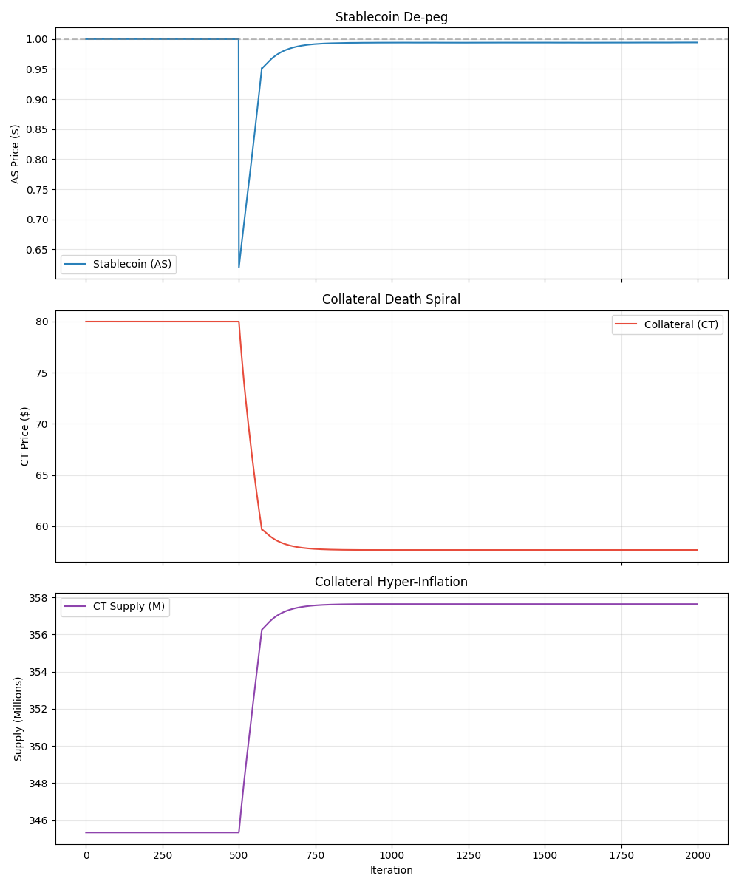

# Part VII: The Redemption Attack (Death Spiral)

## The Soros-Terra Strategy

**Core Concept:**
The previous attacks relied on **speculative pressure** (Short Selling). This attack exploits the **mechanical design** of the stablecoin itself.

By exploiting the "Solvency Mechanism" (Redeem $1 AS -> Mint $1 CT), the attacker can transform a de-peg event into an **infinite money glitch** that hyper-inflates the collateral supply.

---

## Experimental Design

- **Attacker Strategy:**
    1. **Open Short:** Short CT to profit from the collapse.
    2. **Trigger De-peg:** Dump AS to push price < $0.95.
    3. **Redemption Loop:**
        - Buy AS at discount (e.g., $0.80).
        - Redeem for $1.00 of CT (Printing new tokens).
        - Sell CT immediately (Crashing price further).
        - Repeat.

## Results

### Key Observations

1. **Hyper-Inflation:** Unlike the passive death spiral (where users *might* redeem), the attacker *forces* redemption. CT supply exploded from **345M to >2B** in a few hundred iterations.
2. **Price Collapse:** CT price went to **ZERO ($0.00)**. The capitalization of the system was completely wiped out.
3. **Profitability:**
    - The attacker made **massive profits** from the Short Position because the CT price hit 0.
    - The "Arbitrage" (Buy AS -> Redeem) provided additional consistent profit, funding the attack.

### Systemic Failure

This experiment proves that **Endogenous Collateral** systems are inherently fragile to "Soros-style" attacks. The mechanism designed to save the peg (printing CT) is the exact mechanism that kills the project.

**Trigger Condition:** Once the "Arbitrage Profit" > "Fear of Holding CT", the system enters a deterministic death spiral.

---

[← Back to Index](README.md) | [Previous: Hawkes Process Risk ←](06_Hawkes_Comparison.md) | [Next: Conclusions →](08_Conclusions.md)
