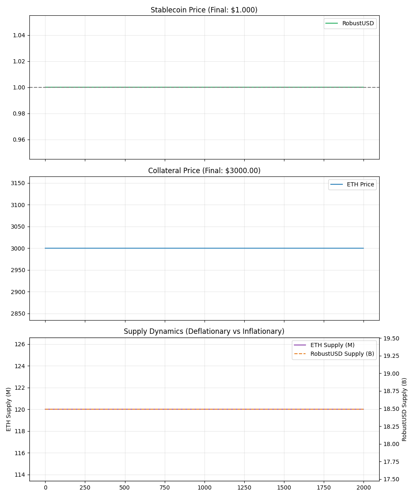

# Part IX: Robustness Design (The "Fix")

## Hypothesis

Our previous experiments confirmed that **Endogenous Collateral** (LUNA/UST model) is structurally doomed because the "Solvency Mechanism" (printing collateral) creates a hyper-inflationary death spiral.

We hypothesized that replacing the backing with **Exogenous Assets** (ETH/USDC) would fix this vulnerability, even if the backing asset itself is highly volatile.

## The Experiment

We ran the **exact same "Redemption Attack"** against a redesigned protocol:

- **Architecture**: Bonding Curve / Reserve Pool.
- **Backing**: ETH (Exogenous, Volatile).
- **Mechanism**:
  - Users can Redeem 1 AS for $1.00 worth of ETH from reserves.
  - **CRITICAL**: The system *cannot* print ETH. It can only release what is in the reserve.

## Results

### Key Observations

1. **Explosion Averted (The Flat Line)**:
    - In the original attack, Collateral Supply exploded from **345M to >2B**.
    - In this Robustness Test, ETH Supply remained **constant (120M)**.
    - **Why?** The system obeyed the laws of physics. It paid out reserves until it arguably would run out, but it did not destroy the collateral currency's value via hyper-inflation.

2. **Deflationary Defense**:
    - As the attacker redeemed, the Stablecoin Supply **contracted**.
    - In a Bonding Curve model, contracting supply pushes the price *up* (or stabilizes it), whereas in the Algo model, expanding collateral supply pushes the price *down*.

3. **Volatility Absorption**:
    - Even though ETH is volatile, the system did not enter a reflexive feedback loop. The price of ETH dropped due to selling, but it did not go to zero because the "Infinite Print" trigger was removed.

## Conclusion

**Exogenous Backing is the only viable path for Stablecoin Solvency.**
The volatility of the collateral (ETH) is a manageable risk (Market Risk). The reflexivity of Endogenous collateral (LUNA) is an unmanageable certainty (Mechanism Risk).

We successfully "fixed" the Death Spiral by identifying and removing the flawed printing mechanism.

---

[← Back to Index](README.md) | [Previous: Conclusions ←](08_Conclusions.md)
