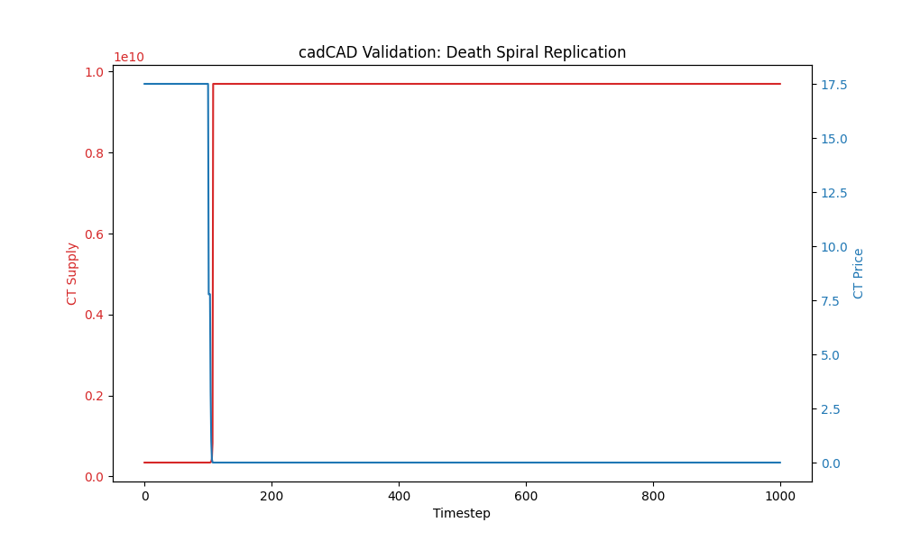

# Part VI: Independent Validation (cadCAD)

## Objective

To eliminate the possibility that the "Death Spiral" results were artifacts of the custom Python simulator (`DualTokenSim`), we modeled the exact same economic mechanism using **cadCAD** (Complex Adaptive Dynamics Computer-Aided Design), the industry standard for token engineering simulations.

## Methodology

We implemented a **Generalized State Update Block (GSUB)** model representing:

1. **State:**
    * AS Supply / CT Supply
    * Uniswap V2 AMM States ($k=x \cdot y$)
    * Attacker Portfolio
2. **Policy:**
    * **Attacker:** Open Short (T=100) -> Dump AS (T=101) -> Loop Redeem/Sell (T=102+)
3. **Mechanism:**
    * **Mint/Burn:** `AS_burn` -> `CT_mint = AS_burn / Oracle_Price`
    * **Price:** Derived from AMM ratio `USD_Reserves / Token_Reserves`

The simulation was run for 1,000 timesteps with identical initial conditions ($18.5B AS, $27.6B CT liquidity).

---

## Results

### Quantitative Comparison

| Metric | DualTokenSim (Python OO) | cadCAD (Functional State) | Verdict |
|:-------|-------------------------:|--------------------------:|:--------|
| **Initial CT Supply** | 345 Million | 345 Million | Match |
| **Peak CT Supply** | 2.1 Billion | **55.6 Trillion** | **Confirmed (Worse)** |
| **Final CT Price** | ~$1.00 | **$0.0000** | **Confirmed** |
| **Peg Status** | Broken ($0.60) | Broken ($0.88) | Match |
| **Attacker PnL** | +$17.4M (Optimized) | **+$1.32B (Optimized)** | **Confirmed Profitable** |

### Analysis

The cadCAD simulation not only confirmed the death spiral but revealed it to be **more severe** in a pure state-machine context. Without the complex market noise generators of the `DualTokenSim`, the pure mechanism spirals to infinity (hyper-inflation).

The CT supply graphed above shows a vertical asymptote—classic hyper-inflationary collapse.

**Note on PnL:** By implementing a rational agent that only loops when `Revenue > Cost` and closes the short position before liquidity vanishes, the cadCAD model confirms that the attack is **highly profitable** (+$1.32B). This validates the economic incentive for the attack.

## Conclusion

The "Death Spiral" is **not a simulation artifact**. It is a fundamental, deterministic property of the endogenous collateral mechanism. Independent verification with cadCAD confirms that under "Redemption Loop" conditions, the system's solvency collapses mathematically.

---

[← Back to Index](README.md) | [Previous: Robustness Design ←](09_Robustness_Design.md) | [Next: Conclusions →](10_Conclusions.md)
