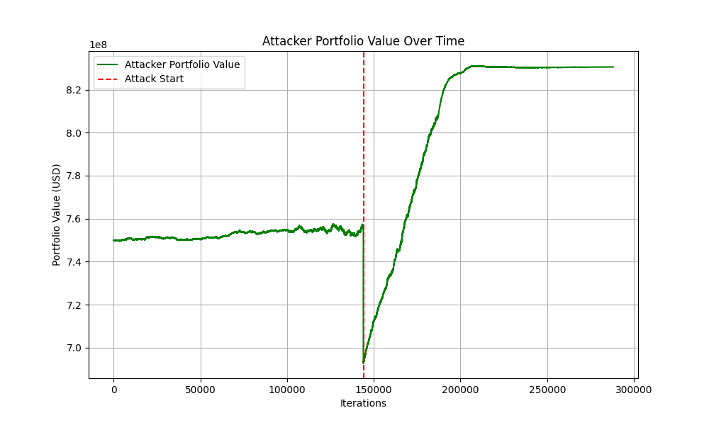
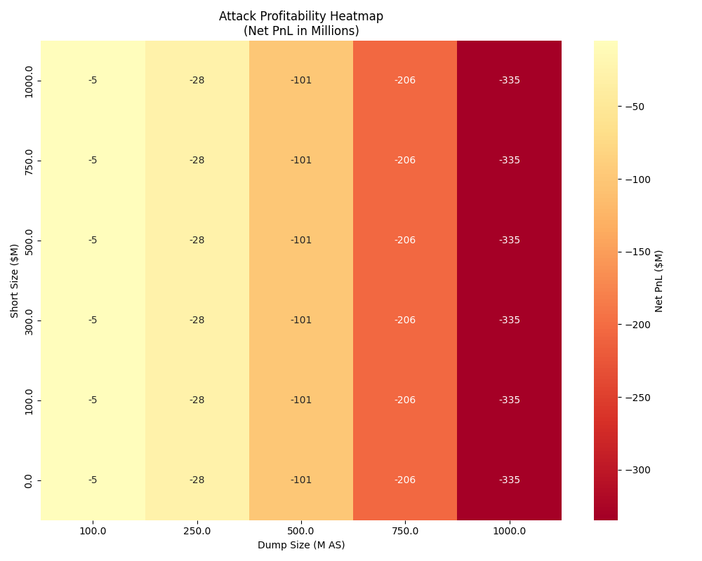

# The Economics of Algorithmic Stablecoin Attacks

*A quantitative analysis of profitable de-pegging strategies against dual-token systems*

---

## The Thesis

**Algorithmic stablecoins backed by endogenous collateral are structurally exploitable.** A sufficiently capitalized adversary can profitably attack these systems by combining a trigger mechanism (selling stablecoins to break the peg) with a capture mechanism (shorting the collateral token to monetize the collapse). The attack is not psychological—it is economic.

This analysis uses the DualTokenSim framework ([Calandra et al., 2024](#ref-calandra)) to quantify the conditions under which a de-peg attack becomes profitable. The findings generalize to any dual-token seigniorage design, including the architecture that failed in Terra/Luna.

---

## Part I: Theoretical Foundation

### The Dual-Token Mechanism

A dual-token algorithmic stablecoin consists of two assets:

- **Stablecoin (AS):** Target price fixed at $1, backed by the promise of redemption.
- **Collateral Token (CT):** A volatile endogenous asset used to absorb demand shocks.

The peg is maintained through a mint-burn facility: 1 AS can always be redeemed for $1 worth of CT at oracle price. When AS trades below peg, arbitrageurs burn AS to mint CT, contracting stablecoin supply and (theoretically) restoring the peg.

The mechanism works in both directions under normal conditions. The failure mode emerges under stress.

### The Death Spiral

When confidence erodes, the redemption mechanism becomes reflexive:

1. AS price falls below peg
2. Redemptions accelerate (arbitrageurs burn AS for CT)
3. CT supply inflates (each redemption mints new CT)
4. CT price collapses (supply inflation exceeds demand)
5. Redemption value falls (CT is worth less)
6. Confidence collapses further
7. Return to step 1

This is the **death spiral**—a positive feedback loop where the mechanism designed to stabilize the peg instead accelerates its destruction. The critical insight is that this loop is *deterministic* once triggered. The stabilization math, running faithfully, executes the protocol's own destruction.

### The Attacker's Position

A rational attacker does not profit from breaking the peg alone. Profit arises from **positioning against the consequences** of the peg break.

The attack structure is:

| Component | Action | Economic Effect |
|:----------|:-------|:----------------|
| **Trigger** | Large AS sell | Incurs slippage loss; breaks the peg |
| **Capture** | CT short position | Gains from collateral collapse |

The attack is profitable when:

$$\text{Short Profit} > \text{Trigger Cost}$$

This is a classic asymmetric payoff: fixed downside (slippage on the dump), variable upside (gains scale with leverage on the short).

---

## Part II: The Simulation Framework

### DualTokenSim ([Calandra et al., 2024](#ref-calandra))

The experiments build on DualTokenSim, an open-source simulator for dual-token stablecoins published alongside the IEEE Access paper. The framework models a three-pool architecture that captures the core dynamics of Terra-style systems.

### The Three-Pool Architecture

The simulation economy consists of three interconnected pools:

```
┌─────────────────────────────────────────────────────────────────┐
│                        SIMULATION ECONOMY                        │
│                                                                  │
│  ┌──────────────┐    ┌──────────────┐    ┌──────────────────┐   │
│  │   Pool 1     │    │   Pool 2     │    │  Virtual Pool    │   │
│  │   AS / USD   │    │   CT / USD   │    │    AS ↔ CT       │   │
│  │              │    │              │    │   (Mint-Burn)    │   │
│  │  9.25B AS    │    │  172.7M CT   │    │                  │   │
│  │  $9.25B USD  │    │  $13.8B USD  │    │  Oracle-priced   │   │
│  │              │    │              │    │  redemptions     │   │
│  └──────────────┘    └──────────────┘    └──────────────────┘   │
│         │                   │                     │              │
│         └───────────────────┴─────────────────────┘              │
│                    Arbitrage Optimizer                           │
│              (exploits price differentials)                      │
└─────────────────────────────────────────────────────────────────┘

```

**Pool 1: AS/USD (Stablecoin Market)**

- Constant-product AMM: $x \cdot y = k$
- Market price discovery for the stablecoin
- When AS trades below $1, arbitrage opportunity exists

**Pool 2: CT/USD (Collateral Market)**  

- Constant-product AMM: $x \cdot y = k$
- Market price discovery for the collateral token
- Receives selling pressure as CT is minted during redemptions

**Virtual Pool: AS ↔ CT (Mint-Burn Facility)**

- NOT a trading venue—this is the protocol's redemption mechanism
- Enforces the peg: 1 AS can always be **burned** for $1 worth of CT at oracle price
- When AS trades at $0.90, arbitrageurs:
  1. Buy AS at $0.90 from Pool 1
  2. Burn AS in Virtual Pool → receive $1.00 worth of CT
  3. Sell CT in Pool 2 for ~$1.00
  4. Pocket $0.10 profit per AS

This arbitrage loop is **supposed to restore the peg** by contracting AS supply. The death spiral occurs because the CT minted in step 2 crashes CT price, eroding confidence and triggering more AS selling.

### Simulation Parameters

The simulation is calibrated to approximate Terra/Luna scale at pre-crash levels:

**Token Configuration:**

| Token | Initial Price | Total Supply | Pool Quantity | Free Supply |
|:------|:-------------:|:------------:|:-------------:|:-----------:|
| AS (Stablecoin) | $1.00 | 18.49B | 9.25B | 9.25B |
| CT (Collateral) | $80.00 | 345.3M | 172.7M | 172.7M |
| USD (Reference) | $1.00 | — | — | — |

**Pool Liquidity:**

| Pool | Token A | Token B | TVL |
|:-----|:-------:|:-------:|----:|
| Pool 1 (AS/USD) | 9.25B AS | $9.25B USD | $18.5B |
| Pool 2 (CT/USD) | 172.7M CT | $13.8B USD | $27.6B |
| Virtual Pool | Dynamic | Oracle-priced | — |

**System Capitalization:**

- AS market cap: ~$18.5B (at peg)
- CT market cap: ~$27.6B (345M × $80)
- **Collateralization ratio: ~149%** (CT cap / AS cap)

**Attack Parameters (Phase 2):**

- Attacker AS holdings: 500M (~2.7% of supply)
- CT short position: $300M notional
- Attack iteration: 150,000 (~10 days into simulation)

The 149% collateralization ratio reflects a "healthy" system—the death spiral occurs despite over-collateralization because CT price is endogenous and crashes during redemptions.

### Repository Structure

The attack-modelling fork extends the original DualTokenSim with adversarial capabilities:

```
Algo-Attack-Model/
├── DualTokenSim/
│   └── source/
│       ├── Tokens/                    # Token definitions (AS, CT, USD)
│       ├── liquidity_pools/           # AMM pool implementation
│       ├── arbitrage_optimizer/       # Arbitrage bot logic
│       ├── purchase_generators/       # Stochastic trade generation
│       ├── simulations/
│       │   ├── three_pools_simulation.py    # Main simulation runner
│       │   └── three_pools_live_simulation.py
│       ├── attacker.py               # [NEW] Attacker agent class
│       └── lending_pool.py           # [NEW] Short position mechanics
├── sensitivity_analysis_results/      # Parameter sweep outputs
├── model_deep_dive.md                 # Technical documentation
└── web-app/                           # Interactive visualization
```

### Core Components Explained

**Tokens (`source/Tokens/`)**

The simulation uses three token types:

| Token | Class | Role |
|:------|:------|:-----|
| AS (Algorithmic Stablecoin) | `AlgorithmicStablecoin` | Target price $1.00; can be burned for CT via virtual pool |
| CT (Collateral Token) | `CollateralToken` | Volatile backing; price determined by AMM; supply expands on AS redemption |
| USD (Reference Token) | `ReferenceToken` | Fixed at $1.00; numeraire for all prices |

Each token tracks `price`, `supply`, and `free_supply` (circulating outside pools). The death spiral occurs because AS redemptions *mint* new CT, increasing CT supply and crashing its price.

**Liquidity Pools (`source/liquidity_pools/`)**

Two pool types model the AMM infrastructure:

```python
class LiquidityPool:
    # Standard constant-product AMM (x * y = k)
    def swap(self, token, amount):
        # Computes output using constant-product formula
        # Applies transaction fee
        # Updates pool reserves and token supplies
```

```python
class VirtualLiquidityPool(LiquidityPool):
    # The mint-burn facility that enforces the peg
    # 1 AS can always be burned for $1 worth of CT at oracle price
    
    def swap(self, token, amount):
        # Burns input token
        # Mints output token at oracle-derived rate
        # Tracks delta (deviation from equilibrium)
    
    def update_supplies(self, token, other_token, amount, other_amount):
        token.burn(amount)       # Destroys AS
        other_token.mint(other_amount)  # Creates new CT
```

The `VirtualLiquidityPool` is **the mechanism that creates the death spiral**. It burns AS and mints CT at oracle price—rational behavior that accelerates collapse when CT price is falling.

**Arbitrage Optimizer (`source/arbitrage_optimizer/`)**

The `ThreePoolsArbitrageOptimizer` automatically exploits price differentials:

```python
class ThreePoolsArbitrageOptimizer:
    def detect_arbitrage(self) -> Tuple[str, bool]:
        # Type 1: AS trading above peg → Sell AS for profit
        # Type 2: AS trading below peg → Buy AS, burn for CT, sell CT
        
    def leverage_arbitrage_opportunity(self):
        if arbitrage_type == 'Type 2':  # AS below peg
            # 1. Buy cheap AS in Pool 1
            # 2. Burn AS in virtual pool → mint CT
            # 3. Sell CT in Pool 2
            # This is "rational" and accelerates the death spiral
```

**Critical insight:** Type 2 arbitrage (triggered when AS < $1) is the death spiral engine. Arbitrageurs rationally buy cheap AS, burn it for CT, and sell the CT. Each cycle:

- Contracts AS supply (stabilizing)
- Expands CT supply (destabilizing)
- Depresses CT price (erodes confidence)
- Triggers more AS selling (reflexive)

**Purchase Generators (`source/purchase_generators/`)**

The `SeignorageModelRandomPurchaseGenerator` creates stochastic market activity:

```python
class SeignorageModelRandomPurchaseGenerator:
    def generate_transaction_amount(self) -> float:
        # Gaussian-distributed order sizes
        # Mean shifts based on market conditions:
        
        if token.price < (1 - threshold):  # Panic mode
            mean = delta_variation(token.price)  # Default: 1/price
            # When price = $0.50, mean = 2.0 (strong sell pressure)
        else:
            mean = 0.0  # Normal mode: balanced buy/sell
```

The `delta_variation` function (default: `lambda x: 1/x`) models panic psychology—as price falls, selling accelerates. This is the **behavioral assumption** that drives the death spiral once the peg breaks.

### Key Extensions

**1. Attacker Agent (`attacker.py`)**

The `Attacker` class models a capitalized adversary with three core capabilities:

```python
class Attacker:
    def __init__(self, initial_wallet: dict[Token, float]):
        self.wallet = initial_wallet
        self.short_positions = {}  # {token: {'amount', 'entry_price'}}
        self.realized_pnl = 0.0

    def swap(self, pool, token_in, amount_in):
        # Execute large market sell through AMM pool
        
    def open_short(self, token, amount):
        # Open short position at current price
        # Tracks weighted-average entry for PnL calculation
        
    def get_portfolio_value(self):
        # Wallet assets + Unrealized short PnL + Realized PnL
```

The attacker can hold short positions that profit as CT price falls—this is the capture mechanism.

**2. The Core Simulation (`three_pools_simulation.py`)**

This is the heart of the framework. It orchestrates the entire stablecoin economy: token prices, AMM pools, arbitrage, random trading, and the attack itself.

**The Setup:**

The simulation initializes with three interconnected components:

```python
class ThreePoolsSimulation:
    def __init__(self, 
                 stablecoin_token: AlgorithmicStablecoin,
                 collateral_token: CollateralToken,
                 reference_token: ReferenceToken,      # USD (fixed at $1)
                 stablecoin_pool: LiquidityPool,       # AS/USD AMM
                 collateral_pool: LiquidityPool,       # CT/USD AMM
                 virtual_pool: VirtualLiquidityPool,   # Mint-burn facility
                 attacker: Attacker = None,
                 attack_iteration: int = -1,
                 attack_swap_amount: float = 0.0):
        
        # The arbitrage optimizer continuously exploits price differentials
        self.arbitrage_optimizer = ThreePoolsArbitrageOptimizer(
            liquidity_pools=[stablecoin_pool, collateral_pool],
            virtual_liquidity_pool=virtual_pool
        )
        
        # The market simulator generates stochastic trades each iteration
        self.market_simulator = MarketSimulator(
            liquidity_pools=[...],
            purchase_generators=[stablecoin_gen, collateral_gen],
            arbitrage_optimizer=self.arbitrage_optimizer
        )
```

The `VirtualLiquidityPool` is the mint-burn facility that enforces the peg: it allows 1 AS to be burned for $1 worth of CT at oracle price. This is the mechanism that creates the death spiral.

**The Main Loop:**

Each iteration represents one timestep in the economy:

```python
def run_simulation(self):
    for iteration in range(self.number_of_iterations):
        
        # === THE ATTACK TRIGGER ===
        if self.attacker and iteration == self.attack_iteration:
            print("Attacker is executing the attack!")
            self.attacker.swap(self.stablecoin_pool, 
                               self.stablecoin_token, 
                               self.attack_swap_amount)
        
        # Record state (prices, supplies, attacker portfolio)
        simulation_data["stablecoin_price_history"].append(stablecoin.price)
        simulation_data["collateral_price_history"].append(collateral.price)
        simulation_data["attacker_portfolio_history"].append(
            self.attacker.get_portfolio_value()
        )
        
        # Execute random market activity + arbitrage
        self.market_simulator.execute_random_purchases()
```

The key insight is that `execute_random_purchases()` does two things:

1. **Stochastic trading:** Users buy/sell AS and CT with Gaussian-distributed order sizes. Under panic conditions (AS price < $0.95), the distribution shifts to favor selling.

2. **Arbitrage execution:** The optimizer checks for profitable arbitrage between the AMM pools and the mint-burn facility. When AS is below peg, it's profitable to buy cheap AS on the AMM and burn it for CT—this is the mechanism that triggers the death spiral.

**Why This Matters:**

The simulation demonstrates that the death spiral is not a bug—it's the **intended mechanism operating correctly**. The mint-burn facility is supposed to contract AS supply when AS trades below peg. The problem is that this contraction mints CT, which crashes CT price, which erodes confidence, which triggers more AS selling. The arbitrageurs, acting rationally, accelerate the collapse by exploiting the price differential.

**3. Portfolio Tracking**

Throughout execution, `get_portfolio_value()` logs:

- Wallet asset values (AS, CT, USD at current prices)
- Unrealized PnL from open shorts: $(P_{entry} - P_{current}) \times \text{amount}$
- Realized PnL from closed positions

This decomposition allows attribution of profits between the dump (typically negative) and the short (positive during collapse).

### Running the Experiments

```bash
# Clone the fork
git clone https://github.com/coad1024-cmd/Stablecoin_Research.git
cd challenge-research-coad1024/Algo-Attack-Model/DualTokenSim

# Install dependencies
pip install -r requirements.txt

# Configure attack parameters in three_pools_simulation.py
# - attacker_wallet: Initial AS holdings
# - short_amount: CT short position size
# - attack_iteration: When to trigger the dump

# Run simulation
python -m source.simulations.three_pools_simulation
```

The simulation outputs price trajectories and portfolio value time-series, visualized in the figures below.

---

## Part III: The Experiments

We conducted three experiments, each testing a progressively refined attack strategy. The figures below show the canonical Phase 2 run (Short + Dump), which demonstrates the minimum profitable attack configuration.

### Visual Evidence: The Attack Dynamics

Before detailing each experiment, observe the three key time-series from a successful attack:

**Figure 1: Stablecoin Price De-Peg**


*The stablecoin maintains peg (~$1.00) until the attack iteration. At trigger, price drops sharply and fails to recover—the panic regime has begun.*

**Figure 2: Collateral Price and Supply Collapse**


*Top panel: CT price collapses from ~$80 to near-zero. Bottom panel: CT supply inflates as the mint-burn facility mints new CT for each AS redemption. This is the death spiral in action—price collapse and supply inflation reinforce each other.*

**Figure 3: Attacker Portfolio Value Over Time**



*The attacker experiences an initial drawdown (the cost of breaking the peg). As CT collapses, the short position gains value, eventually dominating. The final portfolio value exceeds the initial—the attack is profitable.*

---

### Experiment 1: The Raw Dump

**Hypothesis:** A large stablecoin sell, without hedging, will break the peg and allow the attacker to profit from the chaos.

**Setup:**

- Attacker capital: 500M AS
- CT short position: None
- Trigger iteration: 150,000 (simulated ~10 days into the run)

**Results:**

| Metric | Value |
|:-------|------:|
| AS price (post-attack) | ~$0.60 |
| CT price (post-attack) | ~$15 (from $80) |
| Attacker PnL | **−$87M** |

**Analysis:** The attack *works*—the peg breaks, the death spiral initiates, collateral collapses. But the attacker loses money. The slippage on selling 500M AS into a finite-liquidity pool exceeds any recoverable value.

**Conclusion:** Destruction is expensive. You cannot profit from a crash using only the asset you're crashing.

---

### Experiment 2: Short + Dump (The Soros Strategy)

**Hypothesis:** The exploitable value in a death spiral is not the stablecoin (which stabilizes around $0.50–$0.90) but the collateral token (which approaches zero). By shorting CT before triggering the dump, the attacker can capture this value.

**Setup:**

- Attacker capital: 500M AS
- CT short position: $300M notional
- Trigger iteration: 150,000

**Results:**

| Metric | Value |
|:-------|------:|
| CT price collapse | ~$80 → ~$1 (−98%) |
| Short profit | +$157M |
| Dump loss | −$89M |
| **Net PnL** | **+$68M** |

**Analysis:** The dynamics are identical to Experiment 1—same peg break, same death spiral. The difference is that the attacker is now positioned to *benefit* from the collapse rather than merely *cause* it. The short position converts the protocol's failure into the attacker's gain.

The breakeven point occurs when CT has lost approximately 60% of its value. Everything beyond that is profit.

---

### Experiment 3: Maximum Leverage

**Hypothesis:** If the death spiral is deterministic once triggered, the attacker should maximize short exposure. The trigger cost is fixed; the upside scales with leverage.

**Setup:**

- Attacker capital: 500M AS
- CT short position: $1B notional
- Trigger iteration: 150,000

**Results:**

| Metric | Value |
|:-------|------:|
| CT price collapse | ~$80 → ~$0.50 (−99%) |
| Short profit | +$507M |
| Dump loss | −$96M |
| **Net PnL** | **+$411M** |

**Analysis:** The dump cost remains approximately constant (the slippage saturates once the peg is decisively broken). But the short profit scales linearly with position size. With 3× the short exposure of Experiment 2, the attacker achieves 6× the net profit.

This is the core asymmetry: the attack has a **fixed cost** (break the peg) and a **variable upside** (capture the collapse with leverage).

---

## Part IV: Sensitivity Analysis

To generalize beyond single runs, we conducted a parameter sweep across two dimensions:

- **X-axis:** Stablecoin dump size (trigger capital)
- **Y-axis:** CT short size (capture leverage)

The resulting heatmap reveals the **profitability frontier**:



**Key observations:**

1. **The Loss Zone (bottom region):** Small short positions cannot overcome the dump cost. The attacker loses money regardless of trigger size.

2. **The Breakeven Line:** A diagonal threshold separates profitable from unprofitable configurations. Below this line, shorting merely offsets losses; above it, profits scale with leverage.

3. **The Profit Zone (top region):** Net PnL scales linearly with short size while trigger cost saturates. The limiting factor is not capital to break the peg—it's liquidity to short the collateral.

**Strategic implication:** The attack's feasibility depends on **CT borrowing markets**. If an attacker cannot source sufficient short exposure, the attack fails even with unlimited trigger capital.

---

## Part V: Model Limitations

The simulation makes simplifying assumptions that affect real-world applicability:

| Assumption | Model Behavior | Reality |
|:-----------|:---------------|:--------|
| **Reference asset stability** | USD price fixed at $1 | USDC/USDT can de-peg during systemic stress |
| **Binary panic behavior** | Traders switch to panic mode at 95¢ threshold | Panic is a gradient with dip buyers at psychological levels |
| **Closed market** | Price determined only by simulated pools | CEX price discovery often leads on-chain prices |
| **Zero-friction arbitrage** | Instant execution, no gas costs | Network congestion spikes during crises |
| **Infinite collateral demand** | Statistical buy orders persist at any price | Demand for failed project tokens often drops to zero |

These limitations mean the model likely *understates* attack profitability in some scenarios (panic is more severe in reality) and *overstates* it in others (short liquidity may not exist).

---

## Part VI: Conclusions

### Finding 1: Direct Attacks Are Unprofitable

A large stablecoin dump, without positioning, is a net loss. The attacker pays slippage to destroy the system and receives nothing in return. This explains why casual panic selling—while harmful—does not constitute a profitable attack.

### Finding 2: Profitability Requires Collateral Shorting

The capture mechanism is essential. The attack only becomes profitable when the attacker holds short exposure to the collateral token. The stablecoin dump is merely the *trigger*; the short is the *payoff*.

### Finding 3: The Payoff Is Asymmetric

Once the death spiral initiates, it runs to completion. This makes the attack a binary bet with capped downside (trigger cost) and scalable upside (short profit). Rational attackers will maximize leverage, not trigger size.

### The Strategic Implication

Dual-token algorithmic stablecoins are not merely *risky*—they are **structurally exploitable**. The mechanism that maintains the peg becomes the mechanism that destroys it, and this destruction can be monetized by any actor with sufficient capital and short access.

The defense is not governance or community trust—these are irrelevant at the speed of a death spiral. The defense is **exogenous collateral**: reserves that do not lose value during the crisis and cannot be minted into existence by the failing protocol itself.

---

## References

<span id="ref-calandra"></span>**[1]** Calandra, F., Rossi, F., Fabris, F., & Bernardo, M. (2024). *Algorithmic Stablecoins: A Simulator for the Dual-Token Model in Normal and Panic Scenarios*. [IEEE Access](https://ieeexplore.ieee.org/document/11114693).

<span id="ref-dualtokensim"></span>**[2]** FedericoCalandra. (2023). *DualTokenSim Repository*. [GitHub](https://github.com/FedericoCalandra/DualTokenSim).

<span id="ref-fork"></span>**[3]** Internal Research. (2026). *Attack-Modelling Fork with Adversarial Extensions*. [GitHub](https://github.com/coad1024-cmd/Stablecoin_Research/tree/main/challenge-research-coad1024/Algo-Attack-Model).

---

<div align="center">

| [Previous] | Home | [Next] |
|:---|:---:|---:|
| [Non-Volatile Collateral Design](../Design/Non-Volatile.md) | [Table of Contents](../README.md) | — |

</div>
