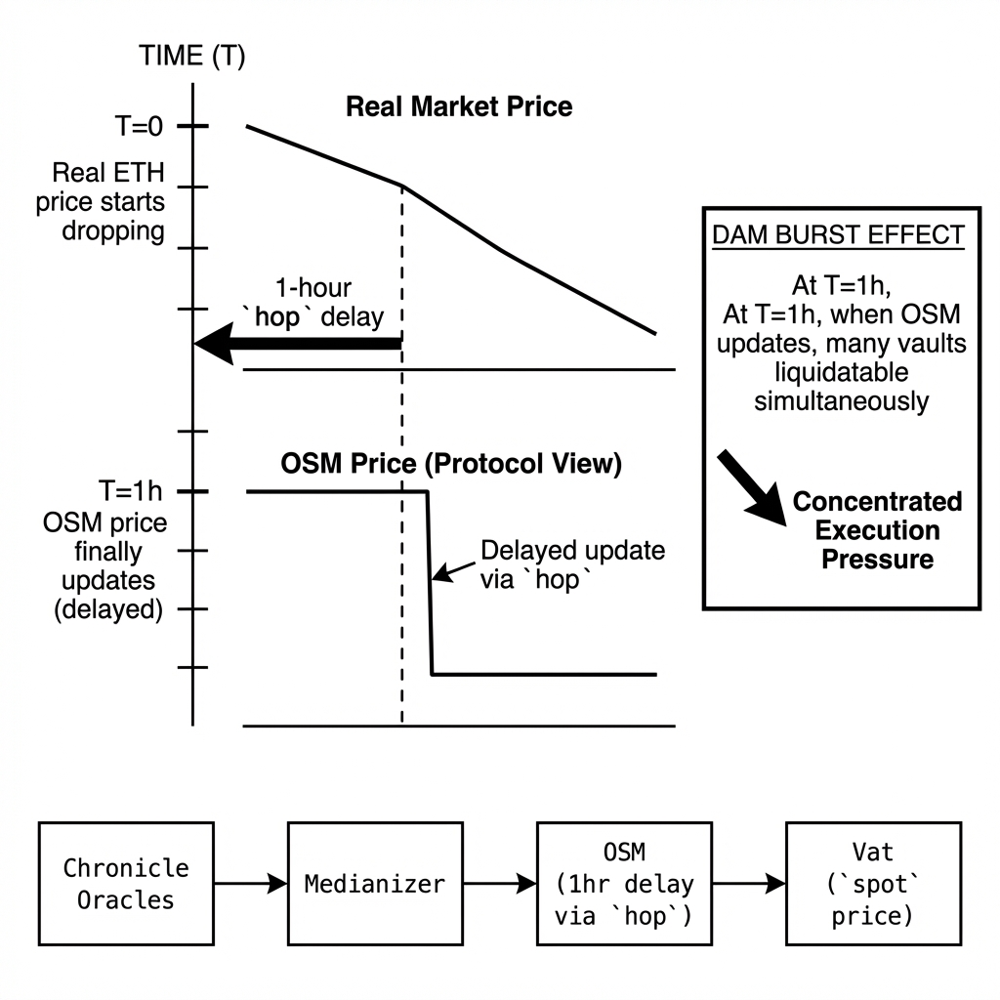
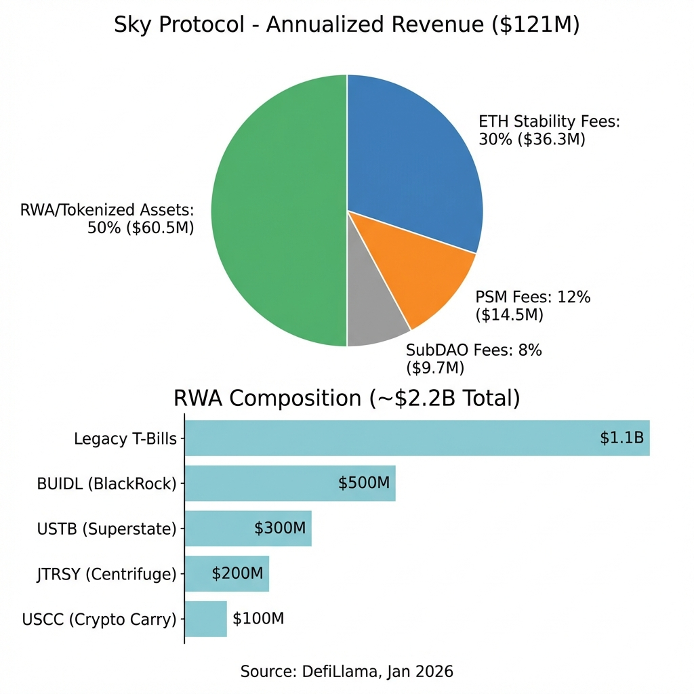

# Sky Ecosystem: The Shadow Bank That Won

*The most successful stablecoin is also the most centralized. That's not a bug — it's the strategy.*

**Thesis: Sky (MakerDAO) survived by becoming what it was designed to replace.** The protocol that pioneered "trustless money" now runs a multi-billion dollar RWA portfolio, depends on USDC custody, and is governed by a concentrated delegate pool. The code is robust. The trust assumptions are not. Understanding this trade-off is essential for anyone building in stablecoin infrastructure.

> **TL;DR**
>
> - **Shadow Bank Model** — 43% RWAs (BUIDL, tokenized treasuries, crypto carry), 28% ETH, 8% USDC. Sky is an on-chain bank, not a DeFi primitive.
> - **Diversified Yield** — T-Bill spreads + 9% crypto carry via Superstate USCC. Rate risk is being hedged.
> - **Battle-Tested Solvency** — Liquidation 2.0 handles 70% ETH crashes. Flash-loan native, no capital lockup.
> - **Centralization Trade-offs** — 78% active voting weight in 3 delegates. 42% backing is custody-dependent.
> - **Execution Risk** — Sky is diversifying, but custody counterparties remain the attack surface.

---

## The Pivot Nobody Predicted

In 2017, Maker was the promise of pure crypto money — DAI backed by ETH, no banks, no custody, no counterparties. By 2026, Sky (the rebrand) is the largest on-chain shadow bank in existence. More than half the backing is now off-chain assets or centralized stablecoins. This isn't drift — it's deliberate architecture.

The "Endgame" restructuring formalized this pivot by spinning out specialized SubDAOs (now "Stars"): **Spark** handles DeFi lending; **Grove** manages RWA partnerships; **Jetstream** builds UIs; **Chronicle** secures oracles. The core protocol focuses purely on monetary policy.

SVB collapsed in March 2023. USDC de-pegged below \$0.90. DAI — backed heavily by USDC via the **`Peg Stability Module`** — traded at $0.90. The message was clear: *depending on Circle's bank relationships is a systemic risk*. Sky's response: **become the bank**. Instead of holding USDC, Sky rotated into direct RWA ownership — first T-Bills via custody partners, then tokenized treasury funds (BlackRock's BUIDL, Superstate's USTB), and most recently Superstate's USCC crypto carry fund (9%+ yields from basis trades, uncorrelated to Fed policy).

---

## The Solvency Engine

The economic model is one thing. The technical infrastructure that enforces solvency is another. Sky's liquidation architecture is the most battle-tested in DeFi — and understanding it explains why the protocol survived when others didn't.


The diagram traces three critical pipelines: (1) **Collateral ingestion** — users deposit ETH/LSTs via adapters, while RWA custodians (BlackRock, Superstate) feed tokenized assets through the Collateral Ingestion Layer into the **`Vat`**. (2) **Price transforms** — Chronicle oracles aggregate feeds through a medianizer, then the **`OSM`** delays prices by 1 hour before updating **`spot`**. (3) **Peg stability** — the **`PSM`** allows 1:1 USDC↔USDS swaps (currently ~$400M capacity), providing instant arbitrage rails when the peg drifts.

At the core sits the **`Vat`** — an immutable ledger that tracks every vault's **`Art`** (normalized debt) and **`Ink`** (locked collateral). The solvency invariant is simple: **`Ink × spot ≥ Art × rate`**. When this breaks, the system must seize and liquidate collateral fast enough to cover the debt. If it fails, bad debt accrues.

Black Thursday 2020 showed what failure looks like. ETH crashed 43% in hours, gas spiked to 500+ gwei, and keepers running the old English auction couldn't afford to bid. Result: **\$5.67M of ETH sold for \$0**. The protocol accrued **`Sin`** (bad debt) that the **`Vow`** had to clear through emergency auctions.


Liquidation 2.0 is the direct response. The **`Dog`** contract calls **`bark()`** to seize collateral and hand it to the **`Clip`** for liquidation. The **`Clip`** runs a Dutch auction where price decays over time until a keeper finds it profitable to call **`take()`**. Settlement is atomic — keepers flash-loan USDS, buy discounted **`Ink`**, swap it on a DEX, and repay in a single transaction. No capital lockup. No multi-block exposure. The system clears in milliseconds.

There's one deliberate bottleneck: the **`Oracle Security Module`** (OSM). Price feeds are delayed by one hour via the **`hop`** parameter before affecting the **`Vat`**. If an oracle gets corrupted, governance has 60 minutes to freeze it via **`stop()`** or **`void()`**. The trade-off is the "dam burst" effect — during genuine crashes, underwater vaults can't be liquidated until the OSM catches up, creating concentrated execution pressure when the delayed price finally updates.

The design choice is **security over reactivity**. Without a delay, an attacker could corrupt oracle feeds and trigger mass liquidations in a single block — buying collateral at manipulated prices before anyone reacts. The 1-hour buffer ensures human oversight can intervene. The cost: stale prices during genuine volatility, arbitrage misalignment between real and protocol prices, and governance dependency (if delegates don't act within 60 minutes, bad prices go live).


<small>The diagram below illustrates this pipeline: Chronicle oracles aggregate price feeds through the Medianizer, which the OSM delays by 1 hour before updating the **`spot`** price in the Vat. During genuine crashes, the real market price drops continuously while the OSM price remains stale — when it finally updates, all accumulated underwater vaults become liquidatable simultaneously.</small>

**Binding constraint:** execution throughput — the system’s ability to liquidate fast enough under adversarial market conditions.

---

## The Economic Engine

Sky's yield doesn't come from trading fees or liquidation penalties. It comes from **interest rate arbitrage** — the same business model as regional banks, just on-chain.

The **mechanics** work like a bank: users lock collateral and pay a **stability fee** (variable, ~5-10% for ETH) to mint USDS. The protocol deploys its treasury into yield-bearing assets — originally T-Bills (~5%), now diversified into tokenized funds (BUIDL, USTB, JTRSY) and crypto carry strategies (USCC at 9%+). A fraction is paid out as the **Sky Savings Rate** (SSR). The spread flows to the **`Vow`**, which accumulates **`Surplus`** until it reaches a threshold, then auctions it for SKY burning.

## Current State: January 2026

| Metric | Value | Source |
|:-------|:------|:-------|
| TVL (Ethereum) | ~$6.78B | [DefiLlama API](https://api.llama.fi/protocol/sky) |
| Annualized Revenue | ~$121M | [DefiLlama](https://defillama.com/protocol/sky) |
| Annualized Earnings | ~$97M | [DefiLlama](https://defillama.com/protocol/sky) |
| Surplus Buffer | ~$962M | [DefiLlama Treasury](https://defillama.com/protocol/sky) |
| SSR | ~4.75-6.5% | [Sky.money](https://sky.money) / [Blockworks](https://blockworks.co/analytics/makerdao) |

```
*Note: Financial metrics vary across sources due to accounting methodology differences. SSR is governance-adjustable and changes frequently.*
```



The **`Jug`** contract enforces this at the smart contract level. It updates the **`rate`** accumulator for each collateral type (**`ilk`**) by calling **`drip()`**, which calculates accrued interest since the last **`drip`** and mints the corresponding USDS to the **`Vow`**.
**The formula:**

$$\text{rate}_{\text{new}} = \text{rate}_{\text{old}} \times (1 + \text{duty})^{(\text{now} - \text{last\_update})}$$

Where **`duty`** is the per-second stability fee for that **`ilk`**. This is how Sky's ~$121M annual revenue materializes on-chain — not through external API calls, but through continuous debt accumulation math.

The risk is obvious: **Rate Shock**. Sky's profit margin has historically been a derivative of the T-Bill/SSR spread. If the Fed cuts rates to 2%, T-Bill yield compresses. Sky is actively hedging this: Spark's $100M allocation to USCC (crypto carry) generates 9%+ yields uncorrelated to Fed policy. But the hedge is nascent — most RWA exposure remains rate-sensitive.

> This architecture naturally favors a composability layer above Spark — unified treasury vaults that dynamically rebalance across T-Bills, basis trades, restaking yields, and on-chain lending as rate regimes shift. As Sky’s balance sheet diversifies, static allocation becomes a liability rather than a safeguard.

**Binding constraint:** rate spread durability — sustaining positive carry across changing macro regimes without eroding solvency.

---

## The Centralization Paradox

Sky exposes DeFi’s core contradiction in its purest form: **the stronger the code became, the more trust migrated off-chain**.

| Asset Class | Value | Share |
|:------------|:------|:------|
| **T-Bills (RWA)** | $2.18B | 43.6% |
| **ETH** | $1.40B | 28.0% |
| **USDC + Coinbase** | $400M | 8.0% |
| **Lending Protocols** | $707M | 14.1% |
<small>Source: [DefiLlama TVL](https://defillama.com/protocol/sky), [Blockworks](https://blockworks.co/news/sky-pivots-beyond-treasuries)</small>

> **Concentration Risk (HHI): 0.29 (Moderate-High)**
> *Calculated: $0.44^2 (\text{RWA}) + 0.28^2 (\text{ETH}) + 0.14^2 (\text{Lending}) + 0.08^2 (\text{USDC}) \approx 0.29$.*

From an engineering standpoint, the system is exceptional. The liquidation stack has survived Black Thursday, USDC de-pegs, and violent volatility regimes. The **`Vat`** is immutable. The **`Dog`**/**`Clip`** pipeline clears liquidations atomically. The oracle system is deliberately conservative. On-chain, Sky is hard to break.


<small>*Figure 1: Sky's GOCE profile — strong on Operational (O), weak on Collateral (C) and Emergency (E) due to RWA dependence.*</small>

Decentralization, at Sky’s scale, is not an engineering problem.
It is an autonomy problem.

**Autonomy is the fault line.** Roughly 40–45% of Sky’s backing (RWAs, tokenized treasury funds, custody-dependent stablecoins) depends on trustees and U.S. courts. A single regulatory action can impair solvency without violating a single on-chain invariant. Under DeFiScan, this is the dominant risk category — not because the protocol is weak, but because its solvency depends on external actors it cannot control or compel.

**Exit windows are no better.** Oracle attacks are buffered by the OSM delay, but governance and custody shocks are not. Emergency Shutdown has been replaced with surgical, delegate-mediated controls. If a major RWA partner freezes redemptions, users cannot permissionlessly exit. This is **High Exit Window risk**. Autonomy that disappears precisely when it is needed most is not partial autonomy — it is conditional autonomy.

**Governance concentration compounds both.** Three Ranked Delegates control **~65 billion SKY** votes (verified on-chain):

1. **[0xce01...6a3](https://etherscan.io/address/0xce01c90de7fd1bcfa39e237fe6d8d9f569e8a6a3)** (**cloaky**): ~29.6B SKY
2. **[0xa1ea...f9a](https://etherscan.io/address/0xa1ea1ba18e88c381c724a75f23a130420c403f9a)** (**BLUE**): ~20.5B SKY
3. **[0x2621...e3c](https://etherscan.io/address/0x2621cc0b3f3c079c1db0e80794aa24976f0b9e3c)** (**Bonapublica**): ~14.9B SKY


Combined, they hold **~88% of active delegated power**. This is not apathy — it is functional centralization. The system moves quickly because decision-making is narrow. That speed is an advantage in crises, but it is also a trust assumption.

> At this level of concentration, governance ceases to be a coordination problem and becomes an operational dependency, incentivizing off-chain reputation systems, social slashing mechanisms, and informal accountability structures rather than on-chain voting reform.

Put together, the classification is unavoidable: **Stage 0 (Full Training Wheels)**.

> *Definition: "Stage 0" implies a system where the operator (or delegates) can effectively upgrade the system or seize assets, preventing users from exiting permissionlessly during a censorship event.*

Not because Sky is fragile — but because it is institutional. It replaced oracle risk with custody risk and permissionlessness with execution certainty. What emerged is not a DeFi primitive, but a **shadow bank running on decentralized rails**.

The code is trustless.
The collateral is not.
And the gap between the two is where Sky lives.

**Binding constraint:** autonomy — solvency depends on actors and jurisdictions the protocol cannot control.

---

## The Endgame Strategy: Fractal Scaling

Sky's architectural response to centralization risk is **SubDAOs** (now "Stars"). By spinning out specialized units (Spark for lending, Jetstream for UIs), the core protocol isolates risk and complexity.

However, scaling this model reveals a critical infrastructure gap. Sky has released the *Endgame Toolkit* — a set of raw smart contracts — but lacks the tooling to make them usable. Furthermore, official Sky SubDAOs are **governance-gated**; you cannot just "launch" one without MKR approval.

Most major DAOs (Aave, Uniswap, Compound) face the same "monolithic scaling" problem Sky just solved. They want to franchise risk but lack the complex engineering to do it.

> Sky’s Endgame model exposes a broader infrastructure gap: fractal governance tooling does not yet exist as a product. While Sky can gate official SubDAOs through governance, most large DAOs face the same scaling problem without the engineering capacity to solve it internally. The Endgame architecture is therefore less a Sky-specific solution than a generalizable operating system for institutional DAOs.

**Binding constraint:** coordination complexity — scaling governance faster than trust can be socially established.

---

## The Bottom Line

Sky did not centralize because it failed to uphold its principles.
It centralized because, beyond a certain scale, execution becomes the binding constraint.

Once RWAs entered the balance sheet, decentralization ceased to be the objective function. Custody, governance concentration, and jurisdictional exposure were no longer risks to be minimized — they became structural requirements for operating at scale.

This outcome was not the result of bad decisions or ideological drift. It was the only stable equilibrium available to a system optimizing for solvency, liquidity, and execution certainty under real-world constraints. At small scale, protocols can afford to optimize for purity. At institutional scale, systems stop optimizing for ideology and begin optimizing for control over failure modes.

**Sky did not abandon DeFi.
DeFi simply stopped being sufficient.**

What emerged is not a broken protocol, but a new class of financial system: a **shadow bank** running on decentralized rails, where the code is trustless, the collateral is not, and the gap between the two is the price of survival.

The question is no longer whether this model works — it already does.
The real question is whether future systems can escape the same gravitational pull, or whether centralization at scale is not a deviation, but the destination.

---

## References

1. Sky Ecosystem Technical Documentation (2026)
2. DefiLlama Protocol Analytics
3. Wonderland Research — Stablecoin Sustainability Framework v1.0
4. Wonderland Research — Stablecoin Decentralization Framework v3.0

---

<div align="center">

| [Previous] | Home | [Next] |
|:---|:---:|---:|
| [Liquity V2 (BOLD)](../Liquity-final/Liquity-Research.md) | [Table of Contents](../README.md) | [Volatile Design](../Design/Volatile.md) |

</div>
