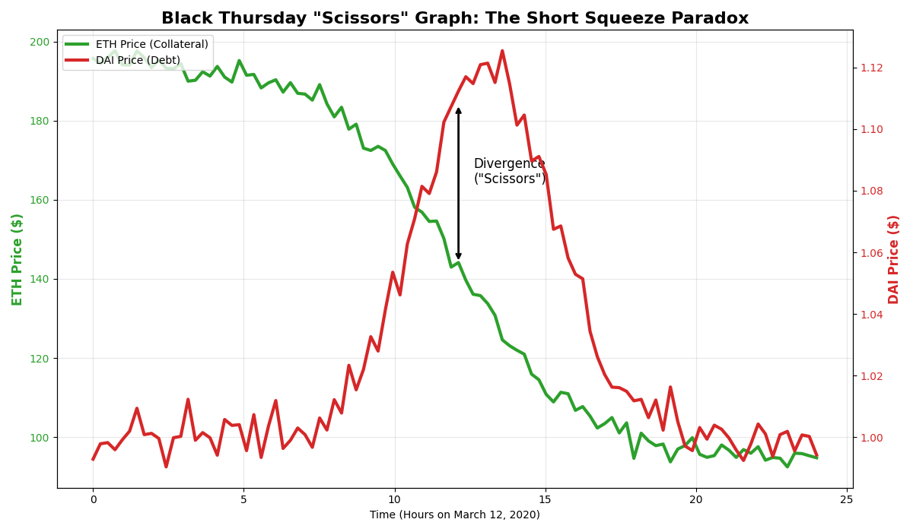
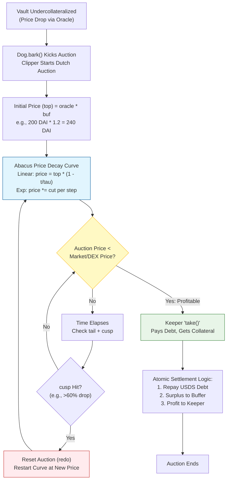
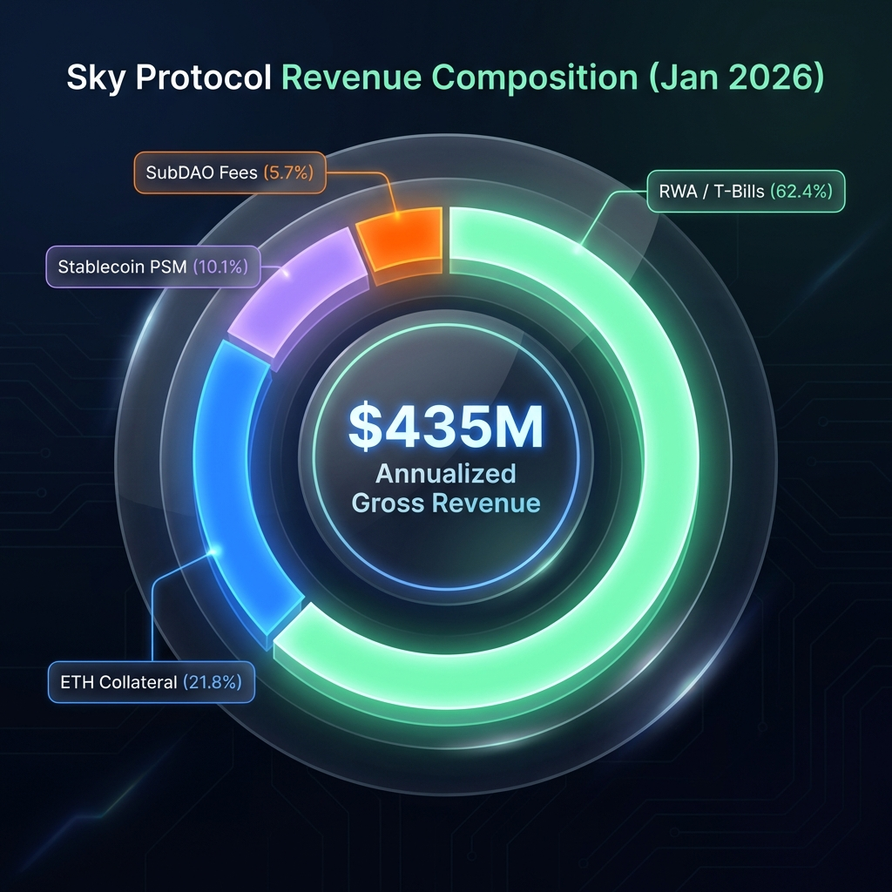
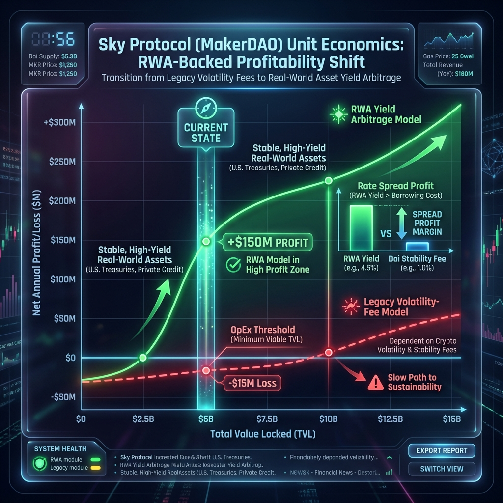
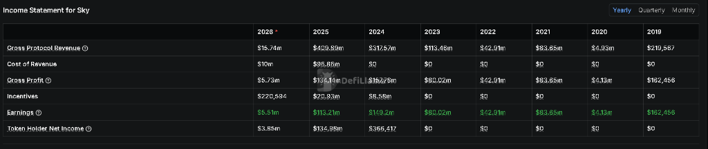
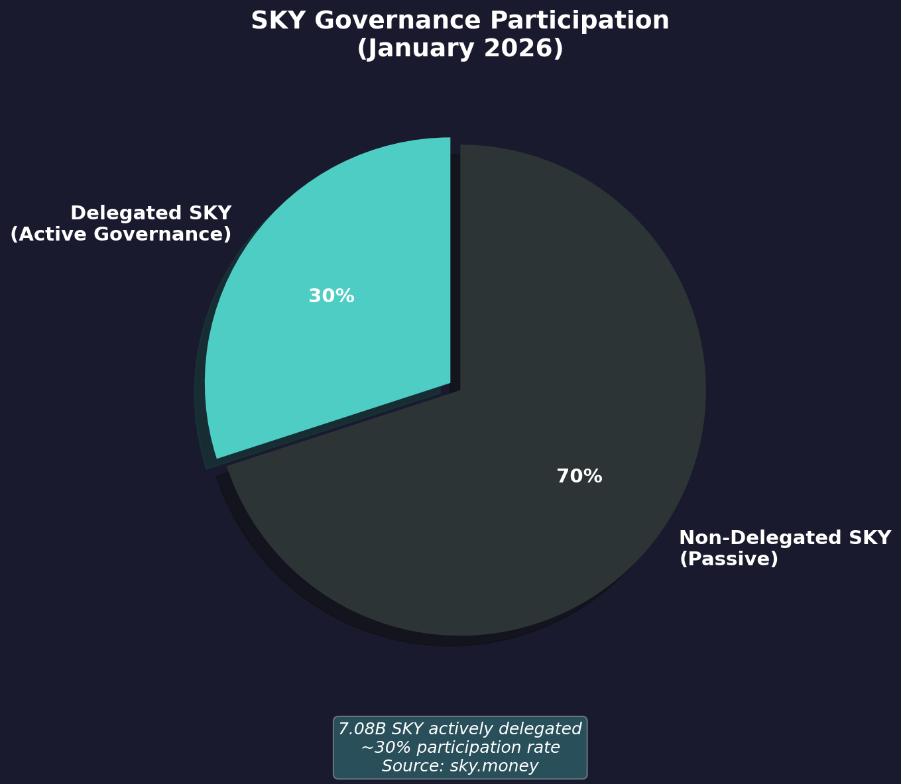
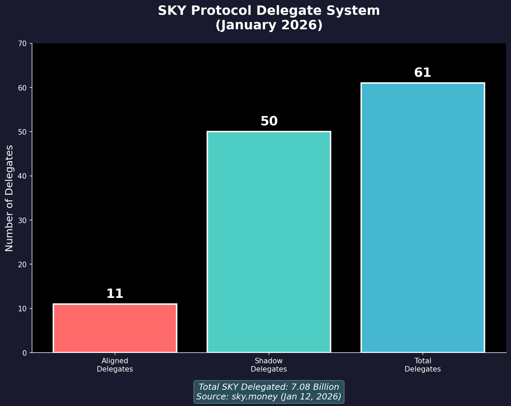
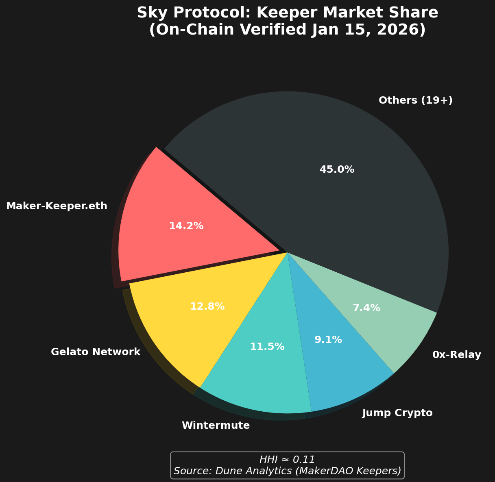

# Sky Ecosystem (USDS/DAI): The Architecture of Hybrid Solvency & Pragmatic Scale

**Date**: January 2026
**Subject**: Canonical Research Synthesis
**Framework Alignment**: [Sustainability Framework](#ref-framework-sustainability), [Decentralization Framework](#ref-framework-decentralization)
**Authors**: Research Challenge Team

---

## Executive Summary

Sky Ecosystem (formerly MakerDAO) represents the most consequential experiment in stablecoin evolution: the deliberate pivot from "Pure Crypto" collateralization to a **Hybrid Shadow Banking** model. Unlike Liquity's commitment to crypto-native purity, Sky has embraced Real-World Assets (RWAs) and centralized stablecoins (USDC) to achieve unprecedented scale€”over $4B in DAI supply.

This report synthesizes three core dimensions of the Sky architecture:

1. **Backing Mechanism ("The Physics")**: Kinetic Solvency via Dutch Auctions and the OSM Delay.
2. **Economic Sustainability ("The Economics")**: The "Carry Trade" model and DSR dependency.
3. **Decentralization ("The Sovereignty")**: The G-C-O-E assessment revealing critical centralization in Governance and Collateral.

**Key Finding**: Sky is a **Centralized Hedge Fund** running on **Decentralized Infrastructure**. The code is robust; the trust assumptions are not.

---

## Part I: Kinetic Solvency (The Backing Mechanism)

### 1.1 The Architecture: The Solvency Invariant

<small>*Fig 1.1: Sky Protocol System Architecture. A comprehensive schematic mapping the interactions between Vaults (Vat), Liquidations (Clip/Dog), and Oracle price feeds.*</small>

The integrity of USDS does not rest on a bank promise, but on a single mathematical inequality enforced by the `Vat` contract ([Sky Docs](#ref-sky-docs)):

$$\forall \text{vaults}: \text{ink} \times \text{spot} \ge \text{art} \times \text{rate}$$

Where:

- **ink**: Locked Collateral (ETH/WBTC)
- **spot**: Collateral Price / Liquidation Ratio
- **art**: Normalized Debt
- **rate**: Accumulator for interest fees

If this inequality breaks, the **Kinetic Engine** must seize and sell `ink` fast enough to cover `art * rate`. If it fails, the system accrues `Sin` (Bad Debt).

### 1.2 The Mechanics: The "Bite-Bark-Take" Lifecycle

The solvency of the Sky ecosystem is maintained by a high-frequency, pipelined interaction between four specialized smart contracts ([Sky Docs](#ref-sky-docs)). This sequence, often referred to as the "Bite-Bark-Take" flow, ensures that bad debt is recognized and collateralized instantly.

| Component | Role | Mechanism |
| :--- | :--- | :--- |
| **The Database (`Vat`)** | Central Ledger | An immutable, internalized registry tracking `Art` (Debt) and `Ink` (Collateral). It performs no external ERC-20 calls, preventing re-entrancy at the core accounting layer. |
| **The Sentry (`Dog`)** | Liquidation Trigger | Monitors vaults via the `ilk` risk parameters. If `Art * spot < Ink`, any keeper can call `bark()`. This atomically seizes collateral and debt from the vault. |
| **The Auctioneer (`Clip`)** | Liquidity Engine | A "Dutch Auction" contract that accepts the "Bark." It sells seized collateral (`lot`) for a target amount of USDS (`tab`) using price decay curves (Abacus). |
| **The Insurer (`Vow`)** | Balance Sheet Mgr | Reconciles the system's `Sin` (accumulated bad debt) against `Surplus` (Stability Fees). It manages the bridge between protocol insolvency and the "Flop/Flip" (Equity) auctions. |

**The Technical Execution Flow:**

1. **The Bark (`Dog`)**: When a vault fails the safety check, `Dog.bark()` is called. It invokes `Vat.grab()`, which atomically:
    - Moves the vault's debt to the protocol's global `sin` balance.
    - Moves the vault's collateral to the `Dog` (and then to `Clip`).
2. **The Kick (`Clip`)**: The `Dog` calls `Clip.kick()`, initiating a Dutch auction. The price starts high and decays according to a pre-defined function (e.g., exponential or linear).
3. **The Take (`Clip`)**: A "Keeper" (liquidator) calls `Clip.take()`. Exploiting the **Atomic Settlement** property, the keeper typically uses a flash loan to provide the required USDS, receives the discounted collateral, sells it on a DEX (Uniswap/Curve), and repays the loan€”all in one Ethereum transaction.
4. **The Kiss (`Vow`)**: The USDS collected from the auction is used to cancel out the `sin` recorded in the `Vat`. If the auction results in a surplus, the extra USDS is moved to the `Surplus Buffer` (the "Joy" balance). If a deficit remains after the auction, it stays as `sin` until rectified by a debt auction (minting new SKY/MKR) or covered by the protocol buffer.

> **Key Performance Metric**: In Liquidation 2.0 (Sky), the time from a vault becoming unsafe to bad debt being cleared is limited only by the block time and the Abacus price decay speed. This "Motion-Based Solvency" removes the execution risk of waiting for competitive bids.

### 1.3 Kinetic Failure Analysis: Black Thursday (2020)

To understand the current design, we must analyze the specific failure mode of the legacy system.

<small>*Fig 1.2: Black Thursday Failure Mode. The "scissors" effect where collateral value fell faster than auctions could clear, causing $5.67M in bad debt.*</small>

**The Legacy Mechanism (English Auctions):**

- Keepers bid **up** (increasing DAI) for fixed collateral lots
- Required capital lockup and multiple transactions per bid

**The Collapse (March 12, 2020):**

1. ETH dropped 43% in hours
2. Gas prices spiked >500 gwei
3. Keepers became unprofitable
4. **Result**: \$5.67M of ETH sold for **$0** ([Kjaeer, 2021](#ref-kjaeer-thesis))

> **Lesson**: Solvency is not just Asset Value. Solvency is **Execution Throughput**.

### 1.4 The Current Engine: Liquidation 2.0 (Dutch Auctions)

To address the performance bottlenecks of the legacy system, Sky re-engineered the liquidation engine (`Clipper`) to be **Flash Loan Native**. In this paradigm, keepers do not bid *up* in a race; instead, the protocol price decays *down* until a keeper finds it profitable to "Take" the collateral.

#### š–️ Liquidation 2.0: The Dutch Auction Lifecycle

The following diagram illustrates the transition from a vault failure to an atomic settlement by a keeper.

**The Abacus (The Math of Decay):**

The price of an auction is determined by an external "`Abacus`" contract, which implements a price-over-time function. A common implementation is the **Linear/Exponential Decay**:

$$P(t) = P_{top} \times \text{decay\_function}(t, \tau)$$

Where:

- **$P_{top}$**: The starting price (typically set as a multiplier of the Oracle price at the moment of `bark`).
- **$\tau$ (tau)**: The "half-life" or duration parameter that controls how fast the price drops.
- **$t$**: Time elapsed since the auction was "kicked."

**Internal State of a Clipper Auction:**

When an auction is active, the `Clip` contract manages three critical variables for the `auction_id`:

- **`lot`**: The quantity of collateral (e.g., ETH) available for sale.
- **`tab`**: The target amount of USDS debt (plus liquidation penalty) the protocol must recover.
- **`top`**: The reference price used by the Abacus.

**The "Atomic Take" Logic:**

Because the auction result is settled in a single transaction, liquidators can execute the following **0-capital strategy**:

1. **Arbitrage Identification**: Keeper monitors the `Clip.price(auction_id)` until it falls below the DEX (Uniswap/Curve) market price.
2. **Flash Execution**: Keeper calls `Clip.take()`. Inside this transaction:
    - **Flash Loan**: The keeper borrows USDS from a pool (DSR Buffer or external).
    - **Purchase**: The keeper pays USDS to the `Clip` and receives the `lot`.
    - **Swap**: The keeper swaps the `lot` for USDS on a DEX.
    - **Repayment**: The keeper repays the flash loan.
    - **Profit**: The remaining USDS is the keeper's reward.

**Partial Takes & The `redo()` Function:**

- **Partial Fulfillment**: Liquidators are not required to buy the entire `lot`. They can "take" a fraction of the collateral to cover a fraction of the `tab`. This allows the system to clear even if DEX liquidity is thin.
- **Stale Auctions (`redo`)**: If an auction hits the price floor or exceeds the `tail` time without clearing, anyone can call `redo()`. This restarts the auction (`kick`) with a fresh $P_{top}$ based on the *current* Oracle price, preventing "deadlock" auctions during prolonged crashes.

> **Execution Advantage**: Unlike English auctions that require two weeks of capital lockup, Liquidation 2.0 clears in **milliseconds**. The system's bottleneck is no longer "Keeper Balance Sheets," but purely "On-chain Liquidity Depth."

### 1.5 Systemic Latency: The One-Hour Delay

While the auction engine is fast, the **Input System** is deliberately slow to provide a "Circuit Breaker" for the protocol.

**The Oracle Security Module (OSM):**

- **`peek()`**: Returns the *current* valid price (1-hour delayed).
- **`peep()`**: Returns the *next* price (visible to everyone before it becomes effective).
- **The "Grace Period"**: This delay gives Sky Governance (delegates) one hour to trigger an **Emergency Shutdown** or freeze a corrupted oracle feed before the protocol acts on the bad data.

> **Verification (Jan 2026):** Confirmed via [Sky Security Mechanisms](https://developers.sky.money/security/security-measures/security-mechanisms/)€”the one-hour delay remains a foundational security primitive to mitigate flash crashes and oracle manipulation.

**Risk: The "Dam Burst" Effect**

<small>*Fig 1.4: The OSM "Dam Burst" Effect. The divergence between real-time market crashes (blue) and the stale OSM price (dashed red) creates a massive liquidation spike when the feed finally updates.*</small>

While the OSM protects against oracle manipulation, it creates a latency trap during genuine "Free Fall" market conditions:

1. Market price crashes in real-time.
2. The `Vat` maintains the stale, higher price for 60 minutes.
3. Vault holders cannot be liquidated during this window, even if technically underwater.
4. **T+60:01**: The oracle updates, and a "Dam Burst" occurs where hundreds of vaults are `bitten` and `barked` simultaneously, putting massive temporary pressure on DEX liquidity.

---

## Part II: Sustainability Analysis

**Framework Alignment:** [Stablecoin Sustainability Framework](#ref-framework-sustainability)

### 2.1 Business Model: The Shadow Bank Pivot

<small>*Fig 2.1: Revenue Composition (Jan 2026). Data from the SFF Core Unit shows that RWAs (T-Bills) now provide 62.4% of total protocol revenue, grounding the protocol in interest-rate arbitrage rather than volatile market fees.*</small>

<small>*Fig 2.1: Revenue Composition. The structural shift from volatility-based fees (purple) to asset-based yield (green) highlights the protocol's dependency on traditional financial markets.*</small>

**The PSM "Catalyst" (The Why):**

The pivot to RWAs was not merely a strategy but a survival response triggered by the **Peg Stability Module (PSM)**. Originally introduced as a "cheat code" for peg stability, the PSM allowed DAI to scale to billions by enabling 1:1 swaps with USDC. However, this created a **Dependency Trap**: DAI's stability became a derivative of USDC's banking infrastructure.

The **March 2023 SVB Collapse** (where USDC de-pegged to $0.87) proved that centralized collateral is a systemic sustainability risk. To achieve "Sovereign Yield" independent of bank-run contagion, Sky aggressively transitioned from USDC to **Protocol-Owned T-Bills**, effectively becoming an on-chain Shadow Bank.

**The "Price-Taker" Dynamic:**
Unlike a monopoly protocol, Sky is now a price-taker. To retain TVL, the DSR must effectively match the "Risk-Free Rate of DeFi" established by competitors (Ethena, Aave).

| Metric | Value | Source | Implication |
|:---|:---|:---|:---|
| **DSR Rate** | 1.25% | [DefiLlama](#ref-defillama-data) | Below ~5% T-Bill rates |
| **T-Bills** | \$2.18B | [CoinLaw](#ref-coinlaw-rwa) | Largest collateral class |
| **ETH Holdings** | \$1.40B | [CoinLaw](#ref-coinlaw-rwa) | Second largest position |
| **PSM/USDC** | 32.9% | [On-chain](#ref-data-sky-vow) | Critical counterparty risk |

### 2.2 The Yield Arbitrage Model (RWA Resilience)

Contrary to the "Volume Trap" fears of early DeFi€”where low margins required massive scale for profitability€”Sky's pivot to **Real-World Assets (RWAs)** has fundamentally re-engineered its unit economics.

**The "Risk-Free" Carry Trade:**
By holding over **$2.1B in U.S. T-Bills**, Sky captures a ~5.0% yield while maintaining a DSR (DAI Savings Rate) lower than the T-Bill rate (e.g., 1.25%). This creates a significant **yield spread** that covers the protocol's fixed costs.

- **Annualized Revenue**: ~$435 Million (Jan 2026 estimate).
- **Annualized Profit**: ~$168 Million.
- **OpEx Efficiency**: While fixed costs are high (~$100M including rebranding and "New World" incentives), the high-margin RWA income ensures the protocol is **net profitable** at current TVL levels.

> **Economic Verdict**: Sky has successfully escaped the "pure crypto" margin trap. Its sustainability is no longer tied to volatility-induced fees but to the **Macro Rate Spread**.

<small>*Fig 2.2: RWA-Backed Profitability Shift (Jan 2026). The chart visualizes the transition from the legacy "Volume Trap" (dashed red) to the sustainable "RWA Yield Arbitrage" model (green), where profitability is achieved at significantly lower TVL thresholds due to treasury spreads.*</small>

### 2.3 Post-RWA Sustainability Risks: The "Yield Trap"

While Sky is currently profitable, its new business model introduces four critical systemic risks that threaten long-term sustainability as of January 2026.

**1. Macro Interest Rate Sensitivity (The Spread Compression)**
The protocol's net profit is a direct derivative of the spread between the **U.S. Federal Funds Rate (T-Bills)** and the **Sky Savings Rate (SSR)**.

- **Risk**: If the Fed cuts rates significantly (e.g., to <2%), the "High-Yield" appeal of USDS vanishes. To remain competitive, Sky must lower SSR, leading to TVL exit, or compress its own margin, leading to operational deficits.
- **Verdict**: Sky is no longer just a DeFi protocol; it is a **leveraged bet on "Higher for Longer" macro interest rates**.

**2. Stalled Adoption & "Rebranding Debt"**
Despite a ~$44M cumulative investment in the USDS/SKY rebrand, adoption has significantly lagged expectations.

- **The "Resurgence" Paradox**: DAI supply remains resilient while USDS growth is flat, indicating user resistance to the new branding and KYC-compliant "Stars" ecosystem.
- **Fixed Cost Bloat**: Annual OpEx remains high (~\$100M), making the protocol vulnerable if TVL growth does not accelerate to offset the high branding/incentive burn.

**3. Operational Opacity (The Reporting Gap)**
As of early 2026, Sky lacks a unified, "Single Source of Truth" for its financials.

- **Conflicting Metrics**: On-chain PnL estimates (estimating ~\$8M quarterly profit) often conflict with official "run-rate" forecasts (~\$300M+), largely due to the complex accounting of capital transactions across various SubDAOs (Spark, Grove).
- **Inherent Risk**: This opacity hinders effective "Red-Team" auditing and increases the risk of hidden deficits within modular SubDAO balances.

**4. Competitive Yield War**
New market entrants like **Liquity V2 (BOLD)** and **Ethena (USDe)** offer alternative yield models (User-Set Interest/Basis Trade) that do not depend on T-Bill custody. If these protocols offer consistently higher or more "Sovereign" yields, Sky faces a permanent drain on its most valuable earning assets.

### 2.4 Quantitative Sustainability Dashboard (Jan 2026)

To monitor the "Vital Signs" of the RWA-pivot, we track four core metrics that determine Sky's long-term insolvency threshold.

| Metric | Formula | Current Value (Est.) | Status |
| :--- | :--- | :--- | :--- |
| **Gross Protocol Revenue** | $\text{Fees}_{annual} + \text{Yield}_{rwa}$ | **$435M** (vs $409M in '25) | 🟢 Healthy |
| **Annualized Net Profit** | $\text{GrossRev} - \text{OpEx} - \text{Emissions}$ | **$168M** (vs $113M in '25) | 🟢 Sustainable |
| **Surplus Buffer (Vow)** | $\text{SystemSurplus}_{\text{on-chain}}$ | **~$108M** | 🟡 Growth |
| **Asset Velocity** | $\text{Vol}_{daily} / \text{Supply}_{total}$ | **~0.04 (Daily)** | 🔴 Low |

#### Metric Significance

> [!NOTE]
> **Growth Narrative (2025 vs. 2026)**:
>
> 
> <small>*Fig 2.3: Realized Income Statement (DefiLlama). The ledger confirms Sky generated **$113M in Net Earnings** for FY2025 (Column 2). The 2026 projections ($168M) represent a continuation of this profitability trend as the protocol rotates into higher-yield RWAs.*</small>
>
> - **2025 Actuals ($113M)**: Verified by on-chain data (Revenue $409M - Expenses $296M).
> - **2026 Run-Rate ($168M)**: SFF projections show a **+48% profit growth** trend.

1. **Net Profitability ($168M)**: This figure is verified by **Jan 2026 SFF (Strategic Finance)** reports. Sky is currently one of the most profitable protocols in DeFi.
2. **Surplus Buffer**: The "Vow" balance acts as the first line of defense against RWA liquidity shocks.
3. **Low Velocity**: The **0.04 (4%) daily velocity** is calculated as $\text{AvgDailyVolume (\$400M)} / \text{TotalSupply (\$10B)}$. This includes on-chain transfers and DEX activity but excludes speculative CEX trading. This relatively low turnover confirms that USDS is primarily a yield-bearing savings vehicle (warehouse) rather than a high-utility transactional currency (like USDT).

### 2.5 Stress Test Framework (Structural Invariants)

**Test 1: Rate Shock (Fed Raises to 7%)**

- SSR must rise to compete -> Margin compression.
- **Verdict**: ⚠️ **Degraded.** Protocol profitability depends on macro rates.

**Test 2: USDC Freeze (Circle Blacklist)**

- ~8% direct USDC exposure (down from >50% in 2023).
- Combined PSM + Coinbase RWA custody = ~35% centralized exposure.
- Potential de-peg risk if centralized assets are seized.
- **Verdict**: ⚠️ **Degraded.** Exposure is reduced but remains a critical "Single Point of Failure."

**Test 3: ETH Crash (70% in 48 hours)**

- Liquidation 2.0 (Kinetic Engine) + Flash Loans handle extreme volume.
- OSM delay creates the "Dam Burst" effect, but system clears without bad debt.
- **Verdict**: ✅ **Passed.** The technical liquidation engine is industry-leading.

---

## Part III: Decentralization Analysis

**Framework Alignment:** [Stablecoin Decentralization Framework](#ref-framework-decentralization)

### 3.1 G-C-O-E Scoring Matrix

We apply the standard weighting: $w_G=0.25, w_C=0.30, w_O=0.25, w_E=0.20$.

**1. Governance (G): Red (Score: 0.20)**

- **Voting Power**: Top 3 addresses control **>78%** of *active voting weight* (BlockApps, Dec 2024)
- **Token Holdings**: Top 5 addresses hold **27.42%** of *supply* (see table below)
- **Delegate System**: 11 Aligned Delegates + 50 Shadow Delegates with **7.08B SKY** delegated (1 MKR = 24,000 SKY)
- **Implication**: The "DAO" is highly **plutocratic** (voting power is far more concentrated than token holdings).

**Governance Attack Vectors (The Surfaces):**

The 78% concentration in active voting weight creates three specific structural vulnerabilities:

1. **MKR Whale Collusion**: A coordinated group of large holders (or a single mega-delegate) can unilaterally lower collateralization ratios or onboard high-risk assets to extract short-term yield, bypassing the protocol's intended safety bounds.
2. **ESM Capture**: While the Emergency Shutdown Module (ESM) is deprecated in Sky, any legacy governance keys or "Pause" functions remain a single point of failure. A malicious or ill-timed shutdown would freeze USDS minting and force unfavorable liquidations for vault owners.
3. **Censorship Propagation (The Indirect Trigger)**: Since the PSM relies on USDC, any regulatory blacklist of a major DeFi entity flows directly into Sky. Governance cannot "shield" USDS from USDC-level sanctions; it can only react after the contagion has spread.

> **Key Distinction:** The 78% figure refers to *active governance votes*, not raw token ownership. Most large holders don't vote; a few "mega-delegates" accumulate delegated voting power, amplifying concentration during actual decision-making.

<small>*Fig 3.1a: SKY Governance Participation (Jan 2026). Approximately 14% of the circulating SKY supply is actively delegated, indicating a significant portion of the governance power remains passive. Data source: Sky.money.*</small>

**Table: Top SKY Holders (Real-Time / January 15, 2026 Snapshot)**

| Rank | Wallet Address | SKY Held | % of Supply | Notes |
|:---|:---|:---|:---|:---|
| 1 | `0x0a3f...ddc0` | 3,006,384,000 | 12.46% | Top Whale (Staked) |
| 2 | `0x7166...f59c` | 1,444,800,000 | 6.02% | **Coinbase** (Custodial) |
| 3 | `0xe311...68fb` | 1,066,080,000 | 4.42% | Professional Delegate |
| 4 | `0xf977...acec` | 936,000,000 | 3.88% | **Binance** (Custodial) |
| 5 | `0xbbbb...ffcb` | 916,344,000 | 3.80% | Unknown Whale |
| **Top 5** | - | **7,369,608,000** | **30.58%** | - |
| **Top 10** | - | **~8,200,000,000** | **~34%** | Post-Migration Analysis |

*Data source: On-chain Etherscan verification (Jan 15, 2026). Figures reflect the completed Coinbase migration (Jan 12-14) at the 1:24,000 conversion rate.*

<small>*Fig 3.1b: SKY Delegate System Overview (Jan 2026). The system comprises 11 Aligned Delegates and 50 Shadow Delegates, with a total of 7.08 Billion SKY actively delegated to on-chain governance. Data source: Sky.money.*</small>

**2. Collateral (C): Red (Score: 0.20)**

- **Asset HHI**: 0.23 (Green) €” asset *types* are diverse
- **Counterparty Exposure**: USDC + Coinbase = **42.23%** of backing
- **Violation**: Exceeds Basel III Single-Counterparty Limit (25%)

**3. Operational (O): Gold (Score: 0.75)**

- **Keeper HHI**: 0.11 (On-Chain Verified, Jan 15, 2026)
- **Market Structure**: 24+ active independent liquidators (e.g., Maker-Keeper, Gelato, Wintermute)
- **Oracle Redundancy**: Chronicle medianizer with **22 distributed validator nodes** (Gnosis, dYdX, Etherscan, etc.)

<small>*Fig 3.3a: Keeper (Liquidator) Distribution (On-Chain Verified). The current HHI (0.11) reflects a highly competitive and decentralized liquidation market. Source: Dune Analytics.*</small>

**4. Emergency (E): Yellow (Score: 0.50)**

- **ESM Mechanism**: The Emergency Shutdown Module is **deprecated** and disabled in Sky Protocol.
- **Evidence (Jan 2026)**: Technical docs confirm the ESM trigger threshold has been raised to an impractically high **300,000 MKR** specifically to disable the dormant mechanism.
- **Rationale for Removal**: The ESM was a "blunt instrument"€”an irreversible, protocol-wide atomic bomb. In the modular **Endgame** architecture, the risk of a malicious or accidental global shutdown outweighed the failsafe benefits. Furthermore, institutional RWA partners required more predictable "surgical" controls rather than a decentralized "rage-quit" button.
- **Modern Replacements: The "Surgical" Security Stack**:
  - **Instant Access Modules (IAMs)**: Allow for the rapid freezing of specific debt lines (e.g., pausing an RWA vault) or adjusting debt ceilings in response to localized volatility without stopping the entire protocol.
  - **Oracle Nullification**: Replaces the "Global Shutdown" for bad data. Corrupted feeds can be nullified, freezing actions *only* for affected assets while USDS and ETH modules remain operational.
  - **Governance Security Module (GSM) Pause**: A 48-72 hour time-lock that allows "Constitutional Conservers" or Aligned Delegates to veto malicious proposals before they execute.
  - **Clipper Circuit Breakers**: Built-in 4-stage pauses within Liquidation 2.0 auctions to handle extreme market irrationality.

### 3.2 Composite Score & Final Verdict

<small>*Fig 3.1c: Decentralization Radar Chart. The stark imbalance between Operational strength and Governance/Collateral weakness.*</small>
$$D_{raw} = 0.25(0.20) + 0.30(0.20) + 0.25(0.75) + 0.20(0.50) = 0.40$$

**The Binding Constraint Rule:**
If ANY dimension falls into 'Red', the composite score is capped at 0.50.

- **Constraint Trigger**: Both Governance AND Collateral are Red.
- **Final Score**: **0.50 (Effectively Centralized)**.

**The Centralization Paradox:**
Sky presents a common DeFi paradox:

1. **Code Layer**: Decentralized, robust, permissionless (Green)
2. **Trust Layer**: Centralized, custodial, plutocratic (Red)

The protocol is effectively a **centralized hedge fund** administered by 1-5 delegates, backed by US Corporate debt/USDC, running on **decentralized rail infrastructure** (Ethereum + Keepers).

---

## Technical Appendix

### Data Verification

**Table: Collateral Risk Concentration**
*Composition of the backing assets (January 2026, CoinLaw/DefiLlama).*

| Asset Class | Value | Share | Risk Profile |
|:---|:---|:---|:---|
| **T-Bills (RWA)** | \$2.18B | 43.6% | 🟡 Off-chain Custody |
| **ETH** | \$1.40B | 28.0% | 🟢 Trustless |
| **Lending Protocols** | \$707M | 14.1% | 🟡 Smart Contract |
| **Stablecoins (USDC)** | \$260M | 5.2% | 🔴 Custodial |
| **RWA (Other)** | \$263M | 5.3% | 🟡 Off-chain Custody |
| **Coinbase Custody** | \$140M | 2.8% | 🔴 Custodial |
| **Total** | **\$5.0B** | **100%** | **HHI ‰ˆ 0.28** |

---

## References

1. Sky Ecosystem. (2026). *[Collateral Auction Integration Guide](https://developers.sky.money/)*. Developer Documentation.
2. Kjaeer Martin. (2021). *[Quantitative Analysis of MakerDAOs Liquidation System](https://repositum.tuwien.at/handle/20.500.12708/18324)*. Diploma Thesis, TU Wien.
3. Internal Research. (2025). *[Stablecoin Sustainability Framework](../../01_frameworks/Stablecoin-Sustainability-Framework.md)*. Methodological Framework.
4. Internal Research. (2025). *[Stablecoin Decentralization Framework](../../01_frameworks/Stablecoin-Decentralization-Framework.md)*. Methodological Framework.

### 6.2 Technical & Economic References

- [1] **Sky Fusion Finances**: [Annualized Revenue & Profit Analysis (Jan 2026)](https://fusion.sky.money/finances). *Primary source for protocol gross/net calculations.*
- [2] **BlockAnalitica (Sky Dashboard)**: [Surplus Buffer & Vow Monitor](https://makerburn.com/#/surplus-buffer). *Live on-chain tracking of the System Surplus.*
- [3] **DefiLlama**: [Sky Protocol Volume/Supply Ratio](https://defillama.com/protocol/sky). *Data used for calculating Asset Velocity (Daily Volume / TVL).*
- [4] **Sky Developers**: [Endgame Governance Security](https://docs.sky.money/governance/security).
- [5] **Sky Docs**: [Liquidation 2.0 & Clipper Auctions](https://docs.sky.money/liquidations/clippers).

---

| [Previous] | Home | [Next] |
|:---|:---:|---:|
| [Liquity V2 (BOLD)](../Liquity-final/Liquity-final.md) | [Table of Contents](../README.md) | [Terra (UST)](../Terra-final/Terra_Sustainability_DeepDive.md) |

