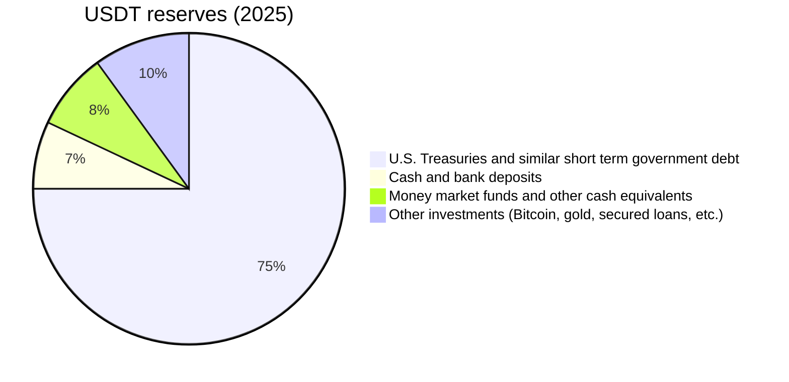
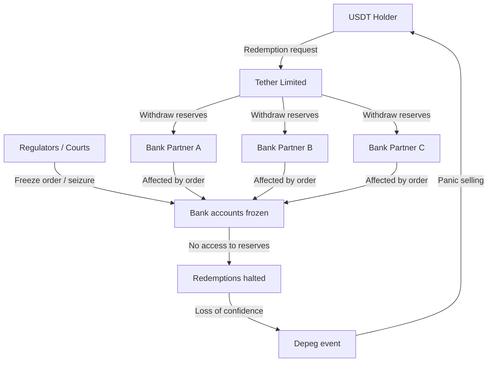
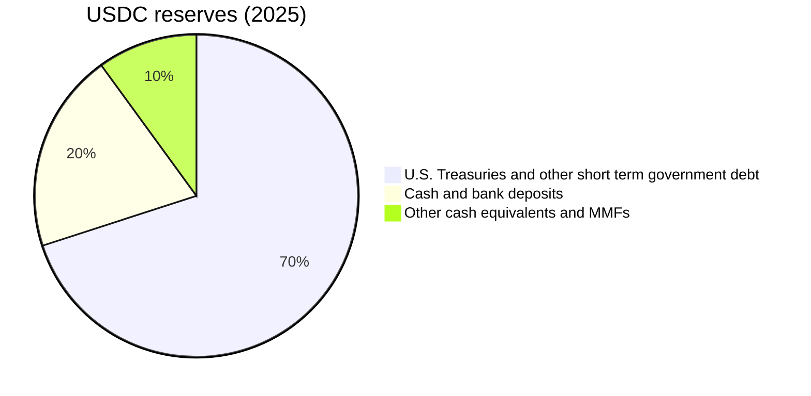
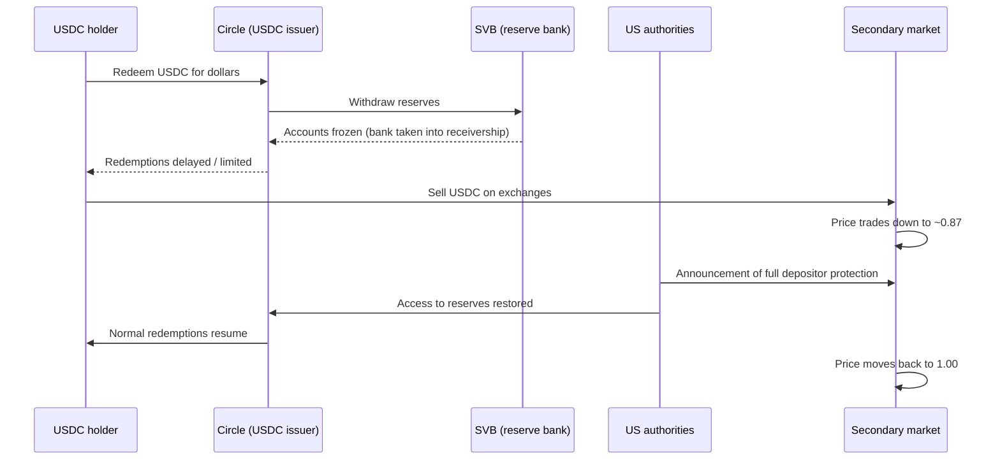
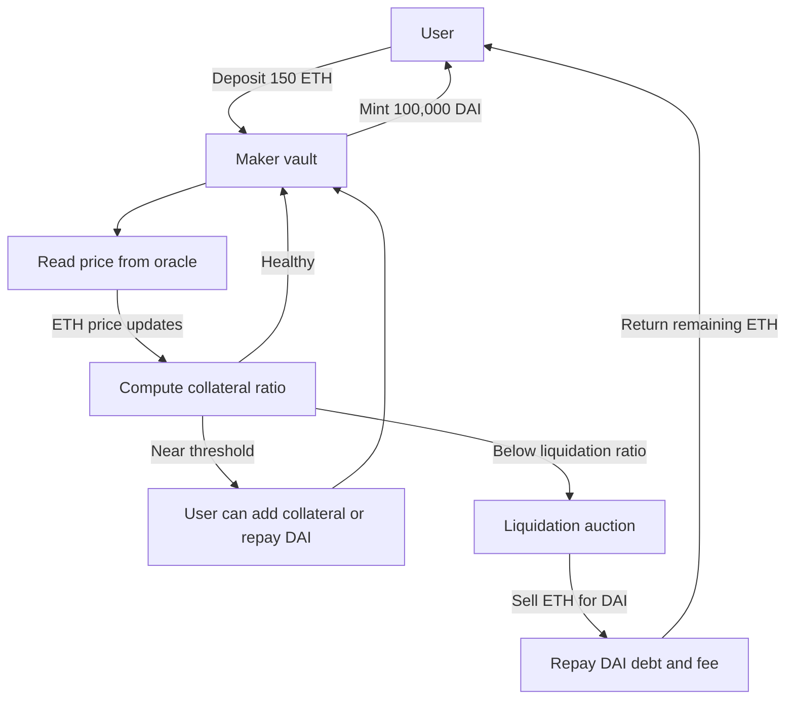
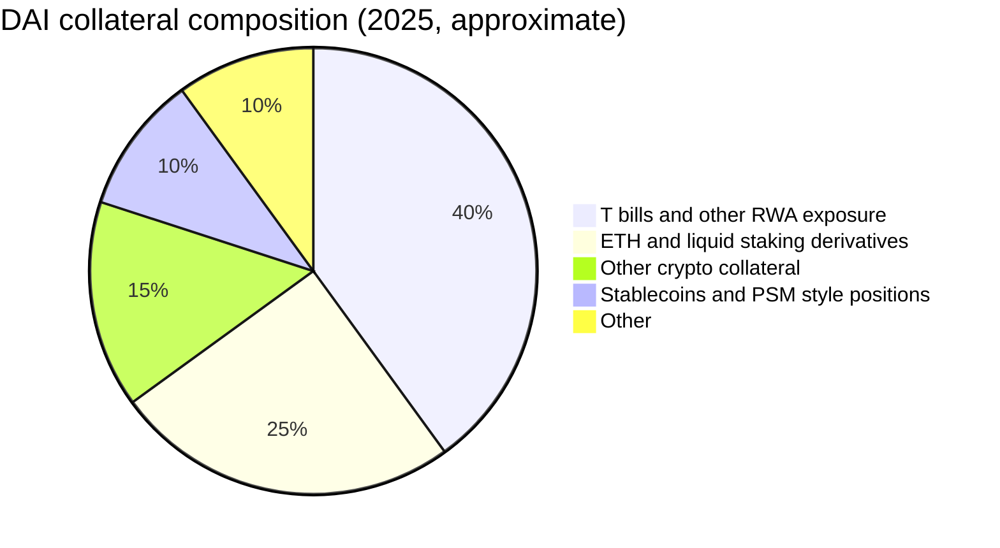
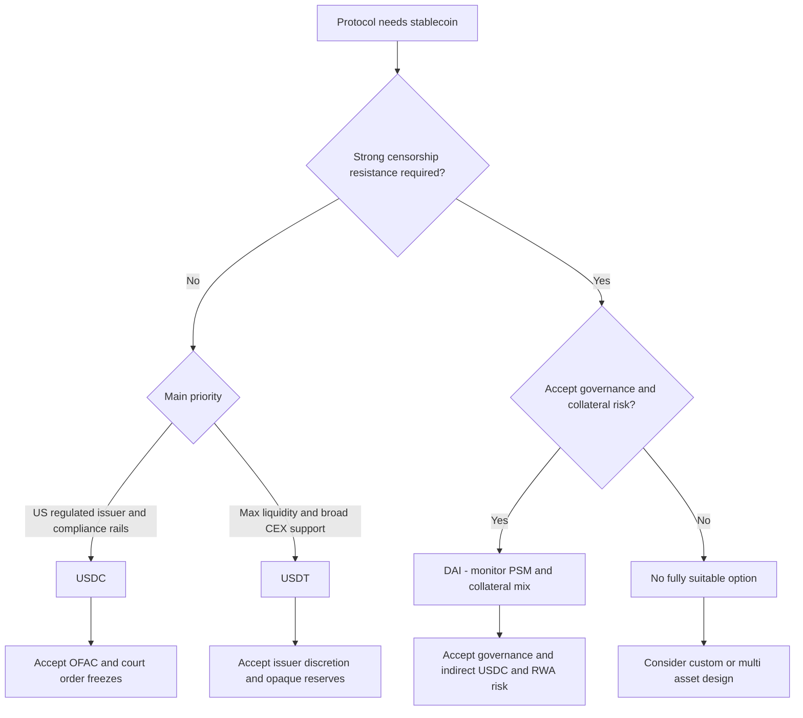
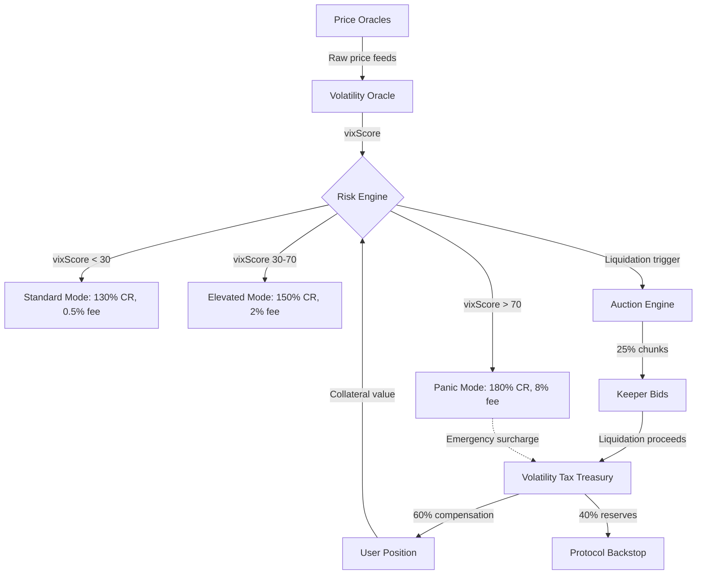
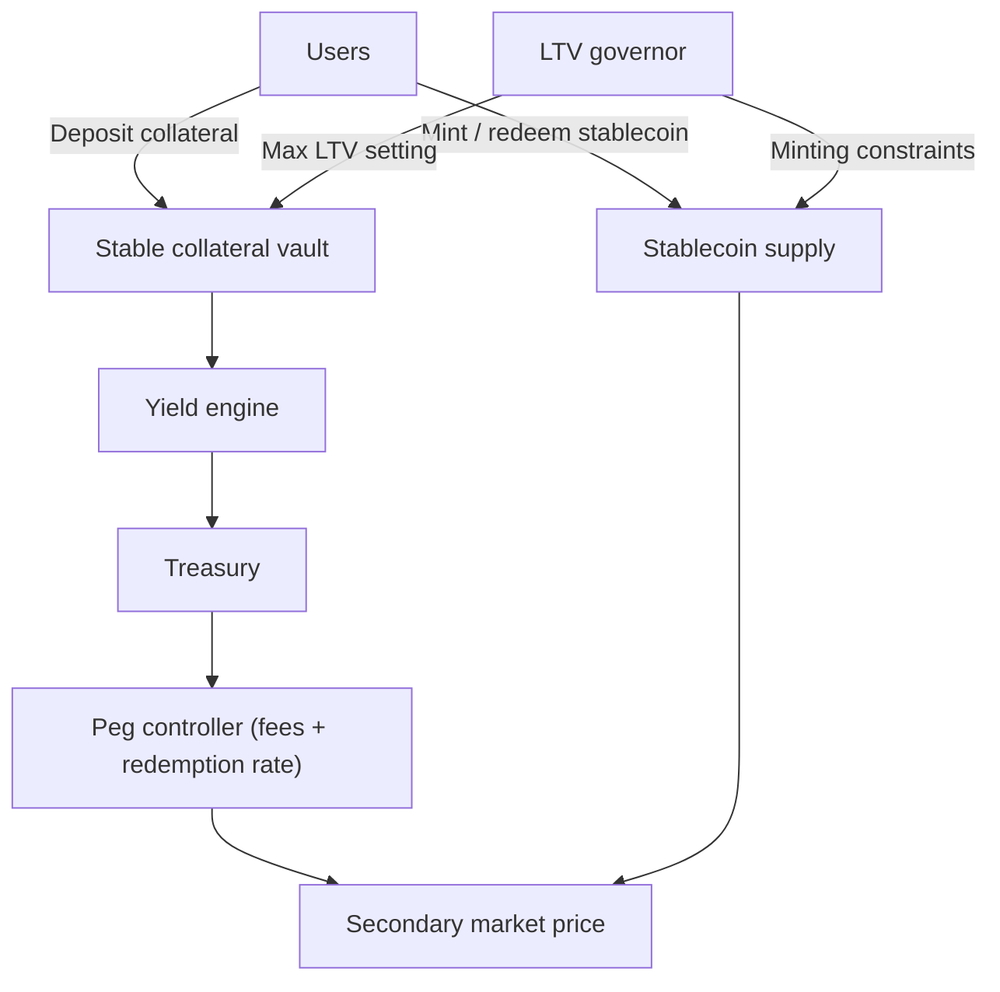

# Stablecoin Technical Report – Option 2 (Stablecoins)

## TL;DR

This report studies stablecoins in three layers: (1) analysis of existing designs, (2) mechanism design for two contrasting environments, and (3) economic modeling of an oracle based attack on a lending protocol. The common thread is how assumptions about collateral and infrastructure push stablecoins toward different trade offs between decentralization, sustainability, and risk.

First, I compare three major stablecoins at different points in the design spectrum. USDT represents the opaque, centrally managed fiat model, with strong market adoption but heavy trust and censorship assumptions. USDC follows a regulated transparency model, with cleaner disclosures and tighter banking integration, but inherits concentration and blacklist risk. DAI illustrates the crypto collateral compromise: it began as a decentralized, over collateralized design and gradually leaned on centralized stablecoins through the PSM to keep the peg tight. This section frames what is realistically achievable today and the main structural risks in each approach.

On top of that baseline, I design two protocol level architectures. Scenario A assumes highly volatile collateral and introduces a volatility coupled collateral ratio and partial liquidations to contain cascades. Scenario B assumes perfectly stable collateral and removes liquidations entirely, relying instead on yield funded buybacks, peg responsive fees, and a slow moving LTV governor. Finally, I model an oracle manipulation attack against a lending protocol that combines Uniswap spot prices with Chainlink feeds, derive when the attack is economically viable, and propose mitigation levers such as TWAP configuration, multi oracle aggregation, and liquidation bonus shaping.

---

## Table of Contents

1. [Stablecoin Analysis](#1-analysis-of-existing-stablecoins)
   - [USDT](#11-usdt-fiat-backed-centralized-reserve-model)
   - [USDC](#12-usdc-stability-through-institutional-compliance)
   - [DAI](#13-dai-the-crypto-collateralized-compromise)
2. [Stablecoin Design](#2-stablecoin-design)
   - [Scenario A: Highly Volatile Collateral](#21-scenario-a-environment-with-highly-risky-collateral)
   - [Scenario B: Perfectly Stable Collateral](#22-scenario-b-environment-with-perfectly-stable-collateral)
   - [Comparison between Scenarios](#scenario-a-vs-scenario-b)
3. [Attack Modelling](#3-economic-security-and-risk-modeling)

---

## 1. Analysis of existing stablecoins

## 1.1 USDT: Fiat-backed centralized reserve model

### Trust Assumptions and disclosure risk

USDT is built on a simple idea: each token represents a claim on one dollar held in Tether’s reserves. The technical setup is straightforward: fiat backed reserves held off chain in bank accounts, invested across cash, cash equivalents, short term U.S. Treasuries, and other assets that are not always fully disclosed. The real complexity does not come from this mechanism, but from the **trust** users must place in Tether to actually hold and manage these reserves as promised.

Tether has a poor track record on transparency. It has never produced a full financial audit. Instead, it relies on attestations from third parties that only confirm that reserves existed at a specific point in time. These are explicitly **not audits**. The difference is important: an attestation says “reserves existed at time T”, while an audit aims to verify that reserves were maintained over time and that internal controls prevent misuse. Tether has never provided that level of assurance.

This lack of transparency turned into a legal issue in 2021, when Tether settled with the New York Attorney General, admitted that it had misrepresented USDT’s backing, and paid an 18.5 million dollar fine. The case also revealed periods in which the reserves included large positions in commercial paper and loans to affiliated entities, which is very far from the simple “fully backed by USD” message presented to users.

**USDT Reserve Composition (2025, based on public attestations)**



### Banking Dependencies as Single Points of Failure

Every banking relationship adds a regulatory attack surface. Tether’s banks must follow the laws and court orders of the jurisdictions where they operate. A single court decision in the Bahamas, Switzerland, or in any country that hosts a correspondent bank can block Tether’s access to its reserves and stop redemptions. In that situation, USDT holders have **no direct recourse**. Even if the reserves still exist on paper, the token behaves like an unbacked liability because users cannot actually redeem it.



### Centralization Risk: The Blacklist Function

USDT's smart contract architecture exposes administrative freeze capabilities:

```solidity
// Simplified representation of USDT's freeze mechanism
function freeze(address user) external onlyAdmin {
    frozen[user] = true;
}

modifier notFrozen(address user) {
    require(!frozen[user], "Address frozen");
    _;
}

function transfer(address to, uint256 amount) public notFrozen(msg.sender) {
    // Transfer logic
}
```

This is not theoretical. On chain data shows that Tether has frozen **more than 5,000 addresses** since 2016, including high profile cases such as the CurioInvest exploit and FTX hot wallets after the collapse. The freeze function is controlled by Tether and can be used in response to law enforcement requests, sanctions, or internal compliance decisions.

**Regulatory pressure points:**

- **OFAC sanctions:** Addresses designated by the U.S. Office of Foreign Assets Control can be blacklisted. Tether is strongly incentivized to comply in order to preserve its banking and payment relationships.  
- **Court orders:** Courts in relevant jurisdictions can require Tether to freeze specific addresses in the context of civil asset forfeiture or criminal proceedings, usually without any prior notice to users.  
- **Issuer discretion:** Tether’s terms of service allow it to freeze addresses for “suspicious activity”, an undefined standard with no transparent appeal process.

The trade off is clear: **scale and liquidity** come with **strong centralization**. USDT dominates many CEX trading pairs and is widely used in cross chain liquidity. For protocols that require censorship resistance at the asset layer, relying on USDT as a core building block is a structural limitation.

### Historical Stress Test: The March 2023 Inversion

During the USDC depeg triggered by the Silicon Valley Bank collapse in March 2023, USDT briefly traded **above peg**, reaching about 1.05 to 1.07 dollars on some exchanges. This premium was unusual and reflected a shift in market preference: traders moved out of USDC and, in some cases DAI, into USDT because they saw Tether’s offshore structure as less exposed to U.S. banking risk. In practice, USDT behaved as a **regulatory arbitrage asset**, not as a transparently backed stability primitive.

### Failure modes

USDT becomes fragile when its regulatory and banking infrastructure is under coordinated stress. A realistic worst case involves legal or regulatory actions that freeze Tether’s key bank accounts and restrict its ability to move reserves, while major venues also blacklist related addresses. In that scenario, redemptions become impossible in practice, and users are left holding tokens backed by reserves they cannot access.

---

## 1.2 USDC: Stability Through Institutional Compliance

### The Regulated Transparency Model

USDC is positioned as the opposite of Tether’s opacity. Circle, its issuer, is a U.S. based company that operates under state money transmitter and related licenses. Each USDC is backed by U.S. dollars in cash or short-term U.S. government securities held at regulated financial institutions, including large custodians such as Bank of New York Mellon. Circle publishes monthly reserve attestations signed by a major auditing firm (currently Grant Thornton), which describe the size and composition of these assets, and files annual audited financial statements with U.S. regulators. These are still attestations on the reserves, not full audits of the reserve itself, but together they create a level of transparency around the firm’s overall balance sheet that Tether does not offer.

### USDC Reserve Composition (high level, 2025)



This transparency comes with **very strong regulatory control**. Circle is legally required to comply with:

- **OFAC sanctions** (blacklisting of sanctioned addresses)
- **FinCEN reporting requirements** (transaction monitoring and suspicious activity reports)
- **Court orders** (civil and criminal asset freezes)
- **State regulator demands** (changes in reserve management or additional supervisory reviews)

In this model, the compliance framework is not a side effect, it is the core value proposition. USDC is explicitly marketed as an “institutional grade” stablecoin, where strict regulatory adherence is presented as a feature for banks, payment companies, and other TradFi integrations.

### The SVB Collapse

March 2023 exposed the fragility of “stability through institutions.” Circle held **3.3 billion dollars of USDC reserves** at Silicon Valley Bank. When SVB was seized by the FDIC on March 10, those reserves became temporarily inaccessible. Within hours, USDC depegged to around **0.87 dollars** on major exchanges.



The peg only stabilized after the U.S. Treasury, Federal Reserve, and FDIC jointly announced **full depositor protection** for SVB accounts. This systemic risk exception was not guaranteed in advance and required an extraordinary policy decision. If the authorities had chosen not to guarantee all deposits, USDC could have faced a permanent or long lasting discount to one dollar.

**Systemic implication:** USDC’s stability is **conditional on U.S. government solvency and on the willingness of U.S. authorities to backstop banking failures**. This is not a decentralized trust model. It is a direct dependency on the Federal Reserve and the broader U.S. banking safety net acting as lender of last resort.

### Censorship and Compliance

USDC includes a blacklist function that is technically similar to Tether’s freeze mechanism, but operated through Circle’s compliance team:

```solidity
// USDC blacklist implementation
function blacklist(address user) external onlyComplianceOfficer {
    blacklisted[user] = true;
    emit Blacklisted(user);
}
```

**Case study: Tornado Cash (August 2022)**

When the U.S. Treasury sanctioned Tornado Cash, Circle immediately blacklisted USDC associated with the sanctioned contracts. This included:

- around 75,000 USDC frozen in the Tornado Cash router contract
- downstream addresses that had received funds from Tornado Cash facing the risk of being blocked
- DeFi protocols using USDC as collateral or liquidity being forced to adapt to the new blacklist status, with Aave, Uniswap and Curve pools partially affected

From a regulatory and institutional perspective, this fast response is the product that USDC is selling: instant and strict compliance with U.S. sanctions. From a decentralization perspective, the trade off is clear. Any protocol that integrates USDC as core collateral or settlement asset inherits the U.S. regulatory perimeter as an attack surface and must accept that balances can be frozen at the issuer’s discretion or in response to external pressure.

### Comparison: Circle vs. Tether Compliance Frameworks

| Dimension              | USDC (Circle)                                                                 | USDT (Tether)                                                                 |
|------------------------|-------------------------------------------------------------------------------|-------------------------------------------------------------------------------|
| **Reserve audits**     | Monthly reserve **attestations** by Grant Thornton; annual audited financials for Circle as a company | Irregular **attestations** only; no public audited financial statements      |
| **Regulatory licenses**| U.S. state money transmitter and related licenses; operates under U.S. AML and securities oversight | Offshore structure with limited disclosed licensing and weaker direct oversight |
| **Blacklist trigger**  | OFAC sanctions, court orders, and internal compliance policies; typically fast and proactive | OFAC sanctions, Law enforcement and court orders, plus issuer discretion; less transparent criteria |
| **Banking counterparties** | Reserves held at named U.S. custodians (for example Bank of New York Mellon) and other regulated institutions | Banks and custodians spread across multiple jurisdictions, generally undisclosed in real time |
| **Main depeg risk**    | U.S. banking or regulatory shocks (for example the SVB failure in March 2023) | Offshore banking issues, reserve mismanagement, or loss of access to key banking partners |
| **Transparency**       | Relatively high: regular reserve breakdowns and audited company accounts     | Low: limited disclosure on counterparties and reserve mix; no full audits    |

**Failure mode:** USDC becomes fragile when U.S. regulatory or banking infrastructure is under severe stress. The SVB event showed that bank counterparty risk can lead to a fast and deep depeg even if deposits are later protected. A secondary failure mode is a large scale sanctions episode in which major DeFi liquidity pools or widely used addresses are blacklisted. In that scenario, USDC could split into “clean” and “tainted” balances, creating a fungibility crisis at the asset level.

---

## 1.3 DAI: The Crypto-Collateralized Compromise

### Over-Collateralization and the Vault Mechanism

DAI represents the original vision of decentralized stablecoins: **no fiat backing, no trusted issuer, only code and collateral**. Users mint DAI by locking crypto assets (ETH, wBTC, stETH) into MakerDAO vaults at over-collateralization ratios—typically **150-200% depending on vault type**.



The system is maintained through three main mechanisms:

1. **Stability fees:** Interest rates paid by vault borrowers on their DAI debt, typically in the low single digit annual range and adjustable by MKR governance. By raising or lowering stability fees, Maker can influence DAI demand and supply.

2. **Liquidation penalties:** If the value of the collateral falls below the required ratio, the vault is liquidated and an additional penalty is charged on top of the debt. This penalty is paid from the liquidated collateral and creates an incentive for keepers to participate in auctions and keep the system solvent.

3. **Surplus buffer:** A portion of protocol revenue accumulates in a surplus buffer that can be used to absorb bad debt when liquidations do not fully cover the outstanding DAI, for example during fast price crashes.

Intuitively, stability fees act as the interest rate on DAI loans, liquidation penalties are the fine users pay if they let their position fall below the required ratio, and the surplus buffer is the system’s safety cushion to absorb bad debt during fast crashes.

This design is **trust minimized but capital inefficient**. Locking around 150 dollars of ETH to mint 100 dollars of DAI creates a clear opportunity cost for users and makes it harder for DAI to scale as fast as fiat backed stablecoins that do not require over collateralization.

### The PSM: A Peg Stability “Cheat Code”

After Black Thursday in March 2020, when ETH dropped by more than 50 percent in a single day and DAI traded up to about 1.12 dollars due to liquidation congestion, MakerDAO introduced the **Peg Stability Module (PSM)**. The PSM allows users to swap USDC for DAI at a fixed rate close to 1 to 1, with only a small fee. In practice, this creates an almost risk free arbitrage that pulls the DAI price back toward one dollar whenever it trades above the peg.

```solidity
// Simplified PSM logic
function swapUSDCForDAI(uint256 usdcAmount) external {
    require(usdcAmount <= psmCap, "Exceeds PSM cap");
    
    // Transfer USDC from user to PSM
    usdc.transferFrom(msg.sender, address(this), usdcAmount);
    
    // Mint DAI to user (minus fee)
    uint256 daiAmount = usdcAmount * (1e18 - feeRate) / 1e18;
    dai.mint(msg.sender, daiAmount);
}
```

**The centralization backdoor**

The PSM turned DAI from a purely crypto collateralized stablecoin into a hybrid design that depends heavily on USDC. At the peak of the SVB and USDC crisis in March 2023, around 60 percent of DAI’s backing came from USDC held in the PSM. When USDC traded down to about 0.87 dollars, DAI also dropped into the high 0.80s on major exchanges. This was a correlated failure mode: stress in a centralized, bank backed stablecoin propagated directly into DAI, weakening its claim to be independent from off chain institutions.

MakerDAO’s medium term response was to increase its exposure to Real World Assets (RWAs), mainly U.S. Treasury bill exposure and other credit like real world lending structures. This improves peg stability by tying DAI to predictable dollar yield, but it also introduces **TradFi counterparty and legal risk** into a system that is marketed as decentralized. The PSM remains active with lower limits, and the precedent is clear: **a growing share of DAI’s peg stability now comes from centralized collateral and off chain institutions**.



### Governance Attack Surface: MKR Holder Collusion

DAI’s decentralization depends on **MakerDAO governance**, controlled by MKR token holders, remaining honest and resilient. MKR holders can decide:

- **Risk parameters** (collateral ratios, liquidation penalties, stability fees)
- **Collateral onboarding** (which assets are allowed to back DAI)
- **PSM configuration** (fees, caps, enable or disable)
- **Emergency shutdown** (the protocol level kill switch)

**Attack vectors:**

1. **MKR whale collusion**

A coordinated group of large MKR holders, or a single actor with effective control over governance, can unilaterally change system parameters. Possible abuses include:

- Lowering collateral ratios to unsafe levels, allowing under collateralized DAI issuance  
- Onboarding attacker controlled collateral types  
- Disabling or reconfiguring the PSM during stress to force or amplify a depeg  
- Triggering emergency shutdown at a time that benefits the attacker

1. **Emergency shutdown risk**

MakerDAO’s emergency shutdown mechanism is designed as a last resort to unwind the system and let DAI holders redeem collateral. At the same time, it is a **governance level single point of failure**:

```solidity
// Emergency Shutdown pseudocode
function emergencyShutdown() external onlyGovernance {
    systemActive = false;
    
    // Freeze all vaults
    for (vault in allVaults) {
        vault.freeze();
    }
    
    // Allow DAI holders to claim collateral
    redemptionActive = true;
}
```

If triggered maliciously or at the wrong time, emergency shutdown would:

- Freeze all new DAI minting and borrowing  
- Force vault owners to reclaim collateral at potentially unfavorable prices, based on the shutdown reference price rather than current market conditions  
- Severely reduce DAI’s usefulness as a stablecoin, since no new supply could be created and existing supply would only be redeemable through the shutdown process  

1. **PSM censorship propagation**

Because the PSM relies on USDC, any censorship event affecting USDC can propagate indirectly into DAI. If Circle blacklists a major DeFi protocol’s USDC holdings, and that protocol relies on the PSM to manage DAI liquidity, its ability to move USDC and use the PSM can be partially or completely blocked. In effect, DAI liquidity and DAI based operations at that protocol become constrained by USDC level sanctions, even though DAI itself is not directly blacklisted.

### Failure mode

DAI can fail through **governance capture** (MKR holders colluding to change parameters in their favor or to trigger emergency shutdown) or through **collateral impairment** (for example, a severe USDC depeg, an extreme ETH price crash, or default on RWA positions). The existence of the PSM means that DAI also inherits USDC’s failure modes as a secondary risk layer, even when most of its backing is nominally crypto collateral or RWA based

---

## IV. Censorship and Governance Risk: USDT vs USDC vs DAI

### Decision Tree for DeFi Protocol Stablecoin Selection



### Comparative Censorship Analysis

| Stablecoin | Freeze authority | Legal attack surface | Technical mechanism | Real world precedent | Decentralization reality |
|------------|------------------|----------------------|---------------------|----------------------|--------------------------|
| **USDT**   | Tether Limited (centralized issuer) | Court orders, law enforcement requests, sanctions, banking pressure, issuer discretion | `freeze(address)` style admin function in the token contract | Thousands of addresses frozen on Ethereum and other chains, including CurioInvest related funds and FTX linked wallets | **Fully centralized.** Tether can freeze or unblock any address at its discretion or in response to external pressure. |
| **USDC**   | Circle (issuer) | OFAC sanctions, FinCEN requirements, court injunctions, state regulators | `blacklist(address)` controlled by internal compliance team | Tornado Cash sanctions in 2022 (tens of thousands of USDC frozen across contracts), fast reaction to new OFAC designations | **Fully centralized.** Circle proactively blacklists to maintain regulatory standing and access to U.S. banking rails. |
| **DAI**    | MakerDAO governance (MKR holders) | Governance capture, political or legal pressure on Maker Foundation successors, PSM and RWA exposure to USDC and TradFi | Governance controlled risk parameters and collateral set, emergency shutdown mechanism, indirect USDC exposure via PSM | March 2023 SVB and USDC crisis, where DAI depegged due to large USDC share in the PSM | **Constrained decentralization.** The base token is permissionless, but PSM and RWA exposure introduce centralized collateral risk, and MKR governance can change system behavior or trigger shutdown. |

---

## 2. Stablecoin Design

### 2.1 Scenario A: Environment with highly risky collateral

#### Stablecoin mechanism design

### Overview

This design targets stablecoins backed by highly volatile crypto assets such as ETH, wBTC and similar tokens, where price drops of 30 percent or more can occur within hours. In these conditions, governance driven systems are often too slow. For example, MakerDAO adjusts risk parameters over days while flash crashes unfold in minutes, which contributed to under-collateralization and losses during Black Thursday in March 2020.

The proposed system introduces an **algorithmic volatility coupling** mechanism: a real time “chaos score” (`vixScore`) that automatically tightens collateral requirements based on market stress. When markets are calm, minimum collateralization can be as low as 130 percent. As volatility increases, `vixScore` raises the required ratio up to 180 percent, with changes applied at the cadence of new blocks rather than governance cycles.

Liquidations are performed in **partial 25 percent chunks** of a position instead of full vault wipes, which aims to reduce market impact and slippage during stressed conditions. In parallel, **emergency fees** collected during these events are redistributed to affected users to partially compensate losses from forced deleveraging.

The core trade off is explicit: users accept more frequent margin calls, even while their positions are still technically solvent, in exchange for a lower probability of systemic under-collateralization and protocol level failure.

### System architecture

**Core modules**

1. **Volatility oracle aggregator**  
   Combines on-chain price variance (for example, Uniswap V3 tick volatility), off-chain volatility feeds (for example, a Chainlink VIX style feed), and liquidation activity into a single `vixScore` on a 0 to 100 scale.  
   **Economic role:** converts market stress into concrete parameter changes for the protocol.

2. **Dynamic collateralization engine**  
   Adjusts minimum collateral ratios in real time based on `vixScore`. When markets are calm (`vixScore < 30`), the minimum collateralization ratio is 130 percent. When markets are stressed (`vixScore > 70`), the required ratio moves up to 180 percent.  
   **Economic role:** forces users to add collateral or reduce debt earlier, before positions become dangerously close to under collateralization.

3. **Tiered liquidation auction**  
   Performs partial liquidations in 25 percent chunks of a position, using a Dutch auction that starts at 115 percent of the debt value and decays to 105 percent over six hours.  
   **Economic role:** avoids full position wipeouts, spreads liquidations over time, and keeps liquidators profitable even in thin markets.

4. **Volatility tax treasury**  
   Collects extra fees charged during high `vixScore` periods and routes 60 percent back to liquidated users as compensation and 40 percent to protocol reserves.  
   **Economic role:** creates a buffer that supports the system during stress while giving users partial reimbursement for forced deleveraging events.



### Key mechanisms

**Volatility indexed collateral ratio**

The protocol uses a synthetic volatility score (`vixScore`) to adjust the minimum collateral ratio in real time:

```python
vixScore = weighted_avg(
    uniswap_tick_variance * 0.4,
    chainlink_vix_feed * 0.3,
    liquidation_velocity * 0.3,
)

required_CR = base_CR * (1 + vixMultiplier * (vixScore / 100))

if vixScore > 70:
    # Enforce a hard minimum of 180% CR in panic conditions
    required_CR = max(required_CR, 1.80)
    # Short window for users to add collateral or repay debt
    grace_period = 30 * MINUTES
```

**Why it works:** Systems that use a single, static collateral ratio can handle slow price moves but are fragile during very fast crashes. By tying the required collateral ratio to realized volatility, this design pushes users to react earlier. When `vixScore` starts to rise, users must add collateral or reduce debt *before* prices move much further, instead of waiting until a large drawdown has already happened. The 30 minute grace period in panic mode makes the choice explicit: accept the higher “volatility fee” to keep the position open, or close it voluntarily at a lower cost.

**Trade off:** Users receive more margin calls during volatile periods, even when their position would be considered solvent under a static collateral ratio. This reduces comfort at the individual level in order to protect the system from under collateralization and socialized losses. The impact is partially softened by the Volatility Tax Treasury, which returns 60 percent of the panic fees to affected users. With an 8 percent panic fee, the effective net cost for users is capped at 3.2 percent.

**Partial liquidation Dutch auction**

```python
auction_start_price = debt_value * 1.15
auction_end_price = debt_value * 1.05

decay_rate = (auction_start_price - auction_end_price) / auction_duration

def current_price(elapsed_time):
    return auction_start_price - decay_rate * elapsed_time

# Liquidate at most 25% of the position in a single auction
liquidation_size = min(position_size * 0.25, debt_to_cover)

keeper_profit = collateral_seized * current_price(elapsed_time) - debt_repaid

if keeper_profit < min_profit_threshold:
    # Extend the auction window to avoid failed auctions and bad debt
    auction_extends_by = 2 * HOURS
```

**Why it works:** Protocols like Compound liquidate entire positions in a single step, which can create large price moves when many positions are hit at once. During the May 2021 crash, this type of design contributed to deep slippage when tens of millions of dollars were sold into DEXs in a short window. By liquidating only 25 percent of a position at a time, the protocol reduces the immediate market impact by about a factor of four while still giving keepers a clear profit opportunity. Even if the first auction clears close to 107 percent of the debt value, keepers remain profitable. The auction extension rule avoids MakerDAO style zero bid situations: if no keeper is willing to bid within the initial window, the protocol extends the auction instead of accepting bad debt.

**Trade off:** Because liquidations are spread out over time, the collateral can continue to fall in price before the full debt is covered. This is accepted as a design choice because partial auctions tend to clear within a relatively short period under normal volatility conditions (for example, when `vixScore < 50`), and any residual gap during true black swan events can be covered by the protocol backstop and the Volatility Tax Treasury.

### Failure modes and mitigations

#### I. Oracle manipulation in low liquidity

**Primary risk**

An attacker manipulates a single price source (for example, pushes the Uniswap price up in a thin market), creates a false “calm” signal, opens a maximum leverage position, and then dumps the collateral.

**Mitigation**

- Three oracle setup:
  - Chainlink price feed  
  - Uniswap V3 TWAP  
  - Liquidation velocity (number and size of liquidations per block)
- Two out of three agreement required for `vixScore` to move down.
- Liquidation velocity acts as a behavioral oracle: if many positions are being liquidated in a short window, `vixScore` cannot drop, even if one price feed suggests lower volatility.

**Residual risk**

- A coordinated attack that corrupts or distorts all three signals would require capital on the order of hundreds of millions of dollars.
- Such an attack would create a visible spike in on chain liquidations.
- The design assumes this pattern is detectable and can trigger an emergency pause controlled by a multisig.

#### II. Keeper cartel collusion

**Primary risk**

Liquidators coordinate and refuse to bid in auctions, trying to force the protocol to accept bad debt or clear liquidations at extremely unfavorable prices.

**Mitigation**

- Auction extension mechanism that lengthens the auction window if bids are too low or absent.  
- Protocol owned keeper bot that bids at around 105.5 percent of the debt value (about 0.5 percent profit) as buyer of last resort.

**Residual risk**

- The protocol owned keeper needs its own capital and gas budget.  
- In this design, it is funded with 40 percent of the Volatility Tax Treasury.

---

### 2.2 Scenario B: Environment with perfectly stable collateral  

#### Stablecoin mechanism design

### Overview

This design assumes an environment where collateral value cannot decrease. Once one unit of collateral is deposited into the system, its accounting value is guaranteed not to fall. Under this assumption, the classic problem of under collateralization from price crashes disappears: there is no need to monitor loan health with price oracles, no risk of liquidation cascades, and no requirement for auction based liquidations.

In the naive version of this world, the protocol could simply allow users to deposit 100 units of collateral and mint 100 units of stablecoin, with no liquidators, no auctions, and no margin calls. As long as the collateral remains in the contract and cannot be stolen, the system is always solvent on paper.

However, this does not automatically guarantee a stable peg or a good user experience. Even with perfectly stable collateral, the stablecoin can still trade away from one dollar if redemptions are slow, if governance becomes captured, or if users lose confidence in the protocol. The real design problem moves from managing asset price risk to managing liquidity, queues, and human behavior.

The system described here uses stable collateral to push capital efficiency close to one hundred percent, but stops short of full leverage. Target LTV (Loan To Value) is set around 94 percent, leaving a 6 percent buffer for smart contract failures, governance mistakes, and redemption surges. Instead of liquidations, peg stability is enforced through three tools: (1) continuous deployment of collateral yield into buybacks and supply expansion, (2) dynamic minting and redemption fees that react to peg deviations, and (3) a slow moving LTV controller that tightens or loosens leverage based on system health metrics such as redemption queue depth and governance concentration.

### System architecture

**Core modules**

1. **Stable collateral vault**  
   Holds assets whose value is axiomatically non-decreasing. Users deposit collateral and mint stablecoins up to the current LTV limit.  
   **Economic role:** provides the hard backing for the system without price risk. Solvency depends on custody and contract safety, not on market volatility.

2. **Yield engine and treasury**  
   Tracks the yield generated by the collateral (for example 3 to 8 percent APY from staking or similar sources) and sends it into a system treasury. The treasury then allocates this yield between peg defense, reserves, and optional protocol revenue.  
   **Economic role:** turns collateral income into continuous peg defense firepower, replacing the one off value extraction of liquidations.

3. **Peg controller: fees and redemption rate**  
   Observes the secondary market price of the stablecoin and adjusts two parameters:  
   - Minting and burning fees.  
   - The redemption rate used when users redeem stablecoins for collateral inside the protocol.  

   **Economic role:** shapes the incentives for issuing, holding, and redeeming the stablecoin so that supply and demand move back toward a one dollar peg without forced sales.

4. **LTV and risk governor**  
   Maintains the maximum allowed LTV between conservative and aggressive bands (for example between 92 and 96 percent) based on system health signals such as redemption queue length, yield stability, governance concentration, and audit freshness.  
   **Economic role:** ensures that leverage only increases when the system has enough capacity to process redemptions and withstand governance or contract failures.



### Key mechanisms

#### Yield directed peg maintenance

Instead of liquidating collateral when the peg breaks, the system uses collateral yield to buy back or expand supply.

```python
state = {
    "collateral_value": ...,
    "yield_apy": 0.05,          # example: 5% annual yield
    "treasury_balance": T,
}

def hourly_step(market_price):
    hourly_yield = state["collateral_value"] * state["yield_apy"] / 8760
    state["treasury_balance"] += hourly_yield

    peg_deviation = (market_price - 1.0) / 1.0

    if peg_deviation < -0.005:
        # stablecoin trades below 0.995
        buyback_budget = min(
            hourly_yield * 2.0,       # use up to 2x fresh yield
            state["treasury_balance"] * 0.10  # cap per hour
        )
        stable_bought = market_buy_stable(buyback_budget)
        burn(stable_bought)
        state["treasury_balance"] -= buyback_budget

    elif peg_deviation > 0.005:
        # stablecoin trades above 1.005
        mint_amount = hourly_yield / market_price
        mint_to_treasury(mint_amount)
        proceeds = market_sell_stable(mint_amount)
        state["treasury_balance"] += proceeds
```

**Why it works**

When the stablecoin trades below one dollar, the protocol becomes a constant buyer funded by yield. Arbitrageurs can buy below peg expecting that protocol buybacks will support the price and compress the discount. When it trades above one dollar, the protocol mints small amounts against the yield and sells into the premium, adding supply where demand is too strong.

This is only viable because the collateral is not being wiped out by price crashes. Yield continues to accumulate even in stressed markets, so the system always has some ammunition. In a volatile collateral system, any serious peg break usually coincides with collateral price drops, which makes yield almost irrelevant compared to principal losses.

**Trade off**

Peg defense capacity is directly linked to the yield rate and the size of the treasury. If yield collapses for an extended period or the treasury has been drained by previous interventions, buybacks may be too small to restore the peg quickly. The design accepts that peg deviations can last longer in low yield regimes and relies on LTV reductions and fee adjustments as additional backstops.

### Dynamic mint and redemption fees

Instead of liquidations, the protocol shapes issuance and redemptions through fee changes that depend on the peg.

```python
def update_fees(market_price, peg_sma_6h):
    deviation = (peg_sma_6h - 1.0) / 1.0

    base_mint_fee = 0.001   # 0.10%
    base_burn_fee = 0.0005  # 0.05%

    if deviation < -0.005:
        # under peg: discourage new supply, make exits cheap
        mint_fee = base_mint_fee + 0.040   # about 4.1%
        burn_fee = 0.0

    elif deviation > 0.005:
        # over peg: encourage new supply, make exits expensive
        mint_fee = base_mint_fee * 0.5     # about 0.05%
        burn_fee = base_burn_fee + 0.030   # about 3.05%

    else:
        mint_fee = base_mint_fee
        burn_fee = base_burn_fee

    return mint_fee, burn_fee
```

**Why it works**

When the stablecoin is cheap, issuing new units at a high mint fee is unattractive, because the user would pay more than one dollar in fees and collateral to mint something that then trades for less in the market. It is strictly better to buy on the DEX. This pushes new demand toward buying existing supply, which helps the peg recover. When the stablecoin is expensive, burning becomes costly and minting cheap, so users are incentivized to issue new units against their collateral and sell them, increasing supply until the premium disappears.

Fee revenue collected in normal times can be routed to the treasury and later used to fund buybacks or to build additional reserves.

**Trade off**

Fees are a relatively soft lever. They work well for moderate, sustained deviations, but they are not enough by themselves in a sharp panic where users are willing to pay high costs to exit. For that reason, they are combined with redemption rate adjustments and LTV governance, which can intervene when queues or sell pressure become too large.

#### Slow moving LTV controller

Even with stable collateral, it is not safe to run at full 100 percent LTV. The system keeps a target band such as 92 to 96 percent and adjusts within that band based on slow, structural metrics.

```python
state = {
    current_ltv = 0.94,
    min_ltv = 0.92,
    max_ltv = 0.96,
}

def update_ltv(queue_utilization,
               yield_stability,
               governance_concentration,
               audit_freshness):
    # All inputs rescaled between 0 and 1
    # Lower queue_utilization is better
    # Higher yield_stability, audit_freshness are better
    # Lower governance_concentration is better

    health = (
        0.30 * (1 - queue_utilization) +
        0.30 * yield_stability +
        0.25 * (1 - governance_concentration) +
        0.15 * audit_freshness
    )

    target = current_ltv

    if health > 0.85:
        target = min(max_ltv, current_ltv + 0.005)
    elif health < 0.65:
        target = max(min_ltv, current_ltv - 0.010)

    # Smooth transition
    new_ltv = current_ltv + 0.3 * (target - current_ltv)
    current_ltv = new_ltv

    return current_ltv
```

**Why it works**

LTV adjustments are not driven by asset prices, but by the system’s ability to handle stress. When redemption queues are short, yields are stable, governance is relatively decentralized, and audits are fresh, the system can tolerate slightly higher leverage. When any of those signals deteriorate, the LTV ratchets down and new mints are restricted.

This replaces the emergency governance moves that volatile collateral systems use when volatility spikes. Instead of reacting to markets in hours or days, the system preemptively adapts leverage based on its own internal capacity, leaving enough buffer for redemptions and potential bugs.

**Trade off**

Users lose some predictability about the maximum LTV they can rely on over long periods, and new debt can be throttled precisely when demand is highest. The design favors systemic safety over continuous access to maximum leverage.

### Failure modes and mitigations

#### I. Yield rate collapse

**Primary risk**

The protocol assumes a minimum level of collateral yield to fund peg defense. If the effective yield drops sharply and remains low for months (for example due to a protocol change in the underlying staking system, slashing events, or regulatory limits), the treasury’s ability to buy back stablecoins and support the peg is reduced. In a prolonged low yield environment, users may lose confidence, the peg can drift below one, and redemptions may spike.

**Mitigation**

- Monitor yield trends and define a minimum “safe” yield band.
- If yield falls sharply:
  - Immediately pause new mints and reduce target LTV by several percentage points.
  - Allocate a fixed portion of remaining yield and reserves exclusively to peg defense.
  - Optionally sell a small share of collateral into external reserve assets if that is compatible with the model.

**Residual risk**

Even with automatic responses, a long period of low or zero yield reduces the system’s ability to actively support the peg. The design accepts that in such scenarios the stablecoin may trade with a small discount for extended periods, while remaining fully backed on chain. Governance may eventually need to switch to a more conservative steady state with lower LTV and higher fees.

#### II. Redemption queue saturation and bank runs

**Primary risk**

Redemption throughput is finite. If a large fraction of users tries to redeem in a short time window, redemption queues can grow from minutes to many hours or days. Beyond a certain point, the presence of long queues becomes self-reinforcing: users see that exits are slow, panic, and submit even more redemption requests or sell aggressively in secondary markets, pushing the peg below one and risking a classic bank run pattern even though collateral is intact.

**Mitigation**

- Continuously estimate projected queue length given current redemption rates.
- Define multiple thresholds:
  - At moderate projected queue lengths, automatically pause new mints and slightly lower target LTV so that the system deleverages over time.
  - At higher levels, temporarily increase minting and burning fees to discourage speculative movements and prioritize genuine exits.
  - If queues approach an absolute limit, introduce partial redemptions per user or blended payouts (for example part in collateral, part in other liquid assets) to keep exits progressing.

**Residual risk**

Queue based mitigations manage the pace of exits but cannot fully remove the psychological effects of a perceived bank run. The protocol can still face extended periods where the stablecoin trades below one, even if redemptions are eventually honored. This is a trade off accepted in exchange for avoiding fire sale style liquidations.

#### III. Governance capture at high LTV

**Primary risk**

At high LTV levels the system’s total value is very close to the collateral base. Governance has effective control over almost all of this value through parameter choices such as fee routing, redemption conditions, or allowed collateral. If a concentrated group acquires enough governance power, it can pass proposals that redirect yield, change redemption rules to penalize exits, or otherwise extract value from users while the protocol appears technically solvent.

**Mitigation**

- Cap effective voting power per address or per entity.
- Require higher quorum and supermajority thresholds for changes that affect collateral, LTV, redemption mechanics, or treasury allocation.
- Add execution delays for such proposals so that users can redeem or unwind positions before changes take effect.
- Optionally separate “safety” parameters into a different layer that can only be changed with slower, more restrictive processes.

**Residual risk**

Well designed governance reduces but does not remove the possibility of capture, especially over long time horizons. The design deliberately concentrates economic power in the protocol to gain capital efficiency, accepting that governance becomes a first class security concern. This is the main trade off compared to Scenario A: price risk is largely gone, but coordination and governance risk become central.

---

### Scenario A vs Scenario B

| Dimension                       | Scenario A: volatile collateral                                  | Scenario B: perfectly stable collateral                                   | Comment |
|---------------------------------|------------------------------------------------------------------|----------------------------------------------------------------------------|---------|
| Collateral behavior             | Can drop 30% or more within hours, needs a large safety buffer  | Cannot lose value, price risk is effectively removed                      | In A the central problem is volatility, in B that problem simply does not exist. |
| Primary safety mechanism        | Partial liquidations via auctions, coupled to `vixScore`        | High but bounded LTV, plus control of redemption queues and governance    | A protects against price crashes, B protects against queues and power concentration. |
| Peg mechanism                   | Auctions, penalties, and dynamic collateral parameters          | Yield-funded buybacks, mint/burn fee adjustments, and slow-moving LTV     | A uses “the stick” (liquidations), B uses “the carrot” (incentives and yield). |
| Capital efficiency (typical LTV)| Effective CR 130–180%, LTV around 55–75%                        | Target band around 92–96% LTV, never pushed to full 100%                  | B extracts much more capital efficiency but takes on different risks. |
| Role of liquidations            | Central: without liquidations the system breaks                 | Non-existent: collateral is never force-sold                              | This is the largest architectural difference. |
| Oracle dependence               | High: prices and volatility feed `vixScore` and liquidations    | Lower: prices mainly used to track the peg, not to keep the system solvent| In B the system does not depend on a “collateral price” to stay alive. |
| Operational complexity          | Many moving parts: oracles, keepers, auctions, stress treasury | Fewer core modules: vault, yield engine, peg controller, LTV governor     | B simplifies mechanics but makes incentive design more central. |
| Dominant failure modes          | Oracle attacks, liquidation cascades, failed auctions           | Long redemption queues, yield collapse, governance capture                | A fails through price dynamics, B fails through coordination and exit timing. |

---

## 3. Economic security and risk modeling  

### Oracle manipulation attack: threat assessment

## Threat summary

In this model we consider an oracle manipulation attack against a lending protocol that uses a USD stablecoin as the borrowed asset and a Chainlink price feed based on Uniswap TWAP prices for collateral valuation. Chainlink acts as the primary oracle, aggregating prices from multiple venues, while the Uniswap TWAP (time weighted average price) provides an on chain price that averages the pool price over a time window instead of relying on a single spot tick. The attacker temporarily pushes down the on chain price of the collateral, makes otherwise healthy positions appear undercollateralized, and then buys the liquidated collateral at a discount.

Under these assumptions, the attack is generally uneconomic for actors with less than 20 million dollars of effective capital, but can become attractive once protocol TVL and the pool of liquidatable positions are large enough. Flash loans can reduce the upfront capital requirement to roughly 300,000 to 500,000 dollars, which makes this a realistic vector even for undercapitalized actors. For liquidation bonuses in the 5 to 8 percent range, the attack can yield around 100 to 190 percent ROI when liquidatable positions exceed 50 million dollars.

Protocols with more than 1 billion dollars of TVL and a concentrated set of liquidatable positions are therefore high value targets if they rely on a single price source and short TWAP windows.

## Attack mechanics

1. **Obtain temporary capital**  
   Borrow 50 million dollars worth of ETH via an Aave flash loan (fee ≈ 0.09%, about 45,000 dollars).

2. **Push down the on chain price**  
   Sell the full ETH position into a Uniswap ETH/USDC pool with roughly 500 million dollars of liquidity, pushing the spot price down by around 8–10 percent.

3. **Hold the manipulated TWAP**  
   Keep the price depressed over a 30 minute TWAP window (about 150 blocks) by preventing arbitrage from restoring the original price. This ensures that the Uniswap TWAP remains significantly below the true market level.

4. **Propagate the false price to the oracle**  
   The Chainlink feed updates using the manipulated TWAP as input, which makes many collateralized positions appear undercollateralized according to the protocol’s risk engine and triggers liquidations.

5. **Buy liquidated collateral at a discount**  
   Participate in the liquidation auctions and purchase collateral at a 5–8 percent discount via the liquidation bonus mechanism.

6. **Close the loop and realize profit**  
   After the manipulation period ends and prices normalize, sell the acquired collateral back into the market at or near the pre attack level, repay the flash loan, and keep the spread between liquidation discounts and manipulation costs as profit.

## Economic model

### Cost breakdown

| Component          | Calculation              | Amount      |
|-------------------|--------------------------|-------------|
| Flash loan fee    | 0.09% × $50M             | $45,000     |
| Slippage loss     | 3% × $50M                | $1,500,000  |
| Gas costs         | 150 blocks × $1,200/block| $180,000    |
| **Total cost**    |                          | **$1,725,000** (≈ $1.73M) |

This gives an order of magnitude for the capital the attacker effectively “burns” to create and sustain the manipulated price over the TWAP window.

### Profit calculation

**Scenario: 50 million dollars in liquidatable positions at 6 percent bonus**

| Source                  | Calculation              | Amount      |
|-------------------------|--------------------------|-------------|
| Liquidation discount    | 6% × $50M collateral     | $3,000,000  |
| Price recovery arbitrage| 2% × $50M resale         | $1,000,000  |
| **Total profit**        |                          | **$4,000,000** |

**Net result:**  
4.0M − 1.73M ≈ **2.27M profit (around 130% ROI)**

Here the attacker earns both from the liquidation bonus and from the price move back to fair value once the manipulation ends.

### Sensitivity analysis

The table below shows how the attack’s net profit changes with the size of liquidatable positions and the liquidation bonus:

| Liquidatable positions | 5% bonus     | 6% bonus     | 8% bonus     |
|------------------------|-------------:|-------------:|-------------:|
| $30M                   | -$225K (loss)| +$75K        | +$675K       |
| $50M                   | +$775K       | +$1.28M      | +$2.28M      |
| $100M                  | +$3.28M      | +$4.28M      | +$6.28M      |

This illustrates that the attack only becomes clearly attractive once:

- the pool of liquidatable positions is large (around 50M or more), and  
- the liquidation bonus is in the mid to high single digit range.

## Break even analysis

The attack is unattractive when the value of liquidatable positions is too small relative to the total cost of manipulation.

We can approximate the break even condition as:

$$\text{Liquidatable Positions} < \frac{\text{Attack Cost}}{\text{Liquidation Bonus}} = \frac{1.725M}{0.06} = \$28.75M$$

In other words, with an attack cost of roughly 1.73 million dollars and a 6 percent liquidation bonus, the attacker needs at least 29–30 million dollars in liquidatable positions before the attack becomes economically interesting.

**Critical thresholds (in this simplified model):**

- **Minimum protocol TVL**  
  Around 500 million dollars, assuming that roughly 6 percent of TVL is liquidatable at the worst point (about 30 million).

- **Minimum liquidation bonus**  
  A liquidation bonus in the 5.8 percent range on 30 million of liquidations puts the attacker near break even; smaller bonuses significantly reduce the economic incentive.

- **Maximum TWAP window**  
  If the TWAP window is extended from 30 to 60 minutes, the cost of sustaining the manipulation rises to roughly 6.96 million dollars. In that configuration, the attack is no longer attractive unless liquidations exceed about 116 million dollars.

### Stablecoin depeg variant (brief note)

A related variant of this attack targets a direct depeg of the stablecoin in secondary markets rather than forcing liquidations. In this scenario, only 4–8 million dollars of effective capital may be sufficient to create a price deviation of around 2 percent, which can be profitable when trading volumes are on the order of 50 million dollars and even small deviations of roughly 0.29 percent can be captured.

This variant has a significantly lower entry barrier but is primarily a trading and market structure issue rather than a liquidation driven lending attack, so it remains outside the main focus of this model.

## Defense recommendations

### Priority 1: Extend the TWAP window to 60+ minutes

- **Impact:** Increases the cost of sustaining a manipulated price by roughly 4× (from about 1.74M to around 6.9M dollars in this model).
- **Result:** Raises the break even threshold to approximately 116M dollars in liquidatable positions, which removes a large share of smaller protocols from the viable target set.
- **Trade off:** Introduces a slower price response (around 30 minutes of lag), which is generally acceptable for over collateralized lending but less suitable for high frequency trading.

### Priority 2: Use multi oracle aggregation (e.g. Chainlink + Uniswap v3 TWAP + Band)

- **Impact:** An attacker must manipulate several independent price sources at the same time, rather than a single DEX pool.
- **Result:** Effective attack cost increases by an order of magnitude (on the order of 8–12×), pushing required capital into the tens of millions of dollars (for example 14–21M instead of ~1.7M).
- **Cost:** Additional oracle subscriptions and integration work, on the order of 50,000–100,000 dollars per year depending on providers and networks.

### Priority 3: Dynamic liquidation bonuses

- **Design:** Use lower bonuses (for example 2–4 percent) in normal conditions and allow higher bonuses (up to 8 percent) only during clearly stressed volatility regimes.
- **Impact:** Reduces the predictable profit from artificial liquidations by roughly half in normal markets.
- **Result:** Makes manipulation driven attacks unprofitable unless markets are already in extreme conditions, where liquidations are more likely to be legitimate.
- **Implementation:** Tie the liquidation bonus to a volatility index (such as the proposed `vixScore` in the scenario A).

### Priority 4: Circuit breakers on fast price deviations

- **Design:** Pause liquidations automatically when the oracle price moves more than a threshold (for example 5 percent) within a short window (e.g. 30 minutes).
- **Impact:** Stops the attacker from converting a short lived price manipulation into forced liquidations.
- **Result:** Effectively removes the profit window for this specific attack pattern, since liquidations do not trigger while the manipulated move is in progress.
- **Risk:** May also delay legitimate liquidations during genuine flash crashes, so it requires a clearly defined governance override or manual resume mechanism.

### Priority 5: Minimum liquidity requirements for oracle sources

- **Design:** Only enable collateral types whose primary trading venues (DEX pools, major CEX pairs) have deep liquidity, e.g. 1B+ dollars combined.
- **Impact:** Makes it significantly more expensive to move the reference price; attack costs can rise to tens of millions of dollars (for example 40M+) for similar percentage moves.
- **Result:** Restricts feasibility to very large and well capitalized actors, and makes opportunistic manipulation uneconomic.
- **Limitation:** The protocol cannot directly control external DEX or CEX liquidity; it can only choose which markets are acceptable as oracle inputs.

## Security budget and impact

| Defense layer           | Approx. annual cost         | Effect on attack cost (model)         |
|-------------------------|-----------------------------|---------------------------------------|
| 60 minute TWAP          | $0 (parameter change)       | ≈ 4× increase                         |
| Multi oracle aggregation| ~$75,000                    | ≈ 10× increase                        |
| Dynamic bonuses         | ~$20,000 (development + audit) | ≈ 2× increase                     |
| Circuit breakers        | ~$50,000 (monitoring and operations) | Removes this specific vector in most cases |
| **Total**               | **≈ $145,000 per year**     | **Raises modeled cost from ~$1.73M to ~$17M+** |

Taken together, these measures form a relatively small annual security budget compared to the value at risk in a mid sized lending protocol. For on chain money markets with a total value locked above roughly 200 million dollars, allocating on the order of 145,000 dollars per year to oracle and liquidation hardening is justified if it increases the economic cost of manipulation by an order of magnitude and pushes the attack into a capital range that only very large actors could realistically deploy.

### Practical considerations

The attack described above is intentionally stylized. It is best read as a stress test for parameter choices rather than as a literal prediction of observed mainnet behavior.

In practice:

- Rational attackers tend to target weaker designs, such as protocols with in house oracles, illiquid collateral, or single spot price feeds, where the same manipulation can be carried out with far less capital.  
- Deep liquidity, active arbitrage across DEX and CEX venues, and MEV competition make it expensive and operationally complex to sustain a large price deviation over a full TWAP window. The simple cost model presented here is likely a lower bound in realistic conditions.  
- Major lending protocols already apply partial mitigations in the form of conservative collateral parameters, deviation checks, and ad hoc pauses during extreme volatility, which further reduce the expected profitability of large scale oracle manipulation.

Overall, this gap between a clean model and messy on chain reality does not invalidate the analysis. It highlights which combinations of TVL, liquidation exposure, and oracle configuration move the protocol into a region where manipulation becomes economically attractive, and which defensive choices push it back into the “not worth it” zone.
