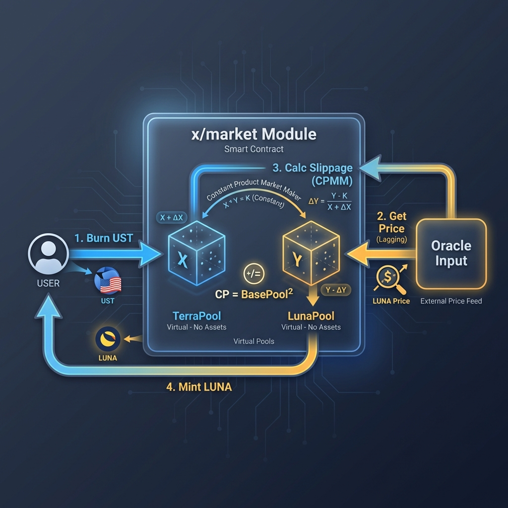
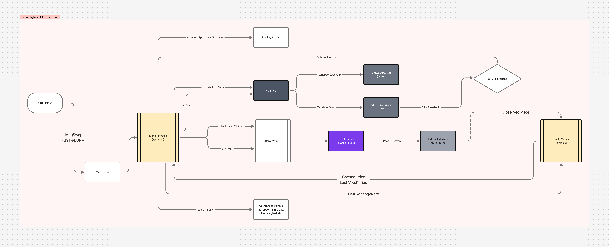
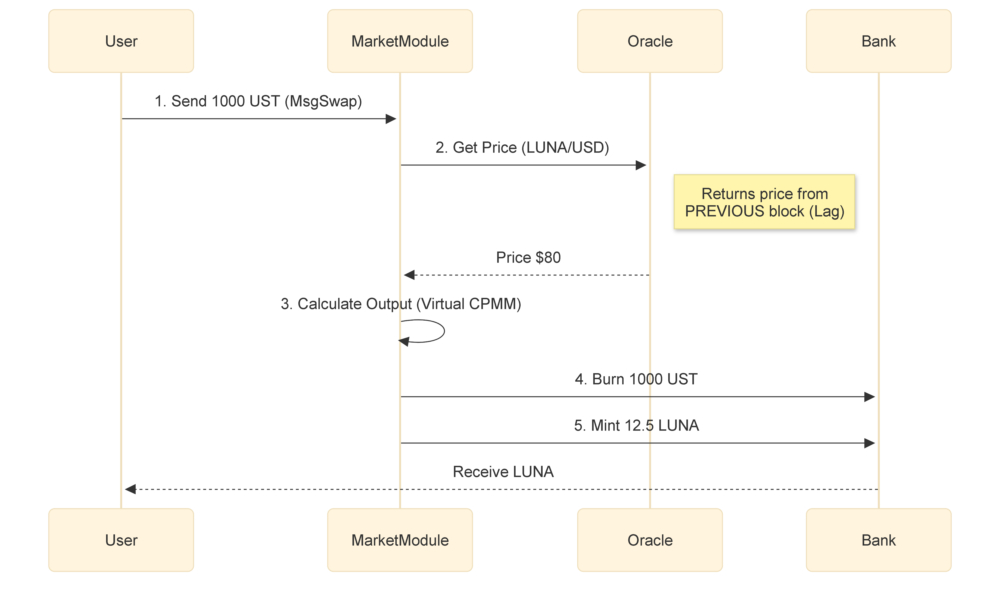
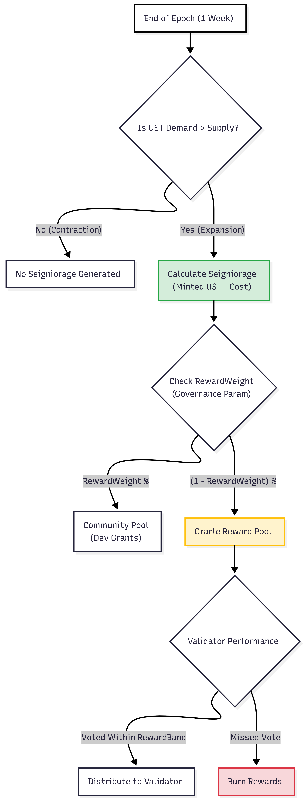

# Terra (UST): Backing Mechanism Deep Dive (Pillar I)

**Authors**: Research Challenge Team
**Date**: January 2026
**Series**: Terra Research Series (Part II)
**Framework**: [General Backing Framework](./general_backing_framework.md)

---

## 1. System Architecture: The Virtual AMM

Unlike collateralized stablecoins (MakerDAO, Liquity) that hold resilient assets in a vault, Terra operates as a **Virtual Automated Market Maker (VAMM)**. The "Backing" is not an asset, but a **Liquidity Commitment**: the protocol promises to mint $1 of LUNA for every 1 UST burned, regardless of market conditions.

*Figure 1.0: Conceptual Overview of the Virtual AMM Model*

*This model corresponds to the "Dual-Token Seigniorage" class defined by Calandra et al. ([Calandra et al., 2023](#ref-calandra)) and is subject to the impossibility results for endogenous collateral described by Klages-Mundt & Minca ([Klages-Mundt & Minca, 2022](#ref-klages)).*

### 1.1 The Market Module (`x/market`)

The core engine is the `x/market` module. It maintains two **Virtual Pools** that simulate liquidity depth to calculate slippage.

* **Reflexivity:** The pools do not hold tokens. They are mathematical variables (`TerraPoolDelta`) that track the deviation from equilibrium.
* **Constant Product:** The pricing follows a $CP = BasePool^2$ invariant.

*Figure 1.1: Virtual Pool Architecture showing the interaction between User and x/market state*

---

**Atomic Execution:** The VAMM executes the swap as a single state transition. The protocol does not hold inventory; it burns the input asset, updates the `TerraPoolDelta` to calculate the new price, and mints the output asset directly to the user's wallet. Use atomic instructions to prevent reentrancy during this calculation.

*Figure 1.2: Atomic Execution Flow of a Swap Transaction*

---

## 2. Kinetic Solvency: The Death Spiral Mechanics

The system's solvency relies entirely on the **Absorption Assumption**: *Market demand for LUNA must always exceed the sell pressure from UST redemptions.*

### 2.1 The Stability Spread (Damping Factor)

To prevent bank runs, the protocol charges a dynamic specific tax called the **Stability Spread**.

*Figure 2.1: Stability Spread mechanics demonstrating cost-of-exit expansion during de-pegs*

**The "Tobin Tax" Mechanism:** The spread is a function of the `TerraPoolDelta` (the net imbalance of UST sold vs. LUNA bought).

* **Equilibrium:** When Δ = 0, the spread is the minimum (e.g., 0.5%).
* **Panic:** As users flee UST, Δ grows rapidly. The swap fee expands exponentially (up to ~60-100%), intending to discourage panic selling by making the "exit door" prohibitively expensive.
* **Failure:** In a true bank run, users accept *any* loss to exit, paying the 60% fee and pushing the LUNA price to zero faster.

$$Spread = \max(MinSpread, \frac{UST_{Sold}}{BasePool})$$

* **Intent:** As selling pressure increases, the cost to exit (Swap UST -> LUNA) increases linearly.
* **Flaw:** The spread decays over time (`PoolRecoveryPeriod` ~24h). If sell pressure is sustained but slow, the spread resets, allowing continuous value extraction at low cost.

### 2.2 The Hyper-Inflationary Trigger

When confidence breaks, the mechanism enters a deterministic feedback loop, often described as a "Reflexive Ponzi" structure by Buterin ([Buterin, 2022](#ref-vitalik)):

1. **Peg Break:** UST drops to $0.90.
2. **Arb Opportunity:** Traders buy UST for $0.90, swap for $1.00 LUNA, and dump LUNA.
3. **LUNA Crash:** The dump lowers LUNA price.
4. **Inflation:** To cover the *next* $1.00 redemption, the protocol must mint *more* LUNA tokens than before.
5. **Recursion:** More LUNA -> Lower Price -> More Minting -> Infinite Supply.

This is not a bug; it is the correct function of the code to defend the $1.00 peg at the expense of LUNA equity.

### 2.3 System Throughput (The Bottleneck)

**Framework Requirement (Pillar II.C):** Maximum System Throughput.

* **Constraint:** The protocol enforced a **Daily Minting Cap** (initially ~$293M).
* **The Squeeze:** During the collapse, exit demand ($Billions) vastly exceeded this throughput limit.
* **Result:** The "Stability Spread" expanded to >60%, effectively freezing efficient exits and trapping liquidity. The engine could not burn UST fast enough to save the peg.

---

## 3. The Sensor: Oracle Latency Risk

Terra relies on a **Weighted Median** vote from validators to price LUNA ([Terraform Labs, 2021](#ref-terra-core)).

* **VotePeriod:** 5 Blocks (~30 seconds).
* **Vulnerability:** The price is always **stale**.
  * *Attack:* If LUNA crashes 20% in 15 seconds, the Oracle reports the *old* high price.
  * *Exploit:* Attackers swap UST for "overpriced" LUNA before the Oracle updates, effectively looting the system of more value than the market supports.

---

## 4. Conclusion: The Unbacked State

Terra V1 proved that **Algorithmically Enforced Convertibility** is not a substitute for **Collateral**.

* **Backing:** None (Endogenous).
* **Solvency:** Dependent on external market sentiment (LUNA demand).
* **Verdict:** The system operates as a **Fractional Reserve Bank** where the reserve asset (LUNA) is correlated with the liability (UST).

---

### Series Navigation

* [Part I: Backing Profile](./Terra_Backing_Profile.md)
* **Part II: Backing Deep Dive** (You are here)
* [Part III: Sustainability Profile](./Terra_Sustainability_Profile.md)
* [Part IV: Decentralization Profile](./Terra_Decentralization_Profile.md)

---

## References

Terraform Labs. (2021). *[Terra Core Repository](https://github.com/terra-money/classic-core)* via `x/market` and `x/oracle`.

Calandra, F., Rossi, F., Fabris, F., & Bernardo, M. (2023). *[Algorithmic Stablecoins: A Simulator for the Dual-Token Model](https://ieeexplore.ieee.org/document/11114693)*. University of Urbino.

Klages-Mundt, A., & Minca, A. (2022). *[While Stability Lasts: A Stochastic Model of Non-Custodial Stablecoins](https://arxiv.org/abs/2004.01304)*. Cornell University.

Buterin, V. (2022). *[Two Thought Experiments to Evaluate Automated Stablecoins](https://vitalik.ca/general/2022/05/25/stable.html)*. Vitalik.ca.
