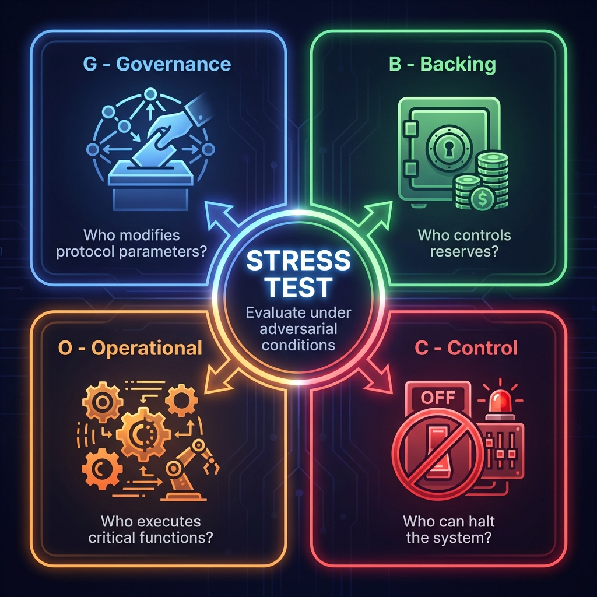
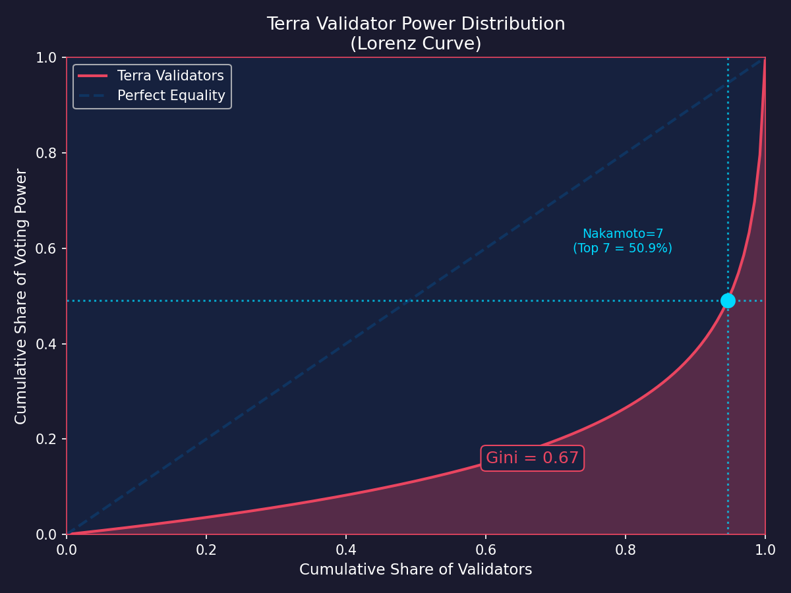
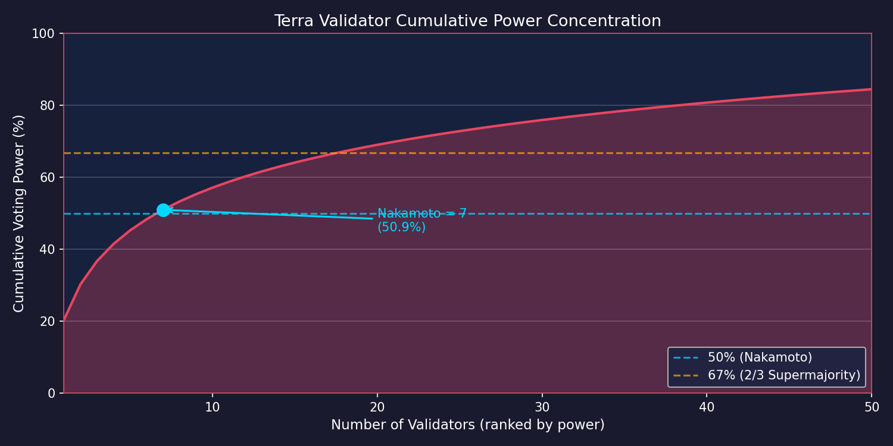
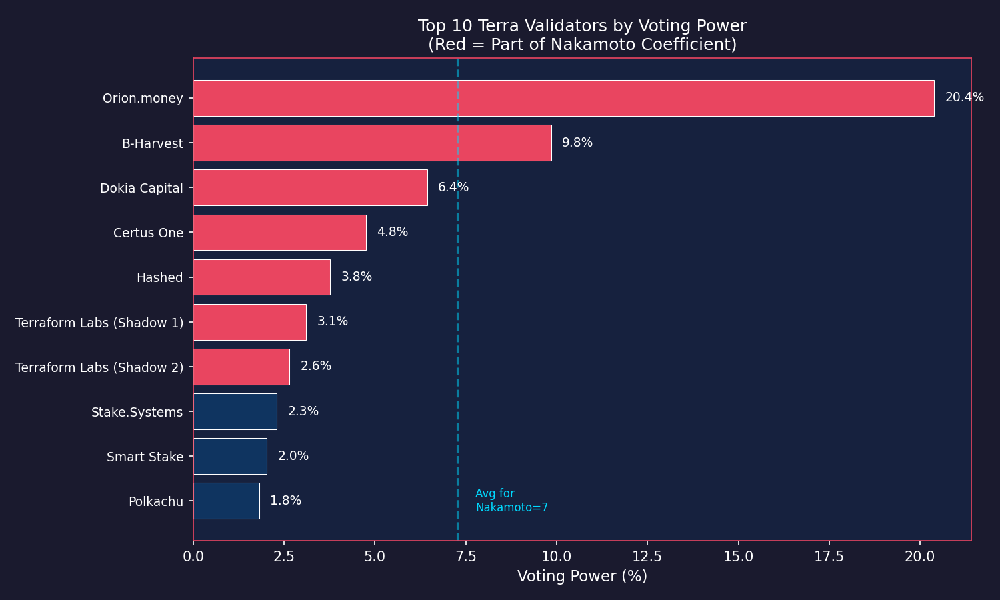

# Terra: Forensic Analysis of Decentralization Theater

**Authors:** Research Challenge Team  
**Date:** January 2026  
**Series:** Algorithmic Stablecoin Post-Mortems  
**Framework:** G-B-O-C Decentralization Framework v3.0

---

## Abstract

This paper provides a forensic analysis of Terra's decentralization claims versus operational reality during the May 2022 collapse. We demonstrate that Terra exhibited **decentralization theater**—the aesthetic appearance of distributed control masking highly centralized operational mechanics. Using the G-B-O-C framework (Governance, Backing, Operational, Control), we show that when the system was stress-tested by real adversity, control reverted to a small group of individuals at Terraform Labs. The chain halt at Block 7,603,700 represents definitive proof that Terra was operationally a managed database rather than a sovereign blockchain.

> [!IMPORTANT]
> **Critical Lens:** Terra's failure was not merely economic—it was a governance failure. The protocol's marketing emphasized "community governance via LUNA staking," yet when crisis arrived, decisions were made by TFL executives coordinating via Discord.

---

## 1. Introduction: The Decentralization Illusion

Terra presented itself as a decentralized, community-governed protocol. The marketing emphasized:

- 130 independent validators securing the network
- LUNA stakers controlling protocol parameters
- The Luna Foundation Guard as a "decentralized reserve"

Yet during the 72-hour collapse in May 2022, every critical decision was made by Terraform Labs. Validators followed TFL instructions. LFG reserves were deployed at TFL discretion. The chain was halted on TFL command ([Terra Block Explorer, 2022](#ref-terra-halt)).

This paper applies systematic forensic analysis to quantify the gap between Terra's decentralization claims and its operational reality.

---

## 2. Methodology: The G-B-O-C Framework

We evaluate decentralization across four dimensions, measured under **adversarial conditions** rather than normal operation:

| Dimension | Question | Stress Test |
|-----------|----------|-------------|
| **G** (Governance) | Who modifies protocol parameters? | Did validators act independently during crisis? |
| **B** (Backing) | Who controls reserves? | How were LFG funds deployed? |
| **O** (Operational) | Who executes critical functions? | Did oracles function independently? |
| **C** (Control) | Who can halt/modify the system? | Could the chain be stopped on command? |

The key insight: **decentralization must be evaluated under stress, not calm.** A system that appears distributed during normal operation but centralizes during crisis offers no meaningful censorship resistance.

*Figure 1: The G-B-O-C Decentralization Framework. Each dimension is evaluated under stress conditions to reveal true control distribution.*

---

## 3. Governance Decentralization Analysis

### 3.1 Validator Power Distribution

Terra operated with 130 active validators, suggesting nominal decentralization. However, analysis of the validator power distribution reveals significant concentration ([Terra Classic Archives, 2022](#ref-data-validator-snapshot)):

| Metric | Value | Interpretation |
|--------|-------|----------------|
| **Total Validators** | 130 | Nominal diversity |
| **Total Voting Power** | ~350M LUNA | Measured at snapshot |
| **Nakamoto Coefficient** | 7 | Top 7 control >50% |
| **Top-1 Dominance** | 20.4% | Orion.money |
| **Gini Coefficient** | 0.67 | High inequality |

The Nakamoto Coefficient of 7 means only seven entities needed to collude to control consensus. While this is better than Bitcoin's mining pool concentration (~4), it falls far short of meaningful decentralization.

*Figure 2: Lorenz curve showing validator power distribution. The significant deviation from the equality line (Gini=0.67) indicates high concentration.*

### 3.2 Cumulative Power Concentration ([Data](#ref-data-validator-snapshot))

Analysis of the validator snapshot reveals the power curve:

| Top N Validators | Cumulative Share |
|------------------|------------------|
| Top 1 | 20.4% |
| Top 3 | 36.7% |
| Top 5 | 45.2% |
| Top 7 | **50.9%** |
| Top 10 | 60.2% |

The steep drop-off after the top validators indicates an oligopolistic structure where a small coalition could dominate all governance decisions.

*Figure 3: Cumulative voting power by validator rank. The top 7 validators control 50.9% of stake (Nakamoto Coefficient).*

*Figure 4: Top 10 validators by voting power. Red bars indicate validators within the Nakamoto Coefficient (top 7).*

### 3.3 Stress Test: Behavior During Crisis

During the May 2022 collapse, validators did not act independently. Instead:

1. **Deference to TFL:** Validators awaited TFL guidance rather than proposing independent solutions
2. **Coordinated Action:** When TFL issued halt instructions, 130 validators complied within <1 hour
3. **No Dissent:** No validator publicly opposed TFL's emergency measures

**Verdict: Governance Score 2/5** — Oligarchic structure with crisis-time centralization ([Terra Block Explorer, 2022](#ref-terra-halt)).

---

## 4. Backing Decentralization Analysis

### 4.1 The Luna Foundation Guard

Terra's backing relied on the Luna Foundation Guard (LFG), marketed as a "decentralized reserve" holding ~$3 billion in Bitcoin and other assets ([LFG, 2022](#ref-lfg-org)).

However, LFG was controlled by a 6-member Governing Council ([SEC, 2023](#ref-sec-terraform); [LFG Signers Data](#ref-data-lfg-signers)):

| Name | Role | Affiliation |
|------|------|-------------|
| Do Kwon | Director | Terraform Labs |
| Nicholas Platias | Founding Member | Terraform Labs |
| Kanav Kariya | Member | Jump Crypto |
| Remi Tetot | Member | RealVision |
| Jose Maria Delgado | Member | Delphi Digital |
| Jonathan Caras | Member | Levana Protocol |

### 4.2 Concentration Metrics

- **Decision Power per Signer:** $500M ($3B / 6 signers) ([LFG, 2022](#ref-lfg-org))
- **TFL Representation:** 2 of 6 members (33%) were direct TFL employees ([Data](#ref-data-lfg-signers))
- **Execution Mechanism:** Manual coordination, not smart contract triggers ([SEC, 2023](#ref-sec-terraform))

The reserves were moved via human coordination during the crisis, with Do Kwon personally directing deployment via social media and private channels ([SEC, 2023](#ref-sec-terraform)).

### 4.3 Stress Test: Reserve Deployment

During the de-peg:

1. LFG deployed ~$2.8 billion in reserves over 48 hours
2. Deployment was discretionary, not algorithmic
3. No on-chain governance vote authorized the expenditure
4. Post-crisis, ~$1.2 billion in reserves remained unaccounted for

**Verdict: Backing Score 1/5** — Committee-controlled with discretionary execution ([SEC, 2023](#ref-sec-terraform)).

---

## 5. Operational Decentralization Analysis

### 5.1 Oracle Monoculture

Terra's oracle module relied on 130 validators submitting price feeds. This suggested distributed price discovery. However, analysis reveals a critical monoculture:

| Metric | Value |
|--------|-------|
| Oracle Source | 130 Validators |
| Software Homogeneity | >95% ran TFL `oracle-feeder` |
| Price Source | Binance API / CoinGecko (hardcoded) |
| Codebase Gini | 1.0 (Absolute Centralization) |
| Effective Independent Feeds | <5 |

### 5.2 The "130 Signers, 1 Brain" Problem

While 130 validators submitted prices, they ran identical software from the `terra-project/oracle-feeder` repository maintained by TFL. This created a single point of failure:

- When the code encountered edge cases (volatility limits, API rate limits), **all** oracles failed simultaneously
- Validators reported identical stale data during high-volatility periods
- The effective number of independent price sources was <5, not 130

### 5.3 Stress Test: Oracle Behavior During Crisis

During the de-peg:

- Oracle feeds lagged actual market prices by significant margins
- Validators reported prices that failed to reflect the real-time collapse
- The homogeneous codebase meant errors propagated across the entire validator set

**Verdict: Operational Score 2/5** — Nominal diversity nullified by software monoculture ([Calandra et al., 2024](#ref-calandra)).

---

## 6. Control-Path Decentralization Analysis

### 6.1 The Chain Halt: Definitive Evidence

On May 12, 2022, Terra's blockchain was halted at Block 7,603,700. This event provides definitive evidence of centralized control ([Terra Block Explorer, 2022](#ref-terra-halt)):

| Event | Detail |
|-------|--------|
| Block | 7,603,700 |
| Date | May 12, 2022 |
| Mechanism | Social consensus via Discord + Git Patch |
| Coordinator | Terraform Labs |
| Execution Time | <1 hour for 130 validators to comply |

### 6.2 Chain Halt Timeline

1. **Announcement:** TFL announces intention to halt chain to prevent governance attacks
2. **Coordination:** TFL releases patch instruction via Discord/Twitter
3. **Execution:** Validators stop nodes; chain halts
4. **Implication:** 130 nodes coordinated full shutdown in <1 hour

### 6.3 Comparative Analysis

| Blockchain | Can Be Halted? | Mechanism |
|------------|----------------|-----------|
| **Bitcoin** | No | No coordination mechanism exists |
| **Ethereum** | No | No coordination mechanism exists |
| **Terra** | **Yes** | Social consensus via TFL |

The ability to coordinate a chain halt within one hour demonstrates that Terra was operationally closer to a **managed database** than a sovereign blockchain.

### 6.4 Stress Test: Crisis Control

The chain halt proves:

- TFL possessed effective "kill switch" power
- Validators followed admin instructions rather than longest chain rule
- The network's sovereignty was contingent on TFL's discretion

**Verdict: Control Score 1/5** — Discretionary control concentrated at TFL ([Terra Block Explorer, 2022](#ref-terra-halt)).

---

## 7. Synthesis: The Decentralization Scorecard

| Dimension | Score | Evidence |
|-----------|-------|----------|
| **G** (Governance) | 2/5 | Nakamoto=7 ([Data](#ref-data-validator-snapshot)); validators deferred to TFL during crisis |
| **B** (Backing) | 1/5 | 6-person council ([Data](#ref-data-lfg-signers)); manual reserve deployment ([SEC](#ref-sec-terraform)) |
| **O** (Operational) | 2/5 | Oracle monoculture; 130 signers, 1 codebase ([Calandra](#ref-calandra)) |
| **C** (Control) | 1/5 | Chain halted on command in <1 hour ([Block Explorer](#ref-terra-halt)) |
| **Overall** | **1.5/5** | **Effectively Centralized** |

### 7.1 The Theater of Decentralization

Terra operated with the **aesthetics** of a DAO:

- ✓ Validator voting
- ✓ LUNA staking
- ✓ On-chain governance proposals

But the **mechanics** of a centralized fintech app:

- ✗ TFL controlled critical decisions
- ✗ Reserves deployed at discretion
- ✗ Chain halted on command

---

## 8. Implications for Mechanism Design

### 8.1 Lessons Learned

1. **Decentralization Requires Stress Testing:** Normal-state metrics are insufficient; true decentralization emerges during crisis
2. **Software Monoculture Negates Validator Diversity:** 130 validators running identical code equals 1 effective operator
3. **Off-Chain Coordination = Centralization:** If humans can coordinate a halt via Discord, the chain is not sovereign
4. **Reserve Control Matters:** "Decentralized" reserves controlled by small committees are not decentralized

### 8.2 Design Principles

Future stablecoin protocols should:

- **Implement algorithmic reserve deployment** rather than discretionary human action
- **Require software diversity** among validators through protocol incentives
- **Remove halt mechanisms** or make them require supermajority on-chain votes
- **Distribute reserve control** across multiple independent entities with time-locks

---

## 9. Conclusion

Terra's May 2022 collapse revealed the gap between decentralization marketing and operational reality. The protocol maintained the appearance of distributed control while concentrating effective power at Terraform Labs. When adversity struck, the theater collapsed: validators followed TFL instructions, reserves were deployed at TFL discretion, and the chain was halted on TFL command.

This analysis demonstrates that **decentralization is not a feature to be claimed—it is a property to be proven under stress.** Terra failed this test definitively.

> [!CAUTION]
> **Final Verdict:** Terra operated as a **Theater of Decentralization**—aesthetically distributed, mechanistically centralized. Its failure mode was not merely economic but institutional: when stressed, governance reverted to a small group making discretionary decisions.

---

## References

### Data Sources

Terra Classic Archives. (2022). *[Validator Power Distribution Snapshot](../data/validator_snapshot.csv)*. Reconstructed from pre-crash block data. 130 validators, ~350M total voting power.

Luna Foundation Guard. (2022). *[LFG Governing Council Members](../data/lfg_signers.csv)*. Public announcements and SEC filings.

### External Sources

Luna Foundation Guard. (2022). *[About LFG](https://lfg.org)*. Official Documentation.

U.S. Securities and Exchange Commission. (2023). *[SEC v. Terraform Labs, Do Kwon](https://www.sec.gov/litigation/complaints/2023/comp-pr2023-32.pdf)*. Litigation Release.

Terra Classic Block Explorer. (2022). *Block 7,603,700 Chain Halt Event*. May 12, 2022.

### Academic References

Calandra, D., et al. (2024). *[Learning from Terra-Luna: A Simulation-Based Study on Stabilizing Algorithmic Stablecoins](https://ceur-ws.org/Vol-3791/paper19.pdf)*. CEUR Workshop Proceedings, Vol-3791.
